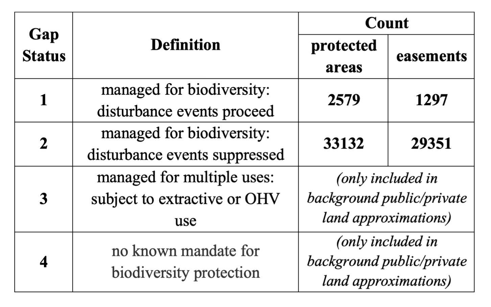

```{r include = FALSE}
library(sf)
library(tidyverse)
library(raster)
library(ggsignif)
library(ggpubr)
library(patchwork)
```

```{r warning=FALSE, message=FALSE, include = FALSE, cache=TRUE}
easements1 <- read_csv("../data/summary_richness/easement_R1_extract.csv")
easements2 <- read_csv("../data/summary_richness/easement_R2_extract.csv")
easements3 <- read_csv("../data/summary_richness/easement_R3_extract.csv")
easements4 <- read_csv("../data/summary_richness/easement_R4_extract.csv")
easements5 <- read_csv("../data/summary_richness/easement_R5_extract.csv")
easements6 <- read_csv("../data/summary_richness/easement_R6_extract.csv")
easements7 <- read_csv("../data/summary_richness/easement_R7_extract.csv")
easements8 <- read_csv("../data/summary_richness/easement_R8_extract.csv")
easements9 <- read_csv("../data/summary_richness/easement_R9_extract.csv")
easements10 <- read_csv("../data/summary_richness/easement_R10_extract.csv")
easements11 <- read_csv("../data/summary_richness/easement_R11_extract.csv")
easements12 <- read_csv("../data/summary_richness/easement_R12_extract.csv")

easements <- rbind(easements1, easements2,easements3, easements4, easements5, easements6, easements7,
                   easements8, easements9, easements10, easements11, easements12)
rm(easements1, easements2,easements3, easements4, easements5, easements6, easements7,
                   easements8, easements9, easements10, easements11, easements12)

easements <- easements %>%
  dplyr::select(Category, Mang_Type, Des_Tp, State_Nm, Date_Est, Access_Dt, GAP_Sts,EHoldTyp, Loc_Ds, Own_Type,
         mammal_mean:area) %>% 
  filter(Des_Tp == "CONE") 
```

```{r warning = FALSE, include=FALSE, cache=TRUE}
fee1 <- read_csv("../data/summary_richness/fee_R1_extract.csv")
fee2 <- read_csv("../data/summary_richness/fee_R2_extract.csv")
fee3 <- read_csv("../data/summary_richness/fee_R3_extract.csv")
fee4 <- read_csv("../data/summary_richness/fee_R4_extract.csv")
fee5 <- read_csv("../data/summary_richness/fee_R5_extract.csv")
fee6 <- read_csv("../data/summary_richness/fee_R6_extract.csv")
fee7 <- read_csv("../data/summary_richness/fee_R7_extract.csv")
fee8 <- read_csv("../data/summary_richness/fee_R8_extract.csv")
fee9 <- read_csv("../data/summary_richness/fee_R9_extract.csv")
fee10 <- read_csv("../data/summary_richness/fee_R10_extract.csv")
fee11 <- read_csv("../data/summary_richness/fee_R11_extract.csv")
fee12 <- read_csv("../data/summary_richness/fee_R12_extract.csv")

fee <- rbind(fee1, fee2,fee3, fee4, fee5, fee6, fee7,
                   fee8, fee9, fee10, fee11, fee12)
rm(fee1, fee2,fee3, fee4, fee5, fee6, fee7,
                   fee8, fee9, fee10, fee11, fee12)
unique(fee$Mang_Type)
fee <- fee %>%
  dplyr::select(Category, Mang_Type, Des_Tp, State_Nm, Date_Est, GAP_Sts, Own_Type,
         mammal_mean:area)  %>%
    mutate(Category = "fee")
```


```{r include = FALSE}
fee_match <- fee %>%
  filter(GAP_Sts == "1" | GAP_Sts == "2" ) %>%
  dplyr::select(Category, State_Nm, richness_all, carbon_vulnerable, area) %>%
  mutate(type = 0) %>% drop_na()
  
ease_match <- easements %>%
  filter(GAP_Sts == "1" | GAP_Sts == "2" ) %>%
  dplyr::select(Category, State_Nm, richness_all, carbon_vulnerable, area) %>%
  mutate(type = 1) %>% drop_na()

match_df <- fee_match %>% rbind(ease_match)
```

All code to run analysis and reproduce main text figures is available at: https://github.com/milliechapman/easements-biodiversity

**Table S1: Summary of GAP definitions and number of polygons**

We classified “Protected areas” as fee owned lands managed for biodiversity (GAP 1 and GAP 2). Our analysis of “public land” vs “private land” leveraged GAP 1-4 protected areas. Because there are incomplete and erroneous polygons in the PAD-US database, we filtered out any invalid polygons from the analysis. Easement data was also acquired from the PAD-US database. US-PAD and NCED data is readily available to download at: https://www.usgs.gov/core-science-systems/science-analytics-and-synthesis/gap/science/protected-areas

{width=250px}


**Figure S1: There is no significant correlation between parcel area and mean richness value in either (a) conservation easements (rˆ2 <0.01) or (b) protected areas (rˆ2 <0.01) (GAP 1 and GAP 2). Similarly, (c) there is no significant trend when considering all of the data (rˆ2<0.01).**

```{r echo = FALSE, message = FALSE, warning = FALSE, fig.width=7.5, fig.height= 4}
a <- match_df %>% filter(Category == "Easement") %>% drop_na() %>%
  ggplot(aes(x = log(area), y = richness_all)) +
  geom_point(color = "#0072B2")+ geom_smooth(method = "lm", se=FALSE, color="black") +
  stat_regline_equation(label.y = 350, aes(label = ..rr.label..)) +
  theme_classic() +
  labs(x = "log(area per parcel)", y = "mean species richness per parcel",
       title = "A. Conservation Easements \n (GAP 1 and GAP 2)")

b <- match_df %>% filter(Category == "fee") %>% drop_na() %>%
  ggplot(aes(x = log(area), y = richness_all)) +
  geom_point(color = "#E69F00") +  
  geom_smooth(method = "lm", se=FALSE, color="black") +
  stat_regline_equation(label.y = 350, aes(label = ..rr.label..)) +
  theme_classic() +
  labs(x = "log(area per parcel)", y = "mean species richness per parcel",
       title = "B. Protected areas \n (GAP 1 and GAP 2)")

c <- match_df %>% drop_na() %>%
  ggplot(aes(x = log(area), y = richness_all)) +
  geom_point(color = "grey") + geom_smooth(method = "lm", se=FALSE, color="black") +
  stat_regline_equation(label.y = 350, aes(label = ..rr.label..)) +
  theme_classic() +
  labs(x = "log(area per parcel)", y = "mean species richness per parcel",
       title = "C. All parcels \n (GAP 1 and GAP 2)")

a + b + c
```

## Figure S3: There is no significant correlation between parcel area and mean vulnerable carbon in either (a) conservation easements (rˆ2 <0.01) or (b) protected areas (rˆ2 <0.01) (GAP 1 and GAP 2). Similarly, (c) there is no significant trend when considering all of the data (rˆ2<0.01).

```{r echo = FALSE, message = FALSE, warning = FALSE, fig.width=7.5, fig.height= 4}

a <- match_df %>% filter(Category == "Easement") %>% drop_na() %>%
  ggplot(aes(x = log(area), y = carbon_vulnerable)) +
  geom_point(color = "#0072B2")+ geom_smooth(method = "lm", se=FALSE, color="black") +
  stat_regline_equation(label.y = 350, aes(label = ..rr.label..)) +
  theme_classic() +
  labs(x = "log(area per parcel)", y = "mean vulnerable carbon per parcel",
       title = "A. Conservation Easements \n (GAP 1 and GAP 2)")

b <- match_df %>% filter(Category == "fee") %>% drop_na() %>%
  ggplot(aes(x = log(area), y = carbon_vulnerable )) +
  geom_point(color = "#E69F00") +  
  geom_smooth(method = "lm", se=FALSE, color="black") +
  stat_regline_equation(label.y = 350, aes(label = ..rr.label..)) +
  theme_classic() +
  labs(x = "log(area per parcel)", y = "mean vulnerable carbon per parcel",
       title = "A. Protected areas \n (GAP 1 and GAP 2)")

c <- match_df %>% drop_na() %>%
  ggplot(aes(x = log(area), y = carbon_vulnerable)) +
  geom_point(color = "grey") + geom_smooth(method = "lm", se=FALSE, color="black") +
  stat_regline_equation(label.y = 350, aes(label = ..rr.label..)) +
  theme_classic() +
  labs(x = "log(area per parcel)", y = "mean vulnerable carbon per parcel",
       title = "C. All parcels \n (GAP 1 and GAP 2)")

a+b+c
```

## Effect of parcel size on overall patterns

However, size and state which the protected area or easement is located could confound these results. To address this, we used propensity score matching (by area) to test the average treatment effect (or richness difference) accounting for this factors.

```{r include = FALSE, message=FALSE, warning=FALSE}
library("MatchIt")
library("lmtest")
library("sandwich")
library("boot")
library("survival")
```

The key components of the m.out1 object are weights (the computed matching weights), subclass (matching
pair membership), distance (the estimated propensity score), and match.matrix (which control units are matched to each treated unit).

```{r}
m.out1 <- matchit(type ~ area, data = match_df, method = "nearest", distance = "glm")
#plot(m.out1, type = "jitter", interactive = FALSE)
m.data1 <- match.data(m.out1)
```

# Table S3: Easements have significantly higher mean richness values, even when accounting for the potentially confounding effects of size and subnational governance

```{r}
fit1 <- lm(richness_all ~ type + area + State_Nm, data = m.data1, weights = weights) 

fit2 <- lm(carbon_vulnerable ~ type + area + State_Nm, data = m.data1, weights = weights) 

kable(coeftest(fit1, vcov. = vcovCL, cluster = ~subclass)[1:2,])
kable(coeftest(fit2, vcov. = vcovCL, cluster = ~subclass)[1:2,])

```


```{r}

```


