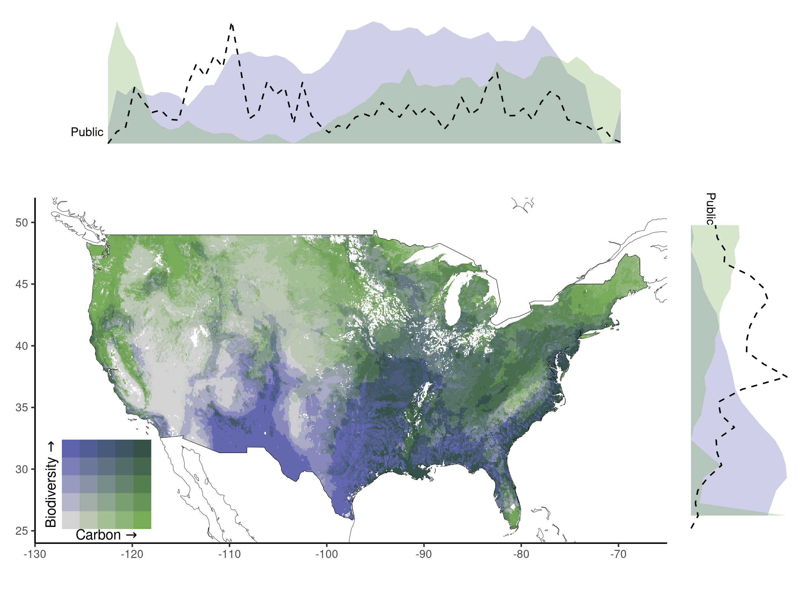

updated-analysis
================

Load libraries

``` r
library(sf)
```

    ## Linking to GEOS 3.8.0, GDAL 3.0.4, PROJ 6.3.1; sf_use_s2() is TRUE

``` r
library(tidyverse)
```

    ## ── Attaching packages
    ## ───────────────────────────────────────
    ## tidyverse 1.3.2 ──

    ## ✔ ggplot2 3.3.6      ✔ purrr   0.3.5 
    ## ✔ tibble  3.1.8      ✔ dplyr   1.0.10
    ## ✔ tidyr   1.2.1      ✔ stringr 1.4.1 
    ## ✔ readr   2.1.3      ✔ forcats 0.5.2 
    ## ── Conflicts ────────────────────────────────────────── tidyverse_conflicts() ──
    ## ✖ dplyr::filter() masks stats::filter()
    ## ✖ dplyr::lag()    masks stats::lag()

``` r
library(raster)
```

    ## Loading required package: sp
    ## 
    ## Attaching package: 'raster'
    ## 
    ## The following object is masked from 'package:dplyr':
    ## 
    ##     select

``` r
#library(ggpubr)
library(lsr) # includes t-test functions
library(stats) # includes different t-test functions
#library(rio) # for importing data
library(psych) # for descriptives
```

    ## 
    ## Attaching package: 'psych'
    ## 
    ## The following object is masked from 'package:raster':
    ## 
    ##     distance
    ## 
    ## The following objects are masked from 'package:ggplot2':
    ## 
    ##     %+%, alpha

``` r
library(pwr) # for conducting a power analysis
library(zoo)
```

    ## 
    ## Attaching package: 'zoo'
    ## 
    ## The following objects are masked from 'package:base':
    ## 
    ##     as.Date, as.Date.numeric

``` r
library(biscale)
library(tigris)
```

    ## To enable caching of data, set `options(tigris_use_cache = TRUE)`
    ## in your R script or .Rprofile.

``` r
library(ggsignif)
library(ggpubr)
```

    ## 
    ## Attaching package: 'ggpubr'
    ## 
    ## The following object is masked from 'package:raster':
    ## 
    ##     rotate

# Load in data with extracted richness values

Background (by state)

US shapefile (for visualization below)

Easement data (already filtered to GAP 1 and GAP 2) by region

Fee data by region (all GAP codes)

# Figure 3:

Filter fee for protected GAP codes and select relevant variables

``` r
fee_fig <- fee %>%
mutate(future = plant_future  + tree_future + reptile_future + amphibian_future + bird_future + mammal_future) %>%
  filter(GAP_Sts == "1" | GAP_Sts == "2") %>%
  dplyr::select(Category,carbon_vulnerable,richness_all:RSR_all, future, area, Date_Est) %>%
  dplyr::rename(`Species Richness` = richness_all,
         `Vulnerable Carbon` = carbon_vulnerable,
         `CRENVU Richness` =  richness_crenvu, 
         `Future Richness` = future)

ease_fig <- easements %>%
  mutate(future = plant_future  + tree_future + reptile_future + amphibian_future + bird_future + mammal_future) %>%
  dplyr::select(Category,carbon_vulnerable,richness_all:RSR_all, future, Date_Est, area) %>%
  dplyr::rename(`Species Richness` = richness_all,
         `Vulnerable Carbon` = carbon_vulnerable,
         `CRENVU Richness` =  richness_crenvu,
         `Future Richness` = future)
```

``` r
library(weights)
```

    ## Loading required package: Hmisc

    ## Loading required package: lattice

    ## Loading required package: survival

    ## Loading required package: Formula

    ## 
    ## Attaching package: 'Hmisc'

    ## The following object is masked from 'package:psych':
    ## 
    ##     describe

    ## The following objects are masked from 'package:raster':
    ## 
    ##     mask, zoom

    ## The following objects are masked from 'package:dplyr':
    ## 
    ##     src, summarize

    ## The following objects are masked from 'package:base':
    ## 
    ##     format.pval, units

``` r
shapiro.test(dplyr::sample_n(fee_fig, 1000)$`Species Richness`)
```

    ## 
    ##  Shapiro-Wilk normality test
    ## 
    ## data:  dplyr::sample_n(fee_fig, 1000)$`Species Richness`
    ## W = 0.61963, p-value < 2.2e-16

``` r
wtd.t.test(x=fee_fig$`Species Richness`,
           y=ease_fig$`Species Richness`,
           weight=fee_fig$area,
           weighty=ease_fig$area,
           samedata=FALSE)
```

    ## $test
    ## [1] "Two Sample Weighted T-Test (Welch)"
    ## 
    ## $coefficients
    ##    t.value         df    p.value 
    ##  -236.5171 42727.6230     0.0000 
    ## 
    ## $additional
    ##  Difference      Mean.x      Mean.y    Std. Err 
    ## -98.7437189 152.7950941 251.5388129   0.4174908

``` r
wtd.t.test(x=fee_fig$`Vulnerable Carbon`,
           y=ease_fig$`Vulnerable Carbon`,
           weight=fee_fig$area,
           weighty=ease_fig$area,
           samedata=FALSE)
```

    ## $test
    ## [1] "Two Sample Weighted T-Test (Welch)"
    ## 
    ## $coefficients
    ##     t.value          df     p.value 
    ##   -86.56398 64774.52662     0.00000 
    ## 
    ## $additional
    ##  Difference      Mean.x      Mean.y    Std. Err 
    ## -26.8234316  45.5747785  72.3982101   0.3098683

``` r
stats::t.test(fee_fig$`Vulnerable Carbon`, ease_fig$`Vulnerable Carbon`)
```

    ## 
    ##  Welch Two Sample t-test
    ## 
    ## data:  fee_fig$`Vulnerable Carbon` and ease_fig$`Vulnerable Carbon`
    ## t = 11.353, df = 59973, p-value < 2.2e-16
    ## alternative hypothesis: true difference in means is not equal to 0
    ## 95 percent confidence interval:
    ##  2.839349 4.024294
    ## sample estimates:
    ## mean of x mean of y 
    ##  80.00855  76.57673

Bind fee and easement data for figure 3

``` r
fig3a <- easements %>%
  mutate(future = plant_future  + tree_future + reptile_future + amphibian_future + bird_future + mammal_future) %>%
  dplyr::select(Category,carbon_vulnerable,richness_all:RSR_all, future, Date_Est, area) %>%
  dplyr::rename(`Species Richness` = richness_all,
         `Vulnerable Carbon` = carbon_vulnerable,
         `CRENVU Richness` =  richness_crenvu,
         `Future Richness` = future) %>%
  drop_na() %>%
  rbind(fee_fig) %>%
  mutate(time = ifelse(Date_Est <2000, NA, 
                       ifelse(Date_Est > 1999 & Date_Est < 2010, "2000-2009", "2010-2019"))) %>%
  drop_na() %>%
  dplyr::select(-c(Date_Est, area, RSR_all)) %>%
  pivot_longer(-c(Category, time)) %>%
  mutate(name = factor(name, levels = c("Species Richness", 
                                        "CRENVU Richness",
                                        "Future Richness",  
                                        "Vulnerable Carbon"))) %>%
  filter(Category == "fee") %>%
  ggplot(aes(x = time, y = value, col = Category)) + geom_boxplot() +
  facet_wrap(vars(name), ncol = 4, scales = "free_y") +
  stat_compare_means(aes(group = time), method = "t.test", vjust = 1, hjust = -1, label = "p.signif", color = "black", size=4) + 
  scale_color_manual(values=c("#E69F00")) +
  theme_classic() +
  theme(legend.position = "none",
        legend.title = element_blank()) +
  theme(axis.title.x = element_blank()) +
  labs(y = "mean value per parcel") + theme(text = element_text(size = 12))

fig3b <- easements %>%
  mutate(future = plant_future  + tree_future + reptile_future + amphibian_future + bird_future + mammal_future) %>%
  dplyr::select(Category,carbon_vulnerable,richness_all:RSR_all, future, Date_Est, area) %>%
  dplyr::rename(`Species Richness` = richness_all,
         `Vulnerable Carbon` = carbon_vulnerable,
         `CRENVU Richness` =  richness_crenvu,
         `Future Richness` = future) %>%
  drop_na() %>%
  rbind(fee_fig) %>%
  mutate(time = ifelse(Date_Est <2000, NA, 
                       ifelse(Date_Est > 1999 & Date_Est < 2010, "2000-2009", "2010-2019"))) %>%
  drop_na() %>%
  dplyr::select(-c(Date_Est, area, RSR_all)) %>%
  pivot_longer(-c(Category, time)) %>%
  mutate(name = factor(name, levels = c("Species Richness", 
                                        "CRENVU Richness",
                                        "Future Richness",
                                        "Vulnerable Carbon"))) %>%
  filter(Category == "Easement") %>%
  ggplot(aes(x = time, y = value, col = Category)) + geom_boxplot() +
  facet_wrap(vars(name), ncol = 4, scales = "free_y") +
  stat_compare_means(aes(group = time), method = "t.test", vjust = 1, hjust = -1, label = "p.signif", color = "black", size=4) + 
  scale_color_manual(values=c("#0072B2")) +
  theme_classic() +
  theme(legend.position = "none",
        legend.title = element_blank()) +
  theme(axis.title.x = element_blank()) +
  labs(y = "mean value per parcel") + theme(text = element_text(size = 11.5))
```

``` r
library(patchwork)
```

    ## 
    ## Attaching package: 'patchwork'

    ## The following object is masked from 'package:raster':
    ## 
    ##     area

``` r
fig3b/fig3a + plot_annotation(tag_levels = 'A')
```

<!-- -->

area stats

``` r
areas <- easements %>%
  mutate(future = plant_future  + tree_future + reptile_future + amphibian_future + bird_future + mammal_future) %>%
  dplyr::select(Category,carbon_vulnerable,richness_all:RSR_all, future, Date_Est, area) %>%
  dplyr::rename(`Species Richness` = richness_all,
         `Vulnerable Carbon` = carbon_vulnerable,
         `CRENVU Richness` =  richness_crenvu,
         `Future Richness` = future) %>%
  drop_na() %>%
  rbind(fee_fig) %>%
  mutate(area = area/10000) %>%
  group_by(Category) %>%
  summarise(mean = mean(area),
            SD = SD(area),
            sum = (sum(area)))

areas$sum[1]/areas$sum[2]
```

    ## [1] 0.04664362

t-test stats for paper

``` r
easements_ttest <- easements %>%
  mutate(future = plant_future  + tree_future + reptile_future + amphibian_future + bird_future + mammal_future) %>%
  dplyr::select(Category,carbon_vulnerable,richness_all:RSR_all, future, Date_Est, area) %>%
  dplyr::rename(`Species Richness` = richness_all,
         `Vulnerable Carbon` = carbon_vulnerable,
         `CRENVU Richness` =  richness_crenvu,
         `Future Richness` = future) %>%
  drop_na() %>%
  rbind(fee_fig) %>%
  mutate(time = ifelse(Date_Est <2000, NA, 
                       ifelse(Date_Est > 1999 & Date_Est < 2010, "2000-2009", "2010-2019"))) %>%
  drop_na() %>%
  dplyr::select(-c(Date_Est, area, RSR_all)) %>%
  pivot_longer(-c(Category, time)) %>%
  mutate(name = factor(name, levels = c("Species Richness", 
                                        "CRENVU Richness",
                                        "Future Richness",
                                        "Vulnerable Carbon"))) %>%
  filter(Category == "Easement")

easements_ttest %>%
  group_by(name, time) %>%
  summarise(mean = mean(value),
            SD = SD(value))
```

    ## `summarise()` has grouped output by 'name'. You can override using the
    ## `.groups` argument.

    ## # A tibble: 8 × 4
    ## # Groups:   name [4]
    ##   name              time        mean    SD
    ##   <fct>             <chr>      <dbl> <dbl>
    ## 1 Species Richness  2000-2009 259.   21.0 
    ## 2 Species Richness  2010-2019 262.   19.3 
    ## 3 CRENVU Richness   2000-2009   3.57  1.49
    ## 4 CRENVU Richness   2010-2019   3.79  1.43
    ## 5 Future Richness   2000-2009 157.   76.6 
    ## 6 Future Richness   2010-2019 165.   80.6 
    ## 7 Vulnerable Carbon 2000-2009  76.9  41.0 
    ## 8 Vulnerable Carbon 2010-2019  77.6  42.8

``` r
easements_ttest %>% rename(variable = name) %>%
  dplyr::select(-Category) %>%
  group_by(time, variable) %>% 
  summarise(value = list(value)) %>% 
  spread(time, value) %>% 
  group_by(variable) %>%
  mutate(p_value = t.test(unlist(`2000-2009`), unlist(`2010-2019`))$p.value,
         t_value = t.test(unlist(`2000-2009`), unlist(`2010-2019`))$statistic,
         estimate_2000 = t.test(unlist(`2000-2009`), unlist(`2010-2019`))$estimate[1],
         estimate_2010 = t.test(unlist(`2000-2009`), unlist(`2010-2019`))$estimate[2],
         df =  t.test(unlist(`2000-2009`), unlist(`2010-2019`))$parameter)
```

    ## `summarise()` has grouped output by 'time'. You can override using the
    ## `.groups` argument.

    ## # A tibble: 4 × 8
    ## # Groups:   variable [4]
    ##   variable          `2000-2009`   2010-…¹  p_value t_value estim…² estim…³    df
    ##   <fct>             <list>        <list>     <dbl>   <dbl>   <dbl>   <dbl> <dbl>
    ## 1 Species Richness  <dbl [7,272]> <dbl>   5.10e-16  -8.12   259.    262.   9926.
    ## 2 CRENVU Richness   <dbl [7,272]> <dbl>   7.44e-16  -8.08     3.57    3.79 9636.
    ## 3 Future Richness   <dbl [7,272]> <dbl>   6.21e- 8  -5.42   157.    165.   8949.
    ## 4 Vulnerable Carbon <dbl [7,272]> <dbl>   4.10e- 1  -0.824   76.9    77.6  9001.
    ## # … with abbreviated variable names ¹​`2010-2019`, ²​estimate_2000,
    ## #   ³​estimate_2010

``` r
fee_ttest <- easements %>%
  mutate(future = plant_future  + tree_future + reptile_future + amphibian_future + bird_future + mammal_future) %>%
  dplyr::select(Category,carbon_vulnerable,richness_all:RSR_all, future, Date_Est, area) %>%
  dplyr::rename(`Species Richness` = richness_all,
         `Vulnerable Carbon` = carbon_vulnerable,
         `CRENVU Richness` =  richness_crenvu,
         `Future Richness` = future) %>%
  drop_na() %>%
  rbind(fee_fig) %>%
  mutate(time = ifelse(Date_Est <2000, NA, 
                       ifelse(Date_Est > 1999 & Date_Est < 2010, "2000-2009", "2010-2019"))) %>%
  drop_na() %>%
  dplyr::select(-c(Date_Est, area, RSR_all)) %>%
  pivot_longer(-c(Category, time)) %>%
  mutate(name = factor(name, levels = c("Species Richness", 
                                        "CRENVU Richness",
                                        "Future Richness",
                                        "Vulnerable Carbon"))) %>%
  filter(Category == "fee")

fee_ttest %>%
  group_by(name, time) %>%
  summarise(mean = mean(value),
            SD = SD(value))
```

    ## `summarise()` has grouped output by 'name'. You can override using the
    ## `.groups` argument.

    ## # A tibble: 8 × 4
    ## # Groups:   name [4]
    ##   name              time        mean    SD
    ##   <fct>             <chr>      <dbl> <dbl>
    ## 1 Species Richness  2000-2009 257.   35.2 
    ## 2 Species Richness  2010-2019 255.   34.7 
    ## 3 CRENVU Richness   2000-2009   3.39  1.73
    ## 4 CRENVU Richness   2010-2019   3.03  1.68
    ## 5 Future Richness   2000-2009 201.   53.5 
    ## 6 Future Richness   2010-2019 205.   68.8 
    ## 7 Vulnerable Carbon 2000-2009  82.4  40.2 
    ## 8 Vulnerable Carbon 2010-2019  82.7  43.3

``` r
fee_ttest %>% rename(variable = name) %>%
  dplyr::select(-Category) %>%
  group_by(time, variable) %>% 
  summarise(value = list(value)) %>% 
  spread(time, value) %>% 
  group_by(variable) %>%
  mutate(p_value = t.test(unlist(`2000-2009`), unlist(`2010-2019`))$p.value,
         t_value = t.test(unlist(`2000-2009`), unlist(`2010-2019`))$statistic,
         estimate_2000 = t.test(unlist(`2000-2009`), unlist(`2010-2019`))$estimate[1],
         estimate_2010 = t.test(unlist(`2000-2009`), unlist(`2010-2019`))$estimate[2],
         df =  t.test(unlist(`2000-2009`), unlist(`2010-2019`))$parameter)
```

    ## `summarise()` has grouped output by 'time'. You can override using the
    ## `.groups` argument.

    ## # A tibble: 4 × 8
    ## # Groups:   variable [4]
    ##   variable          `2000-2009`   2010-…¹  p_value t_value estim…² estim…³    df
    ##   <fct>             <list>        <list>     <dbl>   <dbl>   <dbl>   <dbl> <dbl>
    ## 1 Species Richness  <dbl [3,330]> <dbl>   7.28e- 2   1.80   257.    255.   1947.
    ## 2 CRENVU Richness   <dbl [3,330]> <dbl>   8.22e-10   6.17     3.39    3.03 1974.
    ## 3 Future Richness   <dbl [3,330]> <dbl>   8.53e- 2  -1.72   201.    205.   1597.
    ## 4 Vulnerable Carbon <dbl [3,330]> <dbl>   8.50e- 1  -0.190   82.4    82.7  1810.
    ## # … with abbreviated variable names ¹​`2010-2019`, ²​estimate_2000,
    ## #   ³​estimate_2010

# Figure 2:

``` r
# easements already filtered to GAP1-2 before extraction 
ag_e <- easements %>%
    mutate(future = plant_future  + tree_future + reptile_future + amphibian_future + bird_future + mammal_future) %>%
  mutate(Category = "easement") %>%
  group_by(Category) %>%
  mutate(total_area = sum(area)) %>%
  ungroup() %>%
  mutate(perc_area = area/total_area) %>%
  mutate(richness_all = richness_all*perc_area,
         future = future*perc_area,
         richness_crenvu= richness_crenvu*perc_area,
         carbon_vulnerable = carbon_vulnerable*perc_area) %>%
  group_by(Category, total_area) %>%
  summarise(richness_all = sum(richness_all, na.rm = TRUE),
         future = sum(future, na.rm = TRUE),
         richness_crenvu= sum(richness_crenvu, na.rm = TRUE),
         carbon_vulnerable = sum(carbon_vulnerable, na.rm = TRUE)) %>%
  ungroup()
```

    ## `summarise()` has grouped output by 'Category'. You can override using the
    ## `.groups` argument.

``` r
ag_f <- fee %>%
  filter(GAP_Sts == 1 | GAP_Sts == 2) %>%
      mutate(future = reptile_future + amphibian_future + bird_future + mammal_future) %>%
    mutate(Category = "fee") %>%
  group_by(Category) %>%
  mutate(total_area = sum(area)) %>%
  ungroup() %>%
  mutate(perc_area = area/total_area) %>%
  mutate(richness_all = richness_all*perc_area,
         future = future*perc_area,
         richness_crenvu= richness_crenvu*perc_area,
         carbon_vulnerable = carbon_vulnerable*perc_area) %>%
  group_by(Category, total_area) %>%
  summarise(richness_all = sum(richness_all, na.rm = TRUE),
         future = sum(future, na.rm = TRUE),
         richness_crenvu= sum(richness_crenvu, na.rm = TRUE),
         carbon_vulnerable = sum(carbon_vulnerable, na.rm = TRUE)) %>% 
  ungroup() 
```

    ## `summarise()` has grouped output by 'Category'. You can override using the
    ## `.groups` argument.

``` r
ag_b <- background %>%
  mutate(future = plant_future  + tree_future + reptile_future + amphibian_future + bird_future + mammal_future) %>%
  mutate(bind = "a") %>%
  group_by(bind) %>%
  mutate(total_area = sum(area)) %>%
  ungroup() %>%
  mutate(perc_area = area/total_area) %>%
  mutate(richness_all = richness_all*perc_area,
         future = future*perc_area,
         richness_crenvu= richness_crenvu*perc_area,
         carbon_vulnerable = carbon_vulnerable*perc_area) %>%
  group_by(bind) %>%
  summarise(richness_all_b = sum(richness_all, na.rm = TRUE),
         future_all_b = sum(future, na.rm = TRUE),
         richness_crenvu_b= sum(richness_crenvu, na.rm = TRUE),
         carbon_vulnerable_b = sum(carbon_vulnerable, na.rm = TRUE),
         total_area_ca = sum(area)) %>% 
  ungroup() 
```

public-private

Public = everything fee owned any gap status

``` r
f2public <- fee %>%
  filter(Category == "fee") %>%
  mutate(future = plant_future  + tree_future + reptile_future + amphibian_future + bird_future + mammal_future) %>%
  mutate(Category = recode(Category, fee = "Public")) %>%
  group_by(Category) %>%
  mutate(total_area_public = sum(area)) %>%
  ungroup() %>%
  mutate(perc_area = area/total_area_public) %>%
  mutate(richness_all = richness_all*perc_area,
         future = future*perc_area,
         richness_crenvu= richness_crenvu*perc_area,
         carbon_vulnerable = carbon_vulnerable*perc_area) %>%
  group_by(Category, total_area_public) %>%
  summarise(richness_all = sum(richness_all, na.rm = TRUE),
         future = sum(future, na.rm = TRUE),
         richness_crenvu = sum(richness_crenvu, na.rm = TRUE),
         carbon_vulnerable = sum(carbon_vulnerable, na.rm = TRUE)) %>% 
  ungroup() 
```

    ## `summarise()` has grouped output by 'Category'. You can override using the
    ## `.groups` argument.

``` r
f2private <- f2public %>%
  dplyr::select(-Category) %>%
  cbind(ag_b) %>%
  mutate(area_private = total_area_ca-total_area_public) %>%
  mutate(richness_all = ((richness_all_b*total_area_ca)-(richness_all*total_area_public))/(area_private),
         future = ((future_all_b*total_area_ca)-(future*total_area_public))/(area_private),
         richness_crenvu = ((richness_crenvu_b*total_area_ca)-(richness_crenvu*total_area_public))/(area_private),
         carbon_vulnerable = ((carbon_vulnerable_b*total_area_ca)-(carbon_vulnerable*total_area_public))/(area_private)) %>%
  dplyr::select(richness_all:carbon_vulnerable, area_private) %>%
  mutate(Category = "Private") %>%
  rename(area = area_private)
```

public private

``` r
public_private <- f2public %>%
  rename(area = total_area_public) %>%
  rbind(f2private) %>%
  mutate(bind= "a") %>%
  full_join(ag_b) %>%
  dplyr::mutate(`Species Richness` = (richness_all-richness_all_b)/richness_all_b,
                `Future Richness`  = (future-future_all_b)/future_all_b,
                `CRENVU Richness` = (richness_crenvu-richness_crenvu_b)/richness_crenvu_b,
                `Vulnerable Carbon` = (carbon_vulnerable-carbon_vulnerable_b)/carbon_vulnerable_b) %>%
  dplyr::select(`Species Richness`,`CRENVU Richness`, `Future Richness`, `Vulnerable Carbon`, Category) %>%
  pivot_longer(-Category) %>%
  mutate(name = factor(name, levels = c("Species Richness", 
                                        "CRENVU Richness",
                                        "Future Richness",
                                        "Vulnerable Carbon"))) %>%
  mutate(type = Category) %>%
  mutate(Category = plyr::revalue(Category, c(Private = "easement", Public = "fee") ))
```

    ## Joining, by = "bind"

``` r
fig2a <- ag_e %>%
  rbind(ag_f) %>%
  mutate(bind = "a") %>%
  full_join(ag_b) %>%
  dplyr::select(-c(bind, total_area_ca)) %>%
  dplyr::mutate(`Species Richness` = (richness_all-richness_all_b)/richness_all_b,
                `Future Richness` = (future-future_all_b)/future_all_b,
                `CRENVU Richness` = (richness_crenvu-richness_crenvu_b)/richness_crenvu_b,
                `Vulnerable Carbon` = (carbon_vulnerable-carbon_vulnerable_b)/carbon_vulnerable_b) %>% 
  dplyr::select(Category,`Species Richness`, `CRENVU Richness`,`Future Richness`, `Vulnerable Carbon`) %>%
  pivot_longer(-Category) %>%
  mutate(name = factor(name, levels = c("Species Richness", 
                                        "CRENVU Richness",
                                        "Future Richness",
                                        "Vulnerable Carbon"))) %>%
  ggplot(aes(x = Category, y = value*100, fill = Category)) + 
  geom_bar(stat = "identity") +
    scale_fill_manual(values=c("#0072B2", "#E69F00", "black", "black")) +
  geom_point(public_private, mapping = aes(x = Category, y= as.numeric(value)*100,  
                                           group = type, 
                                           shape= type), stat = "identity", 
             position=position_dodge(width=0.8), size = 3) +
  geom_hline(yintercept = 0, linetype = "dashed") +
  facet_wrap(vars(name), scales = "free", ncol = 4) +
  scale_y_continuous(limits=c(-50,40)) +
  theme_classic() +
  theme(legend.title = element_blank(),
        legend.position = "bottom") +
  theme(axis.title.x = element_blank()) +
  labs(y = "% difference from national mean value") +
  theme(text = element_text(size = 11.5))
```

    ## Joining, by = "bind"

``` r
fig2a
```

<!-- -->

# Figure 4: Bivariate map

``` r
# The function that produces the colour matrix
colmat <- function(nbreaks = 3, breakstyle = "quantile",
                   upperleft = "#0096EB", upperright = "#820050", 
                   bottomleft = "#BEBEBE", bottomright = "#FFE60F",
                   xlab = "x label", ylab = "y label", plotLeg = TRUE,
                   saveLeg = FALSE) {
   # TODO - replace any tidyr, dplyr etc. functions with data.table #
  library(tidyverse)
  require(ggplot2)
  require(classInt)
  library(data.table)
  if (breakstyle == "sd") {
    warning("SD breaks style cannot be used.\nWill not always return the correct number of breaks.\nSee classInt::classIntervals() for details.\nResetting to quantile",
            call. = FALSE, immediate. = FALSE)
    breakstyle <- "quantile"}
  # The colours can be changed by changing the HEX codes for:
  # upperleft, upperright, bottomleft, bottomright
  # From http://www.joshuastevens.net/cartography/make-a-bivariate-choropleth-map/
  # upperleft = "#64ACBE", upperright = "#574249", bottomleft = "#E8E8E8", bottomright = "#C85A5A",
  # upperleft = "#BE64AC", upperright = "#3B4994", bottomleft = "#E8E8E8", bottomright = "#5AC8C8",
  # upperleft = "#73AE80", upperright = "#2A5A5B", bottomleft = "#E8E8E8", bottomright = "#6C83B5", 
  # upperleft = "#9972AF", upperright = "#804D36", bottomleft = "#E8E8E8", bottomright = "#C8B35A",
  # upperleft = "#DA8DC8", upperright = "#697AA2", bottomleft = "#E8E8E8", bottomright = "#73BCA0",
  # Similar to Teuling, Stockli, Seneviratnea (2011) [https://doi.org/10.1002/joc.2153]
  # upperleft = "#F7900A", upperright = "#993A65", bottomleft = "#44B360", bottomright = "#3A88B5",
  # Viridis style
  # upperleft = "#FEF287", upperright = "#21908D", bottomleft = "#E8F4F3", bottomright = "#9874A1",
  # Similar to Fjeldsa, Bowie, Rahbek 2012
  # upperleft = "#34C21B", upperright = "#FFFFFF", bottomleft = "#595757",  bottomright = "#A874B8",
  # Default from original source
  # upperleft = "#0096EB", upperright = "#820050", bottomleft= "#BEBEBE", bottomright = "#FFE60F",
  my.data <- seq(0, 1, .01)
  # Default uses terciles (Lucchesi and Wikle [2017] doi: 10.1002/sta4.150)
  my.class <- classInt::classIntervals(my.data,
                                       n = nbreaks,
                                       style = breakstyle,
                                       )
  my.pal.1 <- classInt::findColours(my.class, c(upperleft, bottomleft))
  my.pal.2 <- classInt::findColours(my.class, c(upperright, bottomright))
  col.matrix <- matrix(nrow = 101, ncol = 101, NA)
  for (i in 1:101) {
    my.col <- c(paste(my.pal.1[i]), paste(my.pal.2[i]))
    col.matrix[102 - i, ] <- classInt::findColours(my.class, my.col)
  }
  ## need to convert this to data.table at some stage.
  col.matrix.plot <- col.matrix %>%
    as.data.frame(.) %>% 
    mutate("Y" = row_number()) %>%
    mutate_at(.tbl = ., .vars = vars(starts_with("V")), .funs = list(as.character)) %>% 
    pivot_longer(data = ., cols = -Y, names_to = "X", values_to = "HEXCode") %>% 
    mutate("X" = as.integer(sub("V", "", .$X))) %>%
    distinct(as.factor(HEXCode), .keep_all = TRUE) %>%
    mutate(Y = rev(.$Y)) %>% 
    dplyr::select(-c(4)) %>%
    mutate("Y" = rep(seq(from = 1, to = nbreaks, by = 1), each = nbreaks),
           "X" = rep(seq(from = 1, to = nbreaks, by = 1), times = nbreaks)) %>%
    mutate("UID" = row_number())
  # Use plotLeg if you want a preview of the legend
  if (plotLeg) {
    p <- ggplot(col.matrix.plot, aes(X, Y, fill = HEXCode)) +
      geom_tile() +
      scale_fill_identity() +
      coord_equal(expand = FALSE) +
      theme_void() +
      theme(aspect.ratio = 1,
            axis.title = element_text(size = 10, colour = "black",hjust = 0.5, 
                                      vjust = 1),
            axis.title.y = element_text(size = 10, angle = 90, hjust = 0.5, vjust = 1)) +
      xlab(bquote(.(xlab) ~  symbol("\256"))) +
      ylab(bquote(.(ylab) ~  symbol("\256")))
    print(p)
    assign(
      x = "BivLegend",
      value = p,
      pos = .GlobalEnv
    )
  }
  # Use saveLeg if you want to save a copy of the legend
  if (saveLeg) {
    ggsave(filename = "bivLegend.pdf", plot = p, device = "pdf",
           path = "./", width = 4, height = 4, units = "in",
           dpi = 300)
  }
  seqs <- seq(0, 100, (100 / nbreaks))
  seqs[1] <- 1
  col.matrix <- col.matrix[c(seqs), c(seqs)]
  attr(col.matrix, "breakstyle") <- breakstyle
  attr(col.matrix, "nbreaks") <- nbreaks
  return(col.matrix)
}

# Function to assign colour-codes to raster data
# As before, by default assign tercile breaks
bivariate.map <- function(rasterx, rastery, colourmatrix = col.matrix,
                          export.colour.matrix = TRUE,
                          outname = paste0("colMatrix_rasValues", names(rasterx))) {
  # TO DO - replace raster with terra #
  require(raster)
  require(classInt)
  # export.colour.matrix will export a data.frame of rastervalues and RGB codes 
  # to the global environment outname defines the name of the data.frame
  quanx <- getValues(rasterx)
  tempx <- data.frame(quanx, quantile = rep(NA, length(quanx)))
  brks <- with(tempx, classIntervals(quanx,
                                    n = attr(colourmatrix, "nbreaks"),
                                    style = attr(colourmatrix, "breakstyle"))$brks)
  ## Add (very) small amount of noise to all but the first break
  ## https://stackoverflow.com/a/19846365/1710632
  brks[-1] <- brks[-1] + seq_along(brks[-1]) * .Machine$double.eps
  r1 <- within(tempx, quantile <- cut(quanx,
                                     breaks = brks,
                                     labels = 2:length(brks),
                                     include.lowest = TRUE))
  quantr <- data.frame(r1[, 2])
  quany <- getValues(rastery)
  tempy <- data.frame(quany, quantile = rep(NA, length(quany)))
  brksy <- with(tempy, classIntervals(quany,
                                     n = attr(colourmatrix, "nbreaks"),
                                     style = attr(colourmatrix, "breakstyle"))$brks)
  brksy[-1] <- brksy[-1] + seq_along(brksy[-1]) * .Machine$double.eps
  r2 <- within(tempy, quantile <- cut(quany,
                                     breaks = brksy,
                                     labels = 2:length(brksy),
                                     include.lowest = TRUE
  ))
  quantr2 <- data.frame(r2[, 2])
  as.numeric.factor <- function(x) {
    as.numeric(levels(x))[x]
  }
  col.matrix2 <- colourmatrix
  cn <- unique(colourmatrix)
  for (i in 1:length(col.matrix2)) {
    ifelse(is.na(col.matrix2[i]),
           col.matrix2[i] <- 1, col.matrix2[i] <- which(
             col.matrix2[i] == cn
           )[1]
    )
  }
  # Export the colour.matrix to data.frame() in the global env
  # Can then save with write.table() and use in ArcMap/QGIS
  # Need to save the output raster as integer data-type
  if (export.colour.matrix) {
    # create a dataframe of colours corresponding to raster values
    exportCols <- as.data.frame(cbind(
      as.vector(col.matrix2), as.vector(colourmatrix),
      t(col2rgb(as.vector(colourmatrix)))
    ))
    # rename columns of data.frame()
    colnames(exportCols)[1:2] <- c("rasValue", "HEX")
    # Export to the global environment
    assign(
      x = outname,
      value = exportCols,
      pos = .GlobalEnv
    )
  }
  cols <- numeric(length(quantr[, 1]))
  for (i in 1:length(quantr[, 1])) {
    a <- as.numeric.factor(quantr[i, 1])
    b <- as.numeric.factor(quantr2[i, 1])
    cols[i] <- as.numeric(col.matrix2[b, a])
  }
  r <- rasterx
  r[1:length(r)] <- cols
  return(r)
}
```

``` r
if (!file.exists("../data/carbon-biodiv-bivariate.tif")) {
  #carbon_vulnerable <- raster("../data/carbon/Vulnerable_Carbon_2010/Vulnerable_C_Total_2010.tif")
  richness_all <- raster("../data/IUCN-precalculated/Richness_all.tif")
  #carbon_vulnerable_rs <- resample(carbon_vulnerable, richness_all, method = 'bilinear')
  #writeRaster(carbon_vulnerable_rs,       "../data/carbon/Vulnerable_Carbon_2010/Vulnerable_C_Total_2010_rs.tif")
  carbon_vulnerable_rs <- raster("../data/carbon/Vulnerable_Carbon_2010/Vulnerable_C_Total_2010_rs.tif")
  US_main <- US %>%
  dplyr::filter(STATE != "AK" & STATE != "HI")
  richness_all <- mask(richness_all, US_main)
  carbon_vulnerable_rs <- mask(carbon_vulnerable_rs, US_main)
  r <- stack(richness_all, carbon_vulnerable_rs)
  names(r) <- c("Biodiversity","Carbon")
  r <- crop(r, US_main)
  writeRaster(r, "../data/carbon-biodiv-bivariate.tif")
}

#read in your data 
biodiv <- raster("../data/carbon-biodiv-bivariate.tif", band = 1)
carbon <- raster("../data/carbon-biodiv-bivariate.tif", band = 2)
r <- stack(biodiv, carbon)
names(r) <- c("Biodiversity","Carbon")
```

``` r
# Define the number of breaks
nBreaks <- 5

# Create the colour matrix
col.matrixQ <- colmat(nbreaks = nBreaks, breakstyle = "quantile",
                       xlab = "Carbon", ylab = "Biodiversity", 
                       bottomright = "#77ac59", upperright = "#355149",
                       bottomleft = "#d3d3d3", upperleft = "#5e63ae",
                       saveLeg = FALSE, plotLeg = TRUE)
```

<!-- -->

``` r
# create the bivariate raster
if (!file.exists("../data/bivmapQ.tif")) {
  bivmapQ <- bivariate.map(rasterx = r[["Carbon"]], rastery = r[["Biodiversity"]],
                          export.colour.matrix = TRUE,
                          colourmatrix = col.matrixQ)
  writeRaster(bivmapQ, "../data/bivmapQ.tif")
}
bivmapQ <- raster("../data/bivmapQ.tif")

# Convert to dataframe for plotting with ggplot
library(data.table)
bivMapDFQ <- setDT(as.data.frame(bivmapQ, xy = TRUE))
colnames(bivMapDFQ)[3] <- "BivValue"
bivMapDFQ <- melt(bivMapDFQ, id.vars = c("x", "y"),
                   measure.vars = "BivValue",
                   value.name = "bivVal",
                   variable.name = "Variable")

# Make the map using ggplot
map_q <- ggplot() +
    geom_raster(data = bivMapDFQ, aes(x = x, y = y, fill = bivVal)) +
      scale_fill_gradientn(colours = col.matrixQ, na.value = "transparent") + 
    theme_classic() + theme(panel.grid.major = element_blank(),
                            panel.grid.minor = element_blank()) +
    theme(text = element_text(size = 10, colour = "black")) +
    borders(colour = "black", size = 0.1) +
    coord_quickmap(expand = FALSE, xlim = c(-130,-65), ylim = c(24,52)) +
    theme(legend.position = "none",
          plot.background = element_blank(),
          strip.text = element_blank(), 
          #axis.text.y = element_blank(),
          #axis.text = element_blank(),
          axis.title = element_blank())

map_q <- map_q + inset_element(BivLegend, 0, 0, 0.2, 0.3)
```

Bar plot Lat:

``` r
fee_line <- read_csv("../data/fee_lat_long.csv") %>%
  drop_na() %>% 
  filter(GAP_Sts == "1" | GAP_Sts == "2") %>%
  rename(x = lon, y = lat) %>%
  filter(x > (-130), x < (-65),
         y >22, y<52) %>%
  mutate(x = round(x, 0),
         y = round(y,0)) %>%
  group_by(x) %>%
  summarise(value = sum(area, na.rm = TRUE)) %>%
  ungroup()  %>%
  mutate(maxval = max(value), minval = min(value)) %>% ungroup() %>%
  mutate(Fee = (value-minval)/(maxval-minval)) %>%
  dplyr::select(x,Fee)
```

    ## Rows: 190738 Columns: 5
    ## ── Column specification ────────────────────────────────────────────────────────
    ## Delimiter: ","
    ## chr (1): Category
    ## dbl (4): GAP_Sts, area, lon, lat
    ## 
    ## ℹ Use `spec()` to retrieve the full column specification for this data.
    ## ℹ Specify the column types or set `show_col_types = FALSE` to quiet this message.

``` r
public_line <- read_csv("../data/fee_lat_long.csv") %>%
  drop_na() %>% 
  rename(x = lon, y = lat) %>%
  filter(x > (-130), x < (-65),
         y >22, y<52) %>%
  mutate(x = round(x, 0),
         y = round(y,0)) %>%
  group_by(x) %>%
  summarise(value = sum(area, na.rm = TRUE)) %>%
  ungroup()  %>%
  mutate(maxval = max(value), minval = min(value)) %>% ungroup() %>%
  mutate(Public = (value-minval)/(maxval-minval)) %>%
  dplyr::select(x,Public)
```

    ## Rows: 190738 Columns: 5
    ## ── Column specification ────────────────────────────────────────────────────────
    ## Delimiter: ","
    ## chr (1): Category
    ## dbl (4): GAP_Sts, area, lon, lat
    ## 
    ## ℹ Use `spec()` to retrieve the full column specification for this data.
    ## ℹ Specify the column types or set `show_col_types = FALSE` to quiet this message.

``` r
easement_line <- read_csv("../data/easement_lat_long.csv") %>%
  drop_na() %>% rename(x = lon, y = lat) %>%
  filter(x > (-130), x < (-65),
         y >22, y<52) %>%
  mutate(x = round(x, 0),
         y = round(y,0)) %>%
  group_by(x) %>%
  summarise(value = sum(area, na.rm = TRUE)) %>%
  ungroup()  %>%
  mutate(maxval = max(value), minval = min(value)) %>% ungroup() %>%
  mutate(Easement = (value-minval)/(maxval-minval)) %>%
  dplyr::select(x,Easement)
```

    ## Rows: 45735 Columns: 5
    ## ── Column specification ────────────────────────────────────────────────────────
    ## Delimiter: ","
    ## chr (1): Category
    ## dbl (4): GAP_Sts, area, lon, lat
    ## 
    ## ℹ Use `spec()` to retrieve the full column specification for this data.
    ## ℹ Specify the column types or set `show_col_types = FALSE` to quiet this message.

``` r
line_x <- public_line %>%
  #left_join(fee_line) %>%
  pivot_longer(-x)
```

``` r
richness_pts <- as_tibble(rasterToPoints(r[[1]])) %>%
  drop_na() %>%
  filter(Biodiversity >0,
         x > (-130), x < (-65),
         y >22, y<52) %>%
  mutate(x = round(x, 0),
         y = round(y,0)) %>%
  group_by(x) %>%
  summarise(value = mean(Biodiversity, na.rm = TRUE)) %>%
  ungroup()  %>%
  mutate(maxval = max(value), minval = min(value)) %>% ungroup() %>%
  mutate(Biodiversity = (value-minval)/(maxval-minval)) %>%
  dplyr::select(x,Biodiversity)
  
carbon_pts <- as_tibble(rasterToPoints(r[[2]])) %>%
  drop_na() %>%
  filter(Carbon >0,
         x > (-130), x < (-65),
         y >22, y<52) %>%
  mutate(x = round(x, 0),
         y = round(y,0)) %>%
  group_by(x) %>%
  summarise(value = mean(Carbon, na.rm = TRUE)) %>%
  ungroup()  %>%
  mutate(maxval = max(value), minval = min(value)) %>% ungroup() %>%
  mutate(Carbon = (value-minval)/(maxval-minval)) %>%
  dplyr::select(x, Carbon)
```

``` r
top <- richness_pts %>%
  left_join(carbon_pts) %>%
  pivot_longer(-x) %>%
  ggplot(aes(x = x, y = value, fill = name)) + 
  geom_density(stat = "identity", adjust = 10 , alpha = 0.3, lwd = 0) + 
  scale_fill_manual(values = c("#5e63ae", "#77ac59", "black", "black")) + xlim(-130,-65) +
  geom_line(data = line_x, aes(x = x, y = value), linetype = "dashed") +
  geom_text(data = subset(line_x, x == (-124)), aes(label = name, x = -124, y = value), size = 3, hjust = 1.4) +
  theme_classic() +
  theme(axis.text.y=element_blank(),
        axis.text.x=element_blank(),
        axis.title.y=element_blank(),
        axis.title.x = element_blank(),
        axis.line.y = element_blank(),
        axis.ticks.y = element_blank(),
        axis.line.x = element_blank(),
        axis.ticks.x = element_blank(),
        legend.position = "none")
```

    ## Joining, by = "x"

    ## Warning: Ignoring unknown parameters: adjust

Bar plot Long:

``` r
fee_line <- read_csv("../data/fee_lat_long.csv") %>%
  drop_na() %>% rename(x = lon, y = lat) %>%
  filter(GAP_Sts == "1" | GAP_Sts == "2") %>%
  filter(x > (-130), x < (-65),
         y >22, y<52) %>%
  mutate(x = round(x, 0),
         y = round(y,0)) %>%
  group_by(y) %>%
  summarise(value = sum(area, na.rm = TRUE)) %>%
  ungroup()  %>%
  mutate(maxval = max(value), minval = min(value)) %>% ungroup() %>%
  mutate(Fee = (value-minval)/(maxval-minval)) %>%
  dplyr::select(y,Fee)
```

    ## Rows: 190738 Columns: 5
    ## ── Column specification ────────────────────────────────────────────────────────
    ## Delimiter: ","
    ## chr (1): Category
    ## dbl (4): GAP_Sts, area, lon, lat
    ## 
    ## ℹ Use `spec()` to retrieve the full column specification for this data.
    ## ℹ Specify the column types or set `show_col_types = FALSE` to quiet this message.

``` r
public_line <- read_csv("../data/fee_lat_long.csv") %>%
  drop_na() %>% 
  rename(x = lon, y = lat) %>%
  filter(x > (-130), x < (-65),
         y >22, y<52) %>%
  mutate(x = round(x, 0),
         y = round(y,0)) %>%
  group_by(y) %>%
  summarise(value = sum(area, na.rm = TRUE)) %>%
  ungroup()  %>%
  mutate(maxval = max(value), minval = min(value)) %>% ungroup() %>%
  mutate(Public = (value-minval)/(maxval-minval)) %>%
  dplyr::select(y,Public)
```

    ## Rows: 190738 Columns: 5
    ## ── Column specification ────────────────────────────────────────────────────────
    ## Delimiter: ","
    ## chr (1): Category
    ## dbl (4): GAP_Sts, area, lon, lat
    ## 
    ## ℹ Use `spec()` to retrieve the full column specification for this data.
    ## ℹ Specify the column types or set `show_col_types = FALSE` to quiet this message.

``` r
easement_line <- read_csv("../data/easement_lat_long.csv") %>%
  drop_na() %>% rename(x = lon, y = lat) %>%
  filter(x > (-130), x < (-65),
         y >22, y<52) %>%
  mutate(x = round(x, 0),
         y = round(y,0)) %>%
  group_by(y) %>%
  summarise(value = sum(area, na.rm = TRUE)) %>%
  ungroup()  %>%
  mutate(maxval = max(value), minval = min(value)) %>% ungroup() %>%
  mutate(Easement = (value-minval)/(maxval-minval)) %>%
  dplyr::select(y,Easement)
```

    ## Rows: 45735 Columns: 5
    ## ── Column specification ────────────────────────────────────────────────────────
    ## Delimiter: ","
    ## chr (1): Category
    ## dbl (4): GAP_Sts, area, lon, lat
    ## 
    ## ℹ Use `spec()` to retrieve the full column specification for this data.
    ## ℹ Specify the column types or set `show_col_types = FALSE` to quiet this message.

``` r
line_y <- public_line %>%
  #left_join(fee_line) %>%
  pivot_longer(-y)
```

``` r
richness_pts <- as_tibble(rasterToPoints(r[[1]])) %>%
  drop_na() %>%
  filter(Biodiversity >0,
         x > (-130), x < (-65),
         y > 26, y<52) %>%
  mutate(x = round(x, 0),
         y = round(y,0)) %>%
  group_by(y) %>%
  summarise(value = mean(Biodiversity, na.rm = TRUE)) %>%
  ungroup()  %>%
  mutate(maxval = max(value), minval = min(value)) %>% ungroup() %>%
  mutate(Biodiversity = (value-minval)/(maxval-minval)) %>%
  dplyr::select(y,Biodiversity)
  
carbon_pts <- as_tibble(rasterToPoints(r[[2]])) %>%
  drop_na() %>%
  filter(Carbon >0,
         x > (-130), x < (-65),
         y > 26, y<52) %>%
  mutate(x = round(x, 0),
         y = round(y,0)) %>%
  group_by(y) %>%
  summarise(value = mean(Carbon, na.rm = TRUE)) %>%
  ungroup()  %>%
  mutate(maxval = max(value), 
         minval = min(value)) %>% ungroup() %>%
  mutate(Carbon = (value-minval)/(maxval-minval)) %>%
  dplyr::select(y, Carbon)

side <- richness_pts %>%
  left_join(carbon_pts) %>%
  pivot_longer(-y) %>%
  ggplot(aes(x = y, y = value, fill = name)) + 
  geom_density(stat = "identity", alpha = 0.3, lwd = 0) + 
  scale_fill_manual(values = c("#5e63ae", "#77ac59", "black", "black")) + 
  xlim(23,52) +
  geom_line(data = line_y, aes(x = y, y = value), linetype = "dashed") +
  geom_text(data = subset(line_y, y == (49)), aes(label = name, x = 49, y = value), size = 3, hjust = 1, vjust = 1, angle=-90) +
  theme_classic() +
  theme(axis.text.x=element_blank(),
        axis.text.y=element_blank(),
        axis.title.x=element_blank(),
        axis.title.y = element_blank(),
        axis.line.x = element_blank(),
        axis.ticks.x = element_blank(),
        axis.line.y = element_blank(),
        axis.ticks.y = element_blank(),
        legend.position = "none") + 
  coord_flip() 
```

    ## Joining, by = "y"

``` r
side
```

<!-- -->

``` r
library(patchwork)
layout <- "
AAAAAAAAAAAA##
CCCCCCCCCCCCBB
CCCCCCCCCCCCBB
CCCCCCCCCCCCBB
"
f4 <- top + side + map_q + plot_layout(design = layout)
f4
```

<!-- -->

``` r
# easements already filtered to GAP1-2 before extraction 
ag_e <- easements %>%
  mutate(Category = "easement") %>%
  group_by(Category, State_Nm) %>%
  mutate(total_area = sum(area)) %>%
  ungroup() %>%
  mutate(perc_area = area/total_area) %>%
  mutate(richness_all = richness_all*perc_area,
         RSR_all = RSR_all*perc_area,
         richness_crenvu= richness_crenvu*perc_area,
         carbon_vulnerable = carbon_vulnerable*perc_area) %>%
  group_by(Category, State_Nm, total_area) %>%
  summarise(richness_all = sum(richness_all, na.rm = TRUE),
         RSR_all = sum(RSR_all, na.rm = TRUE),
         richness_crenvu= sum(richness_crenvu, na.rm = TRUE),
         carbon_vulnerable = sum(carbon_vulnerable, na.rm = TRUE)) %>%
  ungroup()
```

    ## `summarise()` has grouped output by 'Category', 'State_Nm'. You can override
    ## using the `.groups` argument.

``` r
ag_public <- fee %>%
  #filter(GAP_Sts == 1 | GAP_Sts == 2) %>%
    mutate(Category = "fee") %>%
  group_by(Category, State_Nm) %>%
  mutate(total_area = sum(area)) %>%
  ungroup() %>%
  mutate(perc_area = area/total_area) %>%
  mutate(richness_all = richness_all*perc_area,
         RSR_all = RSR_all*perc_area,
         richness_crenvu= richness_crenvu*perc_area,
         carbon_vulnerable = carbon_vulnerable*perc_area) %>%
  group_by(Category, State_Nm, total_area) %>%
  summarise(richness_all = sum(richness_all, na.rm = TRUE),
         RSR_all = sum(RSR_all, na.rm = TRUE),
         richness_crenvu= sum(richness_crenvu, na.rm = TRUE),
         carbon_vulnerable = sum(carbon_vulnerable, na.rm = TRUE)) %>% 
  ungroup()  %>%
  dplyr::select(State_Nm, total_area, richness_all, carbon_vulnerable)
```

    ## `summarise()` has grouped output by 'Category', 'State_Nm'. You can override
    ## using the `.groups` argument.

``` r
ag_fee <- fee %>%
  filter(GAP_Sts == 1 | GAP_Sts == 2) %>%
    mutate(Category = "fee") %>%
  group_by(Category, State_Nm) %>%
  mutate(total_area = sum(area)) %>%
  ungroup() %>%
  mutate(perc_area = area/total_area) %>%
  mutate(richness_all = richness_all*perc_area,
         RSR_all = RSR_all*perc_area,
         richness_crenvu= richness_crenvu*perc_area,
         carbon_vulnerable = carbon_vulnerable*perc_area) %>%
  group_by(Category, State_Nm, total_area) %>%
  summarise(richness_all = sum(richness_all, na.rm = TRUE),
         RSR_all = sum(RSR_all, na.rm = TRUE),
         richness_crenvu= sum(richness_crenvu, na.rm = TRUE),
         carbon_vulnerable = sum(carbon_vulnerable, na.rm = TRUE)) %>% 
  ungroup()  %>%
  dplyr::select(State_Nm, total_area, richness_all, carbon_vulnerable)
```

    ## `summarise()` has grouped output by 'Category', 'State_Nm'. You can override
    ## using the `.groups` argument.

``` r
ag_b <- background %>%
  rename(State_Nm = "STATE") %>%
  dplyr::select(State_Nm, richness_all:RSR_all, carbon_vulnerable, area) %>%
  rename(richness_all_b = richness_all,
         carbon_vulnerable_b = carbon_vulnerable,
         area_b = area) %>%
  dplyr::select(State_Nm,richness_all_b, carbon_vulnerable_b, area_b)
```

``` r
private_data <- ag_b %>%
  left_join(ag_public) %>%
  rename(area_public = total_area,
         richness_public = richness_all,
         carbon_public = carbon_vulnerable) %>%
  mutate(area_private = area_b-area_public,
         perc_private = area_private/area_b,
         perc_public = area_public/area_b) %>%
  mutate(richness_private = (richness_all_b - (richness_public*perc_public))/perc_private,
         carbon_private = (carbon_vulnerable_b - (carbon_public*perc_public))/perc_private) %>%
  mutate(rel_richness = (richness_private- richness_all_b)/richness_all_b,
         rel_carbon = (carbon_private-carbon_vulnerable_b)/carbon_vulnerable_b) %>%
  dplyr::select(State_Nm, rel_richness, rel_carbon, area_private) %>%
  mutate(mean_val = (rel_richness+rel_carbon)/2) 
```

    ## Joining, by = "State_Nm"

``` r
  b <- private_data %>% 
      pivot_longer(-c(State_Nm, area_private, mean_val)) %>%
    ggplot(aes(x = reorder(State_Nm, -mean_val), y = value, fill = name)) + geom_bar(stat = "identity", position = "dodge", width = 0.8) +
  labs(y = "% difference of private land \n relative to state background") +
  scale_fill_manual(values = c("#77ac59","#5e63ae", "black", "black")) + 
  theme_classic() +
  theme(legend.position = "none",
         axis.text.x = element_text(color = "grey20", size = 7, angle = 90, hjust = .5, vjust = .5, face = "plain"),
        axis.title.y = element_text(color = "black", size = 8),
        axis.title.x = element_blank())
```

``` r
private_data
```

    ## # A tibble: 56 × 5
    ##    State_Nm rel_richness rel_carbon  area_private  mean_val
    ##    <chr>           <dbl>      <dbl>         <dbl>     <dbl>
    ##  1 WV        -0.000259    -0.00162   60124233233. -0.000942
    ##  2 FL         0.00409     -0.0813   147909622606. -0.0386  
    ##  3 IL        -0.000949    -0.000369 145768163696. -0.000659
    ##  4 MN        -0.00128      0.00520  216289833462.  0.00196 
    ##  5 MD        -0.00771     -0.0112    29514295869. -0.00944 
    ##  6 RI        -0.0355      -0.0126     3440607535. -0.0240  
    ##  7 ID        -0.000728     0.00803  203229630366.  0.00365 
    ##  8 NH        -0.000417    -0.00951   22084635128. -0.00496 
    ##  9 NC        -0.00252     -0.0362   134752067788. -0.0193  
    ## 10 VT        -0.00000831  -0.00375   23242008117. -0.00188 
    ## # … with 46 more rows

``` r
ease_data <- ag_e %>%
  left_join(ag_b) %>%
  mutate(rel_richness = (richness_all- richness_all_b)/richness_all_b,
         rel_carbon = (carbon_vulnerable-carbon_vulnerable_b)/carbon_vulnerable_b) %>%
  dplyr::select(State_Nm, rel_richness, rel_carbon) %>%
  mutate(mean_val = (rel_richness+rel_carbon)/2)
```

    ## Joining, by = "State_Nm"

``` r
fee_data <- ag_fee %>%
  left_join(ag_b) %>%
  mutate(rel_richness = (richness_all- richness_all_b)/richness_all_b,
         rel_carbon = (carbon_vulnerable-carbon_vulnerable_b)/carbon_vulnerable_b) %>%
  dplyr::select(State_Nm, rel_richness, rel_carbon) %>%
  mutate(mean_val = (rel_richness+rel_carbon)/2)
```

    ## Joining, by = "State_Nm"

``` r
ease_count_st <- ease_data %>% filter(State_Nm != "PR") %>%
  mutate(color = ifelse(rel_richness>0 & rel_carbon>0,1,
                       ifelse(rel_richness<0 & rel_carbon>0,2,
                              ifelse(rel_richness>0 & rel_carbon<0,3,4)))) %>%
  group_by(color) %>% count()
```

``` r
private_count_st <- private_data %>% filter(State_Nm != "PR") %>%
  mutate(color = ifelse(rel_richness>0 & rel_carbon>0,1,
                       ifelse(rel_richness<0 & rel_carbon>0,2,
                              ifelse(rel_richness>0 & rel_carbon<0,3,4)))) %>%
  group_by(color) %>% count()
```

``` r
library(patchwork)
layout <- "
AAAAAAAAAAAA##
CCCCCCCCCCCCBB
CCCCCCCCCCCCBB
CCCCCCCCCCCCBB
"

f4 <- top + side + map_q + plot_layout(design = layout)
f4
```

<!-- -->

``` r
background_shp <- states(cb = FALSE) %>%
  rename(State_Nm = STUSPS) %>%
  st_transform(crs= st_crs(2163))
```

    ## Retrieving data for the year 2020

    ##   |                                                                              |                                                                      |   0%  |                                                                              |                                                                      |   1%  |                                                                              |=                                                                     |   1%  |                                                                              |=                                                                     |   2%  |                                                                              |==                                                                    |   2%  |                                                                              |==                                                                    |   3%  |                                                                              |===                                                                   |   5%  |                                                                              |====                                                                  |   5%  |                                                                              |=====                                                                 |   7%  |                                                                              |======                                                                |   8%  |                                                                              |======                                                                |   9%  |                                                                              |========                                                              |  12%  |                                                                              |==========                                                            |  14%  |                                                                              |==========                                                            |  15%  |                                                                              |===========                                                           |  15%  |                                                                              |===========                                                           |  16%  |                                                                              |============                                                          |  17%  |                                                                              |=============                                                         |  19%  |                                                                              |==============                                                        |  20%  |                                                                              |==============                                                        |  21%  |                                                                              |===============                                                       |  22%  |                                                                              |================                                                      |  23%  |                                                                              |=================                                                     |  24%  |                                                                              |=======================                                               |  33%  |                                                                              |========================                                              |  34%  |                                                                              |========================                                              |  35%  |                                                                              |=========================                                             |  36%  |                                                                              |===========================                                           |  39%  |                                                                              |============================                                          |  39%  |                                                                              |=============================                                         |  41%  |                                                                              |=============================                                         |  42%  |                                                                              |================================                                      |  46%  |                                                                              |=================================                                     |  47%  |                                                                              |===================================                                   |  49%  |                                                                              |===================================                                   |  50%  |                                                                              |===================================                                   |  51%  |                                                                              |====================================                                  |  51%  |                                                                              |====================================                                  |  52%  |                                                                              |=====================================                                 |  52%  |                                                                              |=====================================                                 |  53%  |                                                                              |=====================================                                 |  54%  |                                                                              |======================================                                |  54%  |                                                                              |======================================                                |  55%  |                                                                              |=======================================                               |  55%  |                                                                              |=======================================                               |  56%  |                                                                              |========================================                              |  57%  |                                                                              |========================================                              |  58%  |                                                                              |=========================================                             |  58%  |                                                                              |=========================================                             |  59%  |                                                                              |==========================================                            |  59%  |                                                                              |==========================================                            |  60%  |                                                                              |==========================================                            |  61%  |                                                                              |===========================================                           |  61%  |                                                                              |===========================================                           |  62%  |                                                                              |============================================                          |  63%  |                                                                              |=============================================                         |  64%  |                                                                              |==============================================                        |  65%  |                                                                              |================================================                      |  68%  |                                                                              |=================================================                     |  69%  |                                                                              |==================================================                    |  71%  |                                                                              |==================================================                    |  72%  |                                                                              |===================================================                   |  73%  |                                                                              |====================================================                  |  75%  |                                                                              |======================================================                |  77%  |                                                                              |========================================================              |  81%  |                                                                              |=========================================================             |  81%  |                                                                              |=========================================================             |  82%  |                                                                              |==========================================================            |  82%  |                                                                              |==========================================================            |  83%  |                                                                              |===========================================================           |  84%  |                                                                              |===========================================================           |  85%  |                                                                              |============================================================          |  85%  |                                                                              |============================================================          |  86%  |                                                                              |=============================================================         |  86%  |                                                                              |=============================================================         |  87%  |                                                                              |=============================================================         |  88%  |                                                                              |==============================================================        |  88%  |                                                                              |==============================================================        |  89%  |                                                                              |===============================================================       |  89%  |                                                                              |===============================================================       |  90%  |                                                                              |===============================================================       |  91%  |                                                                              |================================================================      |  91%  |                                                                              |================================================================      |  92%  |                                                                              |=================================================================     |  92%  |                                                                              |=================================================================     |  93%  |                                                                              |==================================================================    |  94%  |                                                                              |==================================================================    |  95%  |                                                                              |===================================================================   |  95%  |                                                                              |===================================================================   |  96%  |                                                                              |====================================================================  |  97%  |                                                                              |====================================================================  |  98%  |                                                                              |===================================================================== |  98%  |                                                                              |===================================================================== |  99%  |                                                                              |======================================================================|  99%  |                                                                              |======================================================================| 100%

``` r
subnational_ease_map = ease_data %>% 
  mutate(color = ifelse(rel_richness>0 & rel_carbon>0,"both",
                       ifelse(rel_richness<0 & rel_carbon>0,"carbon",
                              ifelse(rel_richness>0 & rel_carbon<0,"biodiv","neither"))))

subnational_ease_map <- subnational_ease_map %>%
  left_join(background_shp)
```

    ## Joining, by = "State_Nm"

``` r
subnational_ease_main <- ggplot() +
  geom_sf(data = subnational_ease_map, mapping = aes(fill = color, geometry= geometry), color = "black", size = 0.1, show.legend = FALSE) +
  coord_sf(crs = st_crs(2163), xlim = c(-2350000, 3000000), ylim = c(-2300000, 
         730000))+ theme_minimal() +
  theme(panel.border = element_rect(colour = "black", fill=NA)) +
  scale_fill_manual(values = c("#5e63ae", 
                               "#355149",
                               "#77ac59",
                               "#d3d3d3")) +  theme_minimal() +
  theme(axis.text = element_blank(),
        panel.grid.major = element_blank())


AK_HI <- subnational_ease_map %>%
  dplyr::select(NAME, color) 
USA <- st_read("../data/US_shp/s_11au16.shp") %>%
  left_join(AK_HI)
```

    ## Reading layer `s_11au16' from data source 
    ##   `/home/millie/easements/easements-biodiversity/scripts/data/US_shp/s_11au16.shp' 
    ##   using driver `ESRI Shapefile'
    ## Simple feature collection with 57 features and 5 fields
    ## Geometry type: MULTIPOLYGON
    ## Dimension:     XY
    ## Bounding box:  xmin: -179.1473 ymin: -14.37376 xmax: 179.7785 ymax: 71.38961
    ## Geodetic CRS:  NAD83

    ## Joining, by = "NAME"

``` r
alaska_ease <- ggplot() +
    geom_sf(data = USA,  aes(fill = color), color = "black", size = 0.1, show.legend = FALSE)+
     coord_sf(crs = st_crs(3467), xlim = c(-2400000, 1600000), ylim = c(200000, 
         2500000), expand = FALSE, datum = NA) +theme_minimal() +
   theme(panel.border = element_rect(colour = "black", fill=NA)) +
  scale_fill_manual(values = c("#5e63ae", 
                               "#355149",
                               "#77ac59",
                               "#d3d3d3")) +
  bi_theme() #+  theme(panel.border = element_rect(colour = "black", fill=NA))


hawaii_ease  <- ggplot() +
    geom_sf(data = USA, aes(fill = color),color = "black", size = 0.1, show.legend = FALSE)+
     coord_sf(crs = st_crs(4135), xlim = c(-161, -154), ylim = c(18, 
         23), expand = FALSE, datum = NA) +theme_minimal() +
     theme(panel.border = element_rect(colour = "black", fill=NA)) +
  scale_fill_manual(values = c("#5e63ae", 
                               "#355149",
                               "#77ac59",
                               "#d3d3d3")) +
  bi_theme() #+ theme(panel.border = element_rect(colour = "black", fill=NA))

ease <-subnational_ease_main +
 annotation_custom(
      grob = ggplotGrob(alaska_ease),
      xmin = -2800000,
      xmax = -2750000 + (1600000 - (-2400000))/2.5,
      ymin = -2450000,
      ymax = -2450000 + (2500000 - 200000)/2.5
  ) +
  annotation_custom(
      grob = ggplotGrob(hawaii_ease),
      xmin = -1250000,
      xmax = -1250000 + (-154 - (-161))*120000,
      ymin = -2450000,
      ymax = -2450000 + (23 - 18)*120000
  ) 
```

``` r
subnational_fee_map = fee_data %>% 
  mutate(color = ifelse(rel_richness>0 & rel_carbon>0,"both",
                       ifelse(rel_richness<0 & rel_carbon>0,"carbon",
                              ifelse(rel_richness>0 & rel_carbon<0,"biodiv","neither"))))

subnational_fee_map <- subnational_fee_map %>%
  left_join(background_shp)
```

    ## Joining, by = "State_Nm"

``` r
subnational_fee_main <- ggplot() +
  geom_sf(data = subnational_fee_map, mapping = aes(fill = color, geometry= geometry), color = "black", size = 0.1, show.legend = FALSE) +
  coord_sf(crs = st_crs(2163), xlim = c(-2350000, 3000000), ylim = c(-2300000, 
         730000))+ theme_minimal() +
  theme(panel.border = element_rect(colour = "black", fill=NA)) +
  scale_fill_manual(values = c("#5e63ae", 
                               "#355149",
                               "#77ac59",
                               "#d3d3d3")) +
  theme_minimal() +
  theme(axis.text = element_blank(),
        panel.grid.major = element_blank())

AK_HI <- subnational_fee_map %>%
  dplyr::select(NAME, color) 
USA <- st_read("../data/US_shp/s_11au16.shp") %>%
  left_join(AK_HI)
```

    ## Reading layer `s_11au16' from data source 
    ##   `/home/millie/easements/easements-biodiversity/scripts/data/US_shp/s_11au16.shp' 
    ##   using driver `ESRI Shapefile'
    ## Simple feature collection with 57 features and 5 fields
    ## Geometry type: MULTIPOLYGON
    ## Dimension:     XY
    ## Bounding box:  xmin: -179.1473 ymin: -14.37376 xmax: 179.7785 ymax: 71.38961
    ## Geodetic CRS:  NAD83

    ## Joining, by = "NAME"

``` r
alaska_fee <- ggplot() +
    geom_sf(data = USA,  aes(fill = color), color = "black", size = 0.1, show.legend = FALSE)+
     coord_sf(crs = st_crs(3467), xlim = c(-2400000, 1600000), ylim = c(200000, 
         2500000), expand = FALSE, datum = NA) +theme_minimal() +
   theme(panel.border = element_rect(colour = "black", fill=NA)) +
  scale_fill_manual(values = c("#5e63ae", 
                               "#355149",
                               "#77ac59",
                               "#d3d3d3")) +
  bi_theme() #+  theme(panel.border = element_rect(colour = "black", fill=NA))


hawaii_fee  <- ggplot() +
    geom_sf(data = USA, aes(fill = color),color = "black", size = 0.1, show.legend = FALSE)+
     coord_sf(crs = st_crs(4135), xlim = c(-161, -154), ylim = c(18, 
         23), expand = FALSE, datum = NA) +theme_minimal() +
     theme(panel.border = element_rect(colour = "black", fill=NA)) +
  scale_fill_manual(values = c("#5e63ae", 
                               "#355149",
                               "#77ac59",
                               "#d3d3d3")) +
  bi_theme() #+ theme(panel.border = element_rect(colour = "black", fill=NA))

fee <-subnational_fee_main +
 annotation_custom(
      grob = ggplotGrob(alaska_fee),
      xmin = -2800000,
      xmax = -2750000 + (1600000 - (-2400000))/2.5,
      ymin = -2450000,
      ymax = -2450000 + (2500000 - 200000)/2.5
  ) +
  annotation_custom(
      grob = ggplotGrob(hawaii_fee),
      xmin = -1250000,
      xmax = -1250000 + (-154 - (-161))*120000,
      ymin = -2450000,
      ymax = -2450000 + (23 - 18)*120000
  ) 
```

``` r
subnational_private_map = private_data %>%
  mutate(color = ifelse(rel_richness>0 & rel_carbon>0,"both",
                       ifelse(rel_richness<0 & rel_carbon>0,"carbon",
                              ifelse(rel_richness>0 & rel_carbon<0,"biodiv","neither"))))

  

subnational_private_map <- subnational_private_map %>%
  left_join(background_shp)
```

    ## Joining, by = "State_Nm"

``` r
subnational_private_main <- ggplot() +
  geom_sf(data = subnational_private_map, mapping = aes(fill = color, geometry= geometry), color = "black", size = 0.1, show.legend = FALSE) +
  coord_sf(crs = st_crs(2163), xlim = c(-2350000, 3000000), ylim = c(-2300000, 
         730000))+ theme_minimal() +
  theme(panel.border = element_rect(colour = "black", fill=NA)) +
  scale_fill_manual(values = c("#5e63ae", 
                               "#355149",
                               "#77ac59",
                               "#d3d3d3")) +
  theme_minimal() +
  theme(axis.text = element_blank(),
        panel.grid.major = element_blank())

AK_HI <- subnational_private_map %>%
  dplyr::select(NAME, color) 
USA <- st_read("../data/US_shp/s_11au16.shp") %>%
  left_join(AK_HI)
```

    ## Reading layer `s_11au16' from data source 
    ##   `/home/millie/easements/easements-biodiversity/scripts/data/US_shp/s_11au16.shp' 
    ##   using driver `ESRI Shapefile'
    ## Simple feature collection with 57 features and 5 fields
    ## Geometry type: MULTIPOLYGON
    ## Dimension:     XY
    ## Bounding box:  xmin: -179.1473 ymin: -14.37376 xmax: 179.7785 ymax: 71.38961
    ## Geodetic CRS:  NAD83

    ## Joining, by = "NAME"

``` r
alaska_private <- ggplot() +
    geom_sf(data = USA,  aes(fill = color), color = "black", size = 0.1, show.legend = FALSE)+
     coord_sf(crs = st_crs(3467), xlim = c(-2400000, 1600000), ylim = c(200000, 
         2500000), expand = FALSE, datum = NA) +theme_minimal() +
   theme(panel.border = element_rect(colour = "black", fill=NA)) +
  scale_fill_manual(values = c("#5e63ae", 
                               "#355149",
                               "#77ac59",
                               "#d3d3d3")) +
  bi_theme()# +  theme(panel.border = element_rect(colour = "black", fill=NA))


hawaii_private  <- ggplot() +
    geom_sf(data = USA, aes(fill = color),color = "black", size = 0.1, show.legend = FALSE)+
     coord_sf(crs = st_crs(4135), xlim = c(-161, -154), ylim = c(18, 
         23), expand = FALSE, datum = NA) +theme_minimal() +
     theme(panel.border = element_rect(colour = "black", fill=NA)) +
  scale_fill_manual(values = c("#5e63ae", 
                               "#355149",
                               "#77ac59",
                               "#d3d3d3")) +
  bi_theme() #+ theme(panel.border = element_rect(colour = "black", fill=NA))

private <-subnational_private_main +
 annotation_custom(
      grob = ggplotGrob(alaska_private),
      xmin = -2800000,
      xmax = -2750000 + (1600000 - (-2400000))/2.5,
      ymin = -2450000,
      ymax = -2450000 + (2500000 - 200000)/2.5
  ) +
  annotation_custom(
      grob = ggplotGrob(hawaii_private),
      xmin = -1250000,
      xmax = -1250000 + (-154 - (-161))*120000,
      ymin = -2450000,
      ymax = -2450000 + (23 - 18)*120000
  ) 
```

``` r
fee_subn <- ag_fee %>%
  mutate(richness_fee = richness_all,
         carbon_fee = carbon_vulnerable) %>%
  dplyr::select(State_Nm, richness_fee, carbon_fee)
ease_subn <- ag_e %>%
  mutate(richness_ease = richness_all,
         carbon_ease = carbon_vulnerable) %>%
  dplyr::select(State_Nm, richness_ease, carbon_ease) 

fee_ease_subn <- fee_subn %>%
  left_join(ease_subn) %>%
  drop_na() %>%
  mutate(diff_carbon = carbon_ease-carbon_fee,
         diff_richness = richness_ease- richness_fee) %>%
  mutate(color = ifelse(diff_richness>0 & diff_carbon>0,"both",
                       ifelse(diff_richness<0 & diff_carbon>0,"carbon",
                              ifelse(diff_richness>0 & diff_carbon<0,"biodiv","neither"))))
```

    ## Joining, by = "State_Nm"

``` r
fee_ease_subn <- fee_ease_subn %>%
  left_join(background_shp)
```

    ## Joining, by = "State_Nm"

``` r
fee_ease_subn_main <- ggplot() +
  geom_sf(data = fee_ease_subn, mapping = aes(fill = color, geometry= geometry), color = "black", size = 0.1, show.legend = FALSE) +
  coord_sf(crs = st_crs(2163), xlim = c(-2350000, 3000000), ylim = c(-2300000, 
         730000))+ theme_minimal() +
  theme(panel.border = element_rect(colour = "black", fill=NA)) +
  scale_fill_manual(values = c("#5e63ae", 
                               "#355149",
                               "#77ac59",
                               "#d3d3d3")) +
  theme_minimal() +
  theme(axis.text = element_blank(),
        panel.grid.major = element_blank())

AK_HI <- fee_ease_subn %>%
  dplyr::select(NAME, color) 
USA <- st_read("../data/US_shp/s_11au16.shp") %>%
  left_join(AK_HI)
```

    ## Reading layer `s_11au16' from data source 
    ##   `/home/millie/easements/easements-biodiversity/scripts/data/US_shp/s_11au16.shp' 
    ##   using driver `ESRI Shapefile'
    ## Simple feature collection with 57 features and 5 fields
    ## Geometry type: MULTIPOLYGON
    ## Dimension:     XY
    ## Bounding box:  xmin: -179.1473 ymin: -14.37376 xmax: 179.7785 ymax: 71.38961
    ## Geodetic CRS:  NAD83

    ## Joining, by = "NAME"

``` r
alaska_subn_protected <- ggplot() +
    geom_sf(data = USA,  aes(fill = color), color = "black", size = 0.1, show.legend = FALSE)+
     coord_sf(crs = st_crs(3467), xlim = c(-2400000, 1600000), ylim = c(200000, 
         2500000), expand = FALSE, datum = NA) +theme_minimal() +
   theme(panel.border = element_rect(colour = "black", fill=NA)) +
  scale_fill_manual(values = c("#5e63ae", 
                               "#355149",
                               "#77ac59",
                               "#d3d3d3")) +
  bi_theme()# +  theme(panel.border = element_rect(colour = "black", fill=NA))


hawaii_subn_protected  <- ggplot() +
    geom_sf(data = USA, aes(fill = color),color = "black", size = 0.1, show.legend = FALSE)+
     coord_sf(crs = st_crs(4135), xlim = c(-161, -154), ylim = c(18, 
         23), expand = FALSE, datum = NA) +theme_minimal() +
     theme(panel.border = element_rect(colour = "black", fill=NA)) +
  scale_fill_manual(values = c("#5e63ae", 
                               "#355149",
                               "#77ac59",
                               "#d3d3d3")) +
  bi_theme() #+ theme(panel.border = element_rect(colour = "black", fill=NA))

fee_ease_subn <-fee_ease_subn_main +
 annotation_custom(
      grob = ggplotGrob(alaska_subn_protected),
      xmin = -2800000,
      xmax = -2750000 + (1600000 - (-2400000))/2.5,
      ymin = -2450000,
      ymax = -2450000 + (2500000 - 200000)/2.5
  ) +
  annotation_custom(
      grob = ggplotGrob(hawaii_subn_protected),
      xmin = -1250000,
      xmax = -1250000 + (-154 - (-161))*120000,
      ymin = -2450000,
      ymax = -2450000 + (23 - 18)*120000
  ) 
```

``` r
fee_ease_subn + private
```

<!-- -->

``` r
#c1 <- fee_ease_subn %>% dplyr::filter(State_Nm != "PR") 

#subnational_private_map %>%
 # right_join(c1, by = "State_Nm") %>%
 # group_by(color.x) %>% count()

#fee_ease_subn %>% dplyr::filter(State_Nm != "PR") %>%
 # group_by(color) %>% count()
```
