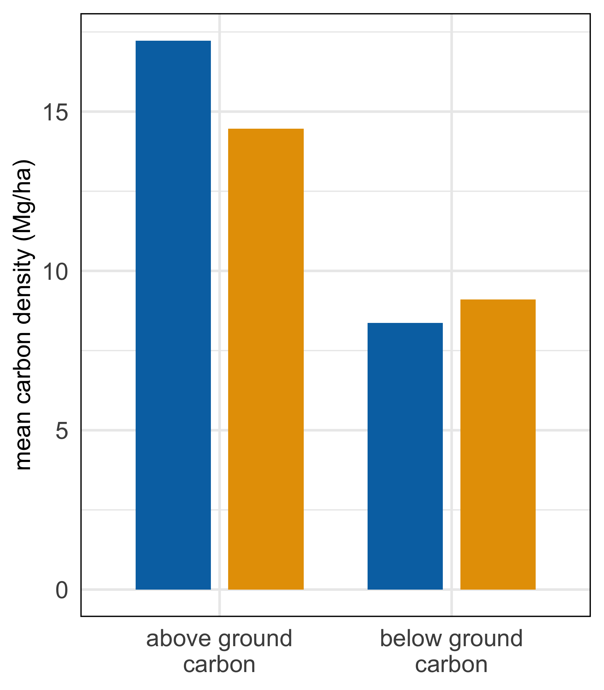

biomass
================
Millie Chapman
2/25/2021

``` r
library(tidyverse)
```

    ## ── Attaching packages ─────────────────────────────────────── tidyverse 1.3.0 ──

    ## ✓ ggplot2 3.3.3     ✓ purrr   0.3.4
    ## ✓ tibble  3.1.0     ✓ dplyr   1.0.5
    ## ✓ tidyr   1.1.3     ✓ stringr 1.4.0
    ## ✓ readr   1.4.0     ✓ forcats 0.5.1

    ## ── Conflicts ────────────────────────────────────────── tidyverse_conflicts() ──
    ## x dplyr::filter() masks stats::filter()
    ## x dplyr::lag()    masks stats::lag()

``` r
library(sf)
```

    ## Linking to GEOS 3.8.1, GDAL 3.1.4, PROJ 6.3.1

``` r
library(ungeviz)
```

``` r
abg_easement_uncertainty <- read_csv("../data/GEE/carbon/easement_abgcarbon_uncertainty.csv") %>%
  dplyr::select(agb_uncertainty_count, agb_uncertainty_sum) %>%
  dplyr::mutate(SE = agb_uncertainty_sum/agb_uncertainty_count) %>%
  select(agb_uncertainty_count,agb_uncertainty_sum, SE)
```

    ## 
    ## ── Column specification ────────────────────────────────────────────────────────
    ## cols(
    ##   .default = col_character(),
    ##   Access_Dt = col_double(),
    ##   AreaRptd = col_double(),
    ##   Date_Est = col_double(),
    ##   GAPCdDt = col_double(),
    ##   GAP_Sts = col_double(),
    ##   GIS_Acres = col_double(),
    ##   IUCNCtDt = col_double(),
    ##   SHAPE_Area = col_double(),
    ##   SHAPE_Leng = col_double(),
    ##   Src_Date = col_date(format = ""),
    ##   Term = col_double(),
    ##   WDPA_Cd = col_double(),
    ##   agb_uncertainty_count = col_double(),
    ##   agb_uncertainty_sum = col_double(),
    ##   .geo = col_logical()
    ## )
    ## ℹ Use `spec()` for the full column specifications.

``` r
bg_easement_uncertainty <- read_csv("../data/GEE/carbon/easement_bgcarbon_uncertainty.csv")%>%
  dplyr::select(bgb_uncertainty_count, bgb_uncertainty_sum) %>%
  dplyr::mutate(SE = bgb_uncertainty_sum/bgb_uncertainty_count) %>%   select(bgb_uncertainty_count,bgb_uncertainty_sum, SE)
```

    ## 
    ## ── Column specification ────────────────────────────────────────────────────────
    ## cols(
    ##   .default = col_character(),
    ##   Access_Dt = col_double(),
    ##   AreaRptd = col_double(),
    ##   Date_Est = col_double(),
    ##   GAPCdDt = col_double(),
    ##   GAP_Sts = col_double(),
    ##   GIS_Acres = col_double(),
    ##   IUCNCtDt = col_double(),
    ##   SHAPE_Area = col_double(),
    ##   SHAPE_Leng = col_double(),
    ##   Src_Date = col_date(format = ""),
    ##   Term = col_double(),
    ##   WDPA_Cd = col_double(),
    ##   bgb_uncertainty_count = col_double(),
    ##   bgb_uncertainty_sum = col_double(),
    ##   .geo = col_logical()
    ## )
    ## ℹ Use `spec()` for the full column specifications.

``` r
agb_fee_uncertainty <- read_csv("../data/GEE/carbon/fee_abgcarbon_uncertainty.csv")%>%
  dplyr::select(agb_uncertainty_count, agb_uncertainty_sum) %>%
  dplyr::mutate(SE = agb_uncertainty_sum/agb_uncertainty_count) %>%
    select(agb_uncertainty_count,agb_uncertainty_sum, SE)
```

    ## 
    ## ── Column specification ────────────────────────────────────────────────────────
    ## cols(
    ##   .default = col_character(),
    ##   Access_Dt = col_double(),
    ##   Date_Est = col_double(),
    ##   GAPCdDt = col_double(),
    ##   GAP_Sts = col_double(),
    ##   GIS_Acres = col_double(),
    ##   IUCNCtDt = col_double(),
    ##   SHAPE_Area = col_double(),
    ##   SHAPE_Leng = col_double(),
    ##   Src_Date = col_date(format = ""),
    ##   WDPA_Cd = col_double(),
    ##   agb_uncertainty_count = col_double(),
    ##   agb_uncertainty_sum = col_double(),
    ##   .geo = col_logical()
    ## )
    ## ℹ Use `spec()` for the full column specifications.

    ## Warning: 13138 parsing failures.
    ## row      col   expected     actual                                               file
    ## 498 Src_Date valid date 2012/00/00 '../data/GEE/carbon/fee_abgcarbon_uncertainty.csv'
    ## 735 Src_Date valid date 2008/00/00 '../data/GEE/carbon/fee_abgcarbon_uncertainty.csv'
    ## 736 Src_Date valid date 2008/00/00 '../data/GEE/carbon/fee_abgcarbon_uncertainty.csv'
    ## 737 Src_Date valid date 2008/00/00 '../data/GEE/carbon/fee_abgcarbon_uncertainty.csv'
    ## 782 Src_Date valid date 2008/00/00 '../data/GEE/carbon/fee_abgcarbon_uncertainty.csv'
    ## ... ........ .......... .......... ..................................................
    ## See problems(...) for more details.

``` r
bg_fee_uncertainty <- read_csv("../data/GEE/carbon/fee_bgcarbon_uncertainty.csv")%>%
  dplyr::select(bgb_uncertainty_count, bgb_uncertainty_sum) %>%
  dplyr::mutate(SE = bgb_uncertainty_sum/bgb_uncertainty_count) %>%
    select(bgb_uncertainty_count,bgb_uncertainty_sum, SE)
```

    ## 
    ## ── Column specification ────────────────────────────────────────────────────────
    ## cols(
    ##   .default = col_character(),
    ##   Access_Dt = col_double(),
    ##   Date_Est = col_double(),
    ##   GAPCdDt = col_double(),
    ##   GAP_Sts = col_double(),
    ##   GIS_Acres = col_double(),
    ##   IUCNCtDt = col_double(),
    ##   SHAPE_Area = col_double(),
    ##   SHAPE_Leng = col_double(),
    ##   Src_Date = col_date(format = ""),
    ##   WDPA_Cd = col_double(),
    ##   bgb_uncertainty_count = col_double(),
    ##   bgb_uncertainty_sum = col_double(),
    ##   .geo = col_logical()
    ## )
    ## ℹ Use `spec()` for the full column specifications.

    ## Warning: 13138 parsing failures.
    ## row      col   expected     actual                                              file
    ## 498 Src_Date valid date 2012/00/00 '../data/GEE/carbon/fee_bgcarbon_uncertainty.csv'
    ## 735 Src_Date valid date 2008/00/00 '../data/GEE/carbon/fee_bgcarbon_uncertainty.csv'
    ## 736 Src_Date valid date 2008/00/00 '../data/GEE/carbon/fee_bgcarbon_uncertainty.csv'
    ## 737 Src_Date valid date 2008/00/00 '../data/GEE/carbon/fee_bgcarbon_uncertainty.csv'
    ## 782 Src_Date valid date 2008/00/00 '../data/GEE/carbon/fee_bgcarbon_uncertainty.csv'
    ## ... ........ .......... .......... .................................................
    ## See problems(...) for more details.

``` r
abg_easement <- read_csv("../data/GEE/carbon/easement_abgcarbon2.csv") %>%
  bind_cols(abg_easement_uncertainty)
```

    ## 
    ## ── Column specification ────────────────────────────────────────────────────────
    ## cols(
    ##   .default = col_character(),
    ##   Access_Dt = col_double(),
    ##   AreaRptd = col_double(),
    ##   Date_Est = col_double(),
    ##   GAPCdDt = col_double(),
    ##   GAP_Sts = col_double(),
    ##   GIS_Acres = col_double(),
    ##   IUCNCtDt = col_double(),
    ##   SHAPE_Area = col_double(),
    ##   SHAPE_Leng = col_double(),
    ##   Src_Date = col_date(format = ""),
    ##   Term = col_double(),
    ##   WDPA_Cd = col_double(),
    ##   agb_count = col_double(),
    ##   agb_sum = col_double(),
    ##   .geo = col_logical()
    ## )
    ## ℹ Use `spec()` for the full column specifications.

``` r
bg_easement <- read_csv("../data/GEE/carbon/easement_bgcarbon2.csv") %>%
  bind_cols(bg_easement_uncertainty)
```

    ## 
    ## ── Column specification ────────────────────────────────────────────────────────
    ## cols(
    ##   .default = col_character(),
    ##   Access_Dt = col_double(),
    ##   AreaRptd = col_double(),
    ##   Date_Est = col_double(),
    ##   GAPCdDt = col_double(),
    ##   GAP_Sts = col_double(),
    ##   GIS_Acres = col_double(),
    ##   IUCNCtDt = col_double(),
    ##   SHAPE_Area = col_double(),
    ##   SHAPE_Leng = col_double(),
    ##   Src_Date = col_date(format = ""),
    ##   Term = col_double(),
    ##   WDPA_Cd = col_double(),
    ##   bgb_count = col_double(),
    ##   bgb_sum = col_double(),
    ##   .geo = col_logical()
    ## )
    ## ℹ Use `spec()` for the full column specifications.

``` r
agb_fee <- read_csv("../data/GEE/carbon/fee_abgcarbon2.csv") %>%
  bind_cols(agb_fee_uncertainty)
```

    ## 
    ## ── Column specification ────────────────────────────────────────────────────────
    ## cols(
    ##   .default = col_character(),
    ##   Access_Dt = col_double(),
    ##   Date_Est = col_double(),
    ##   GAPCdDt = col_double(),
    ##   GAP_Sts = col_double(),
    ##   GIS_Acres = col_double(),
    ##   IUCNCtDt = col_double(),
    ##   SHAPE_Area = col_double(),
    ##   SHAPE_Leng = col_double(),
    ##   Src_Date = col_date(format = ""),
    ##   WDPA_Cd = col_double(),
    ##   agb_count = col_double(),
    ##   agb_sum = col_double(),
    ##   .geo = col_logical()
    ## )
    ## ℹ Use `spec()` for the full column specifications.

    ## Warning: 13138 parsing failures.
    ## row      col   expected     actual                                    file
    ## 498 Src_Date valid date 2012/00/00 '../data/GEE/carbon/fee_abgcarbon2.csv'
    ## 735 Src_Date valid date 2008/00/00 '../data/GEE/carbon/fee_abgcarbon2.csv'
    ## 736 Src_Date valid date 2008/00/00 '../data/GEE/carbon/fee_abgcarbon2.csv'
    ## 737 Src_Date valid date 2008/00/00 '../data/GEE/carbon/fee_abgcarbon2.csv'
    ## 782 Src_Date valid date 2008/00/00 '../data/GEE/carbon/fee_abgcarbon2.csv'
    ## ... ........ .......... .......... .......................................
    ## See problems(...) for more details.

``` r
bg_fee <- read_csv("../data/GEE/carbon/fee_bgcarbon2.csv")%>%
  bind_cols(bg_fee_uncertainty)
```

    ## 
    ## ── Column specification ────────────────────────────────────────────────────────
    ## cols(
    ##   .default = col_character(),
    ##   Access_Dt = col_double(),
    ##   Date_Est = col_double(),
    ##   GAPCdDt = col_double(),
    ##   GAP_Sts = col_double(),
    ##   GIS_Acres = col_double(),
    ##   IUCNCtDt = col_double(),
    ##   SHAPE_Area = col_double(),
    ##   SHAPE_Leng = col_double(),
    ##   Src_Date = col_date(format = ""),
    ##   WDPA_Cd = col_double(),
    ##   bgb_count = col_double(),
    ##   bgb_sum = col_double(),
    ##   .geo = col_logical()
    ## )
    ## ℹ Use `spec()` for the full column specifications.

    ## Warning: 13138 parsing failures.
    ## row      col   expected     actual                                   file
    ## 498 Src_Date valid date 2012/00/00 '../data/GEE/carbon/fee_bgcarbon2.csv'
    ## 735 Src_Date valid date 2008/00/00 '../data/GEE/carbon/fee_bgcarbon2.csv'
    ## 736 Src_Date valid date 2008/00/00 '../data/GEE/carbon/fee_bgcarbon2.csv'
    ## 737 Src_Date valid date 2008/00/00 '../data/GEE/carbon/fee_bgcarbon2.csv'
    ## 782 Src_Date valid date 2008/00/00 '../data/GEE/carbon/fee_bgcarbon2.csv'
    ## ... ........ .......... .......... ......................................
    ## See problems(...) for more details.

``` r
bg_easement_table <- bg_easement %>%
  filter(GAP_Sts == 2 |GAP_Sts == 1) %>%
  dplyr::mutate(total_area = sum(bgb_count),
                type = "easements",
                carbon = "below ground\ncarbon") %>%
  select(total_area,type, carbon, bgb_sum, bgb_uncertainty_sum) %>%
  remove_missing() %>%
  #mutate(biomass_mean = bgb_sum/total_area) %>%
  group_by(carbon, type) %>%
  summarise(biomass_mean = sum(bgb_sum/total_area),
            SE = sum(bgb_uncertainty_sum/total_area)) %>% 
  unique()
```

    ## `summarise()` has grouped output by 'carbon'. You can override using the `.groups` argument.

``` r
easement <- abg_easement %>%
  filter(GAP_Sts == 2 |GAP_Sts == 1) %>%
  dplyr::mutate(total_area = sum(agb_count),
                type = "easements",
                carbon = "above ground\ncarbon") %>%
  select(total_area,type, carbon, agb_sum, agb_uncertainty_sum) %>%
  #mutate(biomass_mean = bgb_sum/total_area) %>%
  group_by(carbon, type) %>%
  summarise(biomass_mean = sum(agb_sum/total_area),
            SE = sum(agb_uncertainty_sum/total_area)) %>%  unique() %>%
  bind_rows(bg_easement_table) 
```

    ## `summarise()` has grouped output by 'carbon'. You can override using the `.groups` argument.

``` r
pa_bg <- bg_fee %>%
  filter(GAP_Sts == 2 |GAP_Sts == 1) %>%
  dplyr::mutate(total_area = sum(bgb_count),
                type = "protected areas",
                carbon = "below ground\ncarbon") %>%
  select(total_area,type, carbon, bgb_sum, bgb_uncertainty_sum) %>%
  #mutate(biomass_mean = bgb_sum/total_area) %>%
  group_by(carbon, type) %>%
  summarise(biomass_mean = sum(bgb_sum/total_area),
            SE = sum(bgb_uncertainty_sum/total_area)) %>% 
  unique()
```

    ## `summarise()` has grouped output by 'carbon'. You can override using the `.groups` argument.

``` r
pa <- agb_fee %>%
  filter(GAP_Sts == 2 |GAP_Sts == 1) %>%
  dplyr::mutate(total_area = sum(agb_count),
                type = "protected areas",
                carbon = "above ground\ncarbon") %>%
  select(total_area,type, carbon, agb_sum,agb_uncertainty_sum ) %>%
  #mutate(biomass_mean = bgb_sum/total_area) %>%
  group_by(carbon, type) %>%
  summarise(biomass_mean = sum(agb_sum/total_area),
            SE = sum(agb_uncertainty_sum/total_area)) %>% ungroup() %>%
  unique() %>% bind_rows(pa_bg)
```

    ## `summarise()` has grouped output by 'carbon'. You can override using the `.groups` argument.

``` r
carbon <- pa %>%
  bind_rows(easement)
```

``` r
bg_background <- read_csv("../data/GEE/carbon/us_bgcarbon_states.csv")
```

    ## 
    ## ── Column specification ────────────────────────────────────────────────────────
    ## cols(
    ##   `system:index` = col_character(),
    ##   ALAND = col_double(),
    ##   AWATER = col_double(),
    ##   DIVISION = col_double(),
    ##   FUNCSTAT = col_character(),
    ##   GEOID = col_character(),
    ##   INTPTLAT = col_double(),
    ##   INTPTLON = col_double(),
    ##   LSAD = col_character(),
    ##   MTFCC = col_character(),
    ##   NAME = col_character(),
    ##   REGION = col_double(),
    ##   STATEFP = col_character(),
    ##   STATENS = col_character(),
    ##   STUSPS = col_character(),
    ##   bgb_count = col_double(),
    ##   bgb_sum = col_double(),
    ##   .geo = col_logical()
    ## )

``` r
abg_background <- read_csv("../data/GEE/carbon/us_abgcarbon_states.csv")
```

    ## 
    ## ── Column specification ────────────────────────────────────────────────────────
    ## cols(
    ##   `system:index` = col_character(),
    ##   ALAND = col_double(),
    ##   AWATER = col_double(),
    ##   DIVISION = col_double(),
    ##   FUNCSTAT = col_character(),
    ##   GEOID = col_character(),
    ##   INTPTLAT = col_double(),
    ##   INTPTLON = col_double(),
    ##   LSAD = col_character(),
    ##   MTFCC = col_character(),
    ##   NAME = col_character(),
    ##   REGION = col_double(),
    ##   STATEFP = col_character(),
    ##   STATENS = col_character(),
    ##   STUSPS = col_character(),
    ##   agb_count = col_double(),
    ##   agb_sum = col_double(),
    ##   .geo = col_logical()
    ## )

``` r
bg_background <- bg_background %>%
  dplyr::mutate(total_area = sum(bgb_count),
                type = "background",
                carbon = "below ground\ncarbon") %>%
  select(total_area,type, carbon, bgb_sum) %>%
  #mutate(biomass_mean = bgb_sum/total_area) %>%
  group_by(carbon, type) %>%
  summarise(biomass_mean = sum(bgb_sum, na.rm = TRUE)/(total_area)) %>% 
  unique()
```

    ## `summarise()` has grouped output by 'carbon', 'type'. You can override using the `.groups` argument.

``` r
background <- abg_background %>%
  dplyr::mutate(total_area = sum(agb_count),
                type = "background",
                carbon = "above ground\ncarbon") %>%
  select(total_area,type, carbon, agb_sum) %>%
  #mutate(biomass_mean = bgb_sum/total_area) %>%
  group_by(carbon, type) %>%
  summarise(biomass_mean = sum(agb_sum, na.rm = TRUE)/(total_area)) %>%  unique() %>%
  bind_rows(bg_background) 
```

    ## `summarise()` has grouped output by 'carbon', 'type'. You can override using the `.groups` argument.

``` r
carbon %>%
  ggplot(aes(x = carbon, y = biomass_mean, fill = type)) +
  geom_bar(stat = "identity", width=0.65,position=position_dodge(width=0.8)) +
 # geom_errorbar(aes(x = carbon, ymin = biomass_mean-SE, ymax = biomass_mean+SE, group = type), position = position_dodge(width=0.8), width = 0.25) +
  scale_fill_manual(values=c("#0072B2","#E69F00")) +
 # geom_hpline(data = background, aes(x=carbon, y =biomass_mean), stat = "identity", height = 0.4, lwd = .75) +
 # geom_point(background, mapping = aes(x = carbon, y= biomass_mean), pch = 19)+
  theme_minimal() +
  labs(y = "mean carbon density (Mg/ha)") +
  theme(axis.title.x =element_blank()) +
  theme(legend.title = element_blank()) + #coord_flip() +
  theme(legend.position = "none") +
   theme(axis.text=element_text(size=10),
        axis.title=element_text(size=10),
        panel.border = element_rect(colour = "black", fill=NA),
        legend.box.background = element_rect(colour = "black"),
        legend.text = element_text(size = 8)) +
  guides(shape = guide_legend(override.aes = list(size = 5))) 
```

<!-- -->
