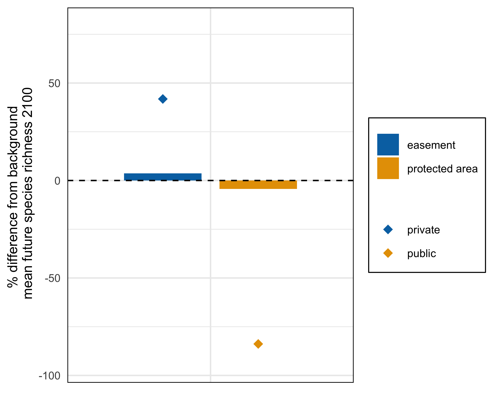

climate-distribution-figures
================
Millie Chapman
3/17/2021

``` r
library(tidyverse)
```

    ## ── Attaching packages ─────────────────────────────────────── tidyverse 1.3.0 ──

    ## ✓ ggplot2 3.3.3     ✓ purrr   0.3.4
    ## ✓ tibble  3.1.0     ✓ dplyr   1.0.5
    ## ✓ tidyr   1.1.3     ✓ stringr 1.4.0
    ## ✓ readr   1.4.0     ✓ forcats 0.5.1

    ## ── Conflicts ────────────────────────────────────────── tidyverse_conflicts() ──
    ## x dplyr::filter() masks stats::filter()
    ## x dplyr::lag()    masks stats::lag()

``` r
library(sf)
```

    ## Linking to GEOS 3.8.1, GDAL 3.1.4, PROJ 6.3.1

``` r
library(ungeviz)
```

``` r
easement <- st_read("../data/PADUS2_0_Shapefiles/PADUS2_0Easement.shp") %>%
  mutate(area = st_area(geometry)) %>%
    filter(GAP_Sts == 1 | GAP_Sts == 2) %>%
  select(area, SHAPE_Area, State_Nm, Unit_Nm) %>%
  mutate(PA_CE = "easement") %>%
  group_by(PA_CE) %>%
  mutate(total_area = sum(area)) %>% ungroup()
```

    ## Reading layer `PADUS2_0Easement' from data source `/Users/milliechapman/Desktop/Berkeley/birdlife/data/PADUS2_0_Shapefiles/PADUS2_0Easement.shp' using driver `ESRI Shapefile'
    ## Simple feature collection with 140241 features and 51 fields
    ## geometry type:  MULTIPOLYGON
    ## dimension:      XY
    ## bbox:           xmin: -10403400 ymin: -57047.14 xmax: 3317527 ymax: 6532636
    ## projected CRS:  USA_Contiguous_Albers_Equal_Area_Conic_USGS_version

``` r
easement <- as_tibble(easement)

easement_future <- read_csv("../data/climate-distributions/easement_futurespp_all.csv") %>%
  rename(amphibians = "b1",
         birds = "b1_1",
         mammals = "b1_2",
         plants = "b1_3",
         reptiles = "b1_4") %>%
    filter(GAP_Sts == 1 | GAP_Sts == 2) %>%
  select(Date_Est, GAP_Sts, State_Nm, Unit_Nm, SHAPE_Area, SHAPE_Leng, amphibians:reptiles) %>%
  left_join(easement) %>%
  mutate(amphibians = amphibians*area/total_area,
         birds = birds*area/total_area,
         mammals = mammals*area/total_area,
         plants = plants*area/total_area,
         reptiles = reptiles*area/total_area) 
```

    ## 
    ## ── Column specification ────────────────────────────────────────────────────────
    ## cols(
    ##   .default = col_character(),
    ##   Access_Dt = col_double(),
    ##   AreaRptd = col_double(),
    ##   Date_Est = col_double(),
    ##   GAPCdDt = col_double(),
    ##   GAP_Sts = col_double(),
    ##   GIS_Acres = col_double(),
    ##   IUCNCtDt = col_double(),
    ##   SHAPE_Area = col_double(),
    ##   SHAPE_Leng = col_double(),
    ##   Src_Date = col_date(format = ""),
    ##   Term = col_double(),
    ##   WDPA_Cd = col_double(),
    ##   b1 = col_double(),
    ##   b1_1 = col_double(),
    ##   b1_2 = col_double(),
    ##   b1_3 = col_double(),
    ##   b1_4 = col_double(),
    ##   .geo = col_logical()
    ## )
    ## ℹ Use `spec()` for the full column specifications.

    ## Joining, by = c("State_Nm", "Unit_Nm", "SHAPE_Area")

``` r
fee_exp <- st_read("../data/GEE/feeexpnum.shp") %>%
    filter(GAP_Sts == 1 | GAP_Sts == 2) %>%
  mutate(area = st_area(geometry)) %>%
  mutate(PA_CE = "protected area") %>%
  group_by(PA_CE) %>%
  mutate(total_area = sum(area)) %>% ungroup()
```

    ## Reading layer `feeexpnum' from data source `/Users/milliechapman/Desktop/Berkeley/birdlife/data/GEE/feeexpnum.shp' using driver `ESRI Shapefile'
    ## Simple feature collection with 178936 features and 8 fields
    ## geometry type:  MULTIPOLYGON
    ## dimension:      XY
    ## bbox:           xmin: -11816080 ymin: -262699.1 xmax: 3407884 ymax: 7786809
    ## projected CRS:  USA_Contiguous_Albers_Equal_Area_Conic_USGS_version

``` r
fee_exp <- as_tibble(fee_exp) %>%
  select(Date_Est, GAP_Sts, area,State_Nm,  num, total_area, PA_CE) 
  
fee_future <- read_csv("../data/climate-distributions/fee_futurespp_all_numbered.csv") %>%
  rename(amphibians = "b1",
         birds = "b1_1",
         mammals = "b1_2",
         plants = "b1_3",
         reptiles = "b1_4") %>%
  filter(GAP_Sts == 1 | GAP_Sts == 2) %>%
  select(amphibians:num) %>%
  left_join(fee_exp, by = "num") %>%
  group_by(PA_CE) %>%
  mutate(total_area = sum(area)) %>%
  ungroup %>%
  arrange(Date_Est) %>%
  mutate(amphibians = amphibians*area/total_area,
         birds = birds*area/total_area,
         mammals = mammals*area/total_area,
         plants = plants*area/total_area,
         reptiles = reptiles*area/total_area) 
```

    ## 
    ## ── Column specification ────────────────────────────────────────────────────────
    ## cols(
    ##   `system:index` = col_character(),
    ##   Category = col_logical(),
    ##   Date_Est = col_logical(),
    ##   GAP_Sts = col_logical(),
    ##   Mang_Type = col_logical(),
    ##   State_Nm = col_logical(),
    ##   b1 = col_double(),
    ##   b1_1 = col_double(),
    ##   b1_2 = col_double(),
    ##   b1_3 = col_double(),
    ##   b1_4 = col_double(),
    ##   d_State_Nm = col_logical(),
    ##   num = col_double(),
    ##   valid = col_double(),
    ##   .geo = col_logical()
    ## )

    ## Warning: 201412 parsing failures.
    ##   row      col           expected actual                                                           file
    ## 16957 Category 1/0/T/F/TRUE/FALSE   1873 '../data/climate-distributions/fee_futurespp_all_numbered.csv'
    ## 16958 Category 1/0/T/F/TRUE/FALSE   1875 '../data/climate-distributions/fee_futurespp_all_numbered.csv'
    ## 16959 Category 1/0/T/F/TRUE/FALSE   1887 '../data/climate-distributions/fee_futurespp_all_numbered.csv'
    ## 16960 Category 1/0/T/F/TRUE/FALSE   1888 '../data/climate-distributions/fee_futurespp_all_numbered.csv'
    ## 16961 Category 1/0/T/F/TRUE/FALSE   1891 '../data/climate-distributions/fee_futurespp_all_numbered.csv'
    ## ..... ........ .................. ...... ..............................................................
    ## See problems(...) for more details.

``` r
background_future <- read_csv("../data/climate-distributions/background_futurespp_all.csv") %>%
  rename(amphibians = "b1",
         birds = "b1_1",
         mammals = "b1_2",
         plants = "b1_3",
         reptiles = "b1_4") %>%
  group_by(ADM0_NAME) %>%
  summarise(amphibians = mean(amphibians),
            birds = mean(birds),
            mammals = mean(mammals),
           # plants = mean(plants),
            reptiles = mean(reptiles),
            richness = amphibians+birds+mammals+reptiles) %>%
  pivot_longer(-ADM0_NAME) %>%
  rename(background = "value") %>%
  select(-ADM0_NAME)
```

    ## 
    ## ── Column specification ────────────────────────────────────────────────────────
    ## cols(
    ##   `system:index` = col_character(),
    ##   ADM0_CODE = col_double(),
    ##   ADM0_NAME = col_character(),
    ##   ADM1_CODE = col_double(),
    ##   ADM1_NAME = col_character(),
    ##   DISP_AREA = col_character(),
    ##   EXP1_YEAR = col_double(),
    ##   STATUS = col_character(),
    ##   STR1_YEAR = col_double(),
    ##   Shape_Area = col_double(),
    ##   Shape_Leng = col_double(),
    ##   b1 = col_double(),
    ##   b1_1 = col_double(),
    ##   b1_2 = col_double(),
    ##   b1_3 = col_double(),
    ##   b1_4 = col_double(),
    ##   .geo = col_logical()
    ## )

``` r
easement_grouped <- easement_future %>%
  group_by(PA_CE) %>%
  summarise(amphibians = sum(amphibians, na.rm = TRUE),
         birds = sum(birds,na.rm = TRUE),
         mammals = sum(mammals, na.rm = TRUE),
         #plants = sum(plants, na.rm = TRUE),
         reptiles = sum(reptiles, na.rm = TRUE),
         richness = amphibians+birds+mammals+reptiles) %>% 
  drop_na()
```

``` r
fee_grouped <- fee_future %>% group_by(PA_CE) %>%
  summarise(amphibians = sum(amphibians, na.rm = TRUE),
         birds = sum(birds,na.rm = TRUE),
         mammals = sum(mammals, na.rm = TRUE),
        # plants = sum(plants, na.rm = TRUE),
         reptiles = sum(reptiles, na.rm = TRUE),
         richness = amphibians+birds+mammals+reptiles)
```

``` r
future_richness <-  fee_grouped %>% bind_rows(easement_grouped) %>%
  pivot_longer(-PA_CE) %>%
  mutate(value = as.numeric(value)) %>%
  left_join(background_future)
```

    ## Joining, by = "name"

``` r
public_private_future <- read_csv("../data/private_public_future.csv") %>%
  left_join(background_future) %>%
  mutate(richness = value-background) %>%
  group_by(type) %>%
  summarise(value = sum(value),
            backgroud = sum(background),
            richness = sum(richness)/sum(background)*100)%>% 
  ungroup() %>%
  mutate(name = "richness")
```

    ## 
    ## ── Column specification ────────────────────────────────────────────────────────
    ## cols(
    ##   type = col_character(),
    ##   name = col_character(),
    ##   value = col_double()
    ## )

    ## Joining, by = "name"

``` r
 future_richness  %>%
  mutate(richness = (as.numeric(value)- as.numeric(background))/as.numeric(background)*100) %>%
  filter(name == "richness") %>%
  ggplot() + 
  scale_fill_manual(values=c("#0072B2", "#E69F00")) +
  geom_bar(mapping = aes(x= name, y= as.numeric(richness), fill = PA_CE),
                                  stat = "identity", width=0.65,
                                  position=position_dodge(width=0.8)) +
  geom_hline(yintercept = 0, linetype = "dashed") +
    ylim(-95,80) +
 geom_point(public_private_future, mapping = aes(x = name, y= as.numeric(richness),  group = type, color = type), stat = "identity", position=position_dodge(width=0.8),  pch = 18, size = 3) +
  scale_color_manual(values=c("#0072B2", "#E69F00")) +
  theme_minimal() +
  theme(axis.title.x =element_blank()) +
  theme(axis.text.x =element_blank()) +
  #theme(axis.text.y = element_text(angle = 90,hjust=0.5)) +
  theme(legend.title = element_blank()) + #coord_flip() +
  #theme(legend.position = c(0.82,0.78)) +
  theme(axis.text=element_text(size=8),
        axis.title=element_text(size=10),
        panel.border = element_rect(colour = "black", fill=NA),
        legend.box.background = element_rect(colour = "black"),
        legend.text = element_text(size = 8)) +
  guides(shape = guide_legend(override.aes = list(size = 5))) +
    labs(y = "% difference from background \n mean future species richness 2100") 
```

<!-- -->

``` r
 ## facet_grid(rows = vars(GAP_Sts))
```
