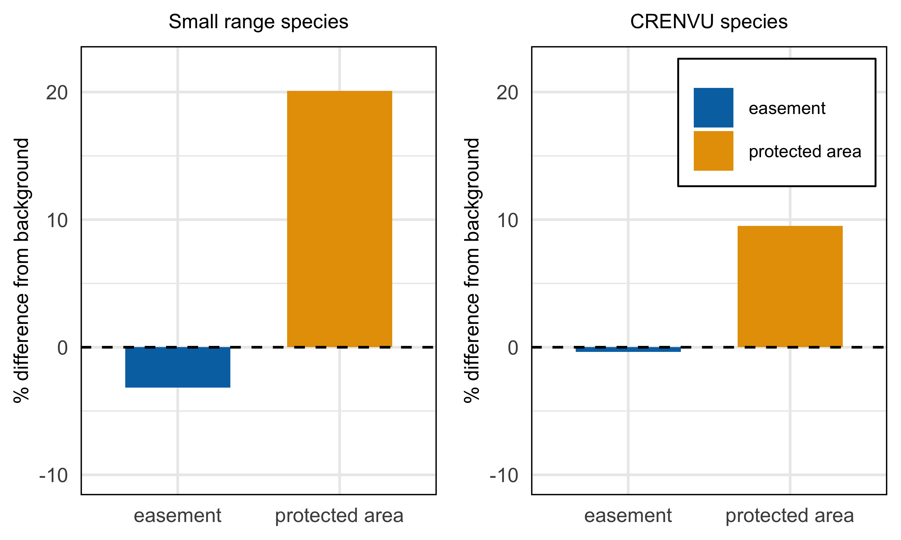

figures-sr
================
Millie Chapman
3/1/2021

``` r
library(sf)
```

    ## Linking to GEOS 3.8.1, GDAL 3.1.4, PROJ 6.3.1

``` r
library(tidyverse)
```

    ## ── Attaching packages ─────────────────────────────────────── tidyverse 1.3.0 ──

    ## ✓ ggplot2 3.3.3     ✓ purrr   0.3.4
    ## ✓ tibble  3.1.0     ✓ dplyr   1.0.5
    ## ✓ tidyr   1.1.3     ✓ stringr 1.4.0
    ## ✓ readr   1.4.0     ✓ forcats 0.5.1

    ## ── Conflicts ────────────────────────────────────────── tidyverse_conflicts() ──
    ## x dplyr::filter() masks stats::filter()
    ## x dplyr::lag()    masks stats::lag()

``` r
library(ggplot2)
library(ungeviz)
```

``` r
fee_richness <- st_read("../data/output/fee_richness_sr.shp")
```

    ## Reading layer `fee_richness_sr' from data source `/Users/milliechapman/Desktop/Berkeley/birdlife/data/output/fee_richness_sr.shp' using driver `ESRI Shapefile'
    ## Simple feature collection with 35711 features and 47 fields
    ## geometry type:  MULTIPOLYGON
    ## dimension:      XY
    ## bbox:           xmin: -11816080 ymin: -262699.1 xmax: 3399943 ymax: 7786809
    ## projected CRS:  USA_Contiguous_Albers_Equal_Area_Conic_USGS_version

``` r
easement_richness1 <- st_read("../data/output/easement_richness1_sr.shp")
```

    ## Reading layer `easement_richness1_sr' from data source `/Users/milliechapman/Desktop/Berkeley/birdlife/data/output/easement_richness1_sr.shp' using driver `ESRI Shapefile'
    ## Simple feature collection with 1297 features and 56 fields
    ## geometry type:  MULTIPOLYGON
    ## dimension:      XY
    ## bbox:           xmin: -3400432 ymin: 34616.11 xmax: 3317527 ymax: 5805660
    ## projected CRS:  USA_Contiguous_Albers_Equal_Area_Conic_USGS_version

``` r
easement_richness2 <- st_read("../data/output/easement_richness2_sr.shp")
```

    ## Reading layer `easement_richness2_sr' from data source `/Users/milliechapman/Desktop/Berkeley/birdlife/data/output/easement_richness2_sr.shp' using driver `ESRI Shapefile'
    ## Simple feature collection with 29351 features and 56 fields
    ## geometry type:  MULTIPOLYGON
    ## dimension:      XY
    ## bbox:           xmin: -6200667 ymin: 311165.3 xmax: 2244940 ymax: 5964881
    ## projected CRS:  USA_Contiguous_Albers_Equal_Area_Conic_USGS_version

``` r
easement_richness <- easement_richness1 %>%
  bind_rows(easement_richness2)
```

``` r
background_richness <- st_read("../data/output/background_richness_sr.shp")
```

    ## Reading layer `background_richness_sr' from data source `/Users/milliechapman/Desktop/Berkeley/birdlife/data/output/background_richness_sr.shp' using driver `ESRI Shapefile'
    ## Simple feature collection with 1 feature and 7 fields
    ## geometry type:  MULTIPOLYGON
    ## dimension:      XY
    ## bbox:           xmin: -179.1506 ymin: 18.90986 xmax: 179.7734 ymax: 72.6875
    ## geographic CRS: WGS 84

area weight biodiversity

``` r
easement <- easement_richness %>%
  mutate(area = st_area(geometry)) %>%
  mutate(total_area = sum(area)) %>%
  mutate(perc_area = area/total_area) %>%
  mutate(reptiles = mean(rptl_rc, na.rm = TRUE)*perc_area,
         amphibians = mean(amphbn_, na.rm = TRUE)*perc_area,
         mammals= mean(mmml_rc, na.rm = TRUE)*perc_area,
         birds = mean(brd_rch, na.rm = TRUE)*perc_area,
         fish = mean(fsh_rch, na.rm = TRUE)*perc_area)

fee <- fee_richness %>%
  mutate(area = st_area(geometry)) %>%
  mutate(total_area = sum(area)) %>%
  mutate(perc_area = area/total_area) %>%
  mutate(reptiles = mean(rptl_rc, na.rm = TRUE)*perc_area,
         amphibians = mean(amphbn_, na.rm = TRUE)*perc_area,
         mammals= mean(mmml_rc, na.rm = TRUE)*perc_area,
         birds = mean(brd_rch, na.rm = TRUE)*perc_area,
         fish = mean(fsh_rch, na.rm = TRUE)*perc_area)
```

``` r
dplyr::as_tibble(fee) %>%
  group_by(GAP_Sts) %>%
  count()
```

    ## # A tibble: 2 x 2
    ## # Groups:   GAP_Sts [2]
    ##   GAP_Sts     n
    ##   <chr>   <int>
    ## 1 1        2579
    ## 2 2       33132

``` r
richness_easement <- dplyr::as_tibble(easement) %>%
  dplyr::mutate(type = "easement",
                perc_area = area/total_area) %>%
  dplyr::group_by(type) %>%
  dplyr::summarize(reptiles = sum(reptiles, na.rm = TRUE),
            amphibians = sum(amphibians, na.rm = TRUE),
            mammals= sum(mammals, na.rm = TRUE),
            birds = sum(birds, na.rm = TRUE),
            fish = sum(fish, na.rm = TRUE))
  
richness_pa <- dplyr::as_tibble(fee) %>%
  mutate(type = "protected area") %>%
  #filter(GAP_Sts == "2") %>%
  group_by(type) %>%
  dplyr::summarize(reptiles = sum(reptiles, na.rm = TRUE),
            amphibians = sum(amphibians, na.rm = TRUE),
            mammals= sum(mammals, na.rm = TRUE),
            birds = sum(birds, na.rm = TRUE),
            fish = sum(fish, na.rm = TRUE))
```

``` r
richness_all <- as_tibble(background_richness) %>%
  dplyr::mutate(type = NAME_0,
         reptiles = mean(rptl_rc, na.rm = TRUE),
         amphibians = mean(amphbn_, na.rm = TRUE),
         mammals= mean(mmml_rc, na.rm = TRUE),
         #birds = mean(brd_rch, na.rm = TRUE),
         fish = mean(fsh_rch, na.rm = TRUE),
         richness_background = reptiles + amphibians + mammals+fish) %>% 
  select(type, richness_background) %>%
  rename(name = "type")

richness_protected_SR <-richness_pa %>%
  bind_rows(richness_easement) %>%
  mutate(richness = reptiles + amphibians + mammals+fish) %>%
  select(type, richness) %>%
  mutate(name = "United States") %>%
  left_join(richness_all) %>%
  mutate(richness = as.numeric(richness)) %>%
  mutate(richness = (richness-richness_background)/richness_background*100)
```

    ## Joining, by = "name"

``` r
SR <- ggplot() + 
  scale_fill_manual(values=c("#0072B2", "#E69F00")) +
  geom_bar(richness_protected_SR, mapping = aes(x= type, y= richness, fill = type),
                                  stat = "identity", width=0.65,
                                  position=position_dodge(width=0.8)) +
  geom_hline(yintercept = 0, linetype = "dashed") +
  #geom_point(richness_background, mapping = aes(x = name, y= value), pch = 19) +
  theme_minimal() + ylim(-10,22) +
  labs(y ="% difference from background", title = "Small range species") +
  theme(axis.title.x = element_blank()) + 
  theme(legend.title = element_blank()) + 
  theme(legend.position = "none") +
   theme(plot.title = element_text(size=8, hjust = 0.5),
        axis.text=element_text(size=8),
        axis.title=element_text(size=8),
        panel.border = element_rect(colour = "black", fill=NA),
        legend.box.background = element_rect(colour = "black"),
        legend.text = element_text(size = 8)) +
  guides(shape = guide_legend(override.aes = list(size = 5))) #+ 
 ## facet_grid(rows = vars(GAP_Sts))
```

\#CRENVU

``` r
fee_richness <- st_read("../data/output/fee_richness_crenvu.shp")
```

    ## Reading layer `fee_richness_crenvu' from data source `/Users/milliechapman/Desktop/Berkeley/birdlife/data/output/fee_richness_crenvu.shp' using driver `ESRI Shapefile'
    ## Simple feature collection with 35711 features and 46 fields
    ## geometry type:  MULTIPOLYGON
    ## dimension:      XY
    ## bbox:           xmin: -11816080 ymin: -262699.1 xmax: 3399943 ymax: 7786809
    ## projected CRS:  USA_Contiguous_Albers_Equal_Area_Conic_USGS_version

``` r
easement_richness1 <- st_read("../data/output/easement_richness1_crenvu.shp")
```

    ## Reading layer `easement_richness1_crenvu' from data source `/Users/milliechapman/Desktop/Berkeley/birdlife/data/output/easement_richness1_crenvu.shp' using driver `ESRI Shapefile'
    ## Simple feature collection with 1297 features and 55 fields
    ## geometry type:  MULTIPOLYGON
    ## dimension:      XY
    ## bbox:           xmin: -3400432 ymin: 34616.11 xmax: 3317527 ymax: 5805660
    ## projected CRS:  USA_Contiguous_Albers_Equal_Area_Conic_USGS_version

``` r
easement_richness2 <- st_read("../data/output/easement_richness2_crenvu.shp")
```

    ## Reading layer `easement_richness2_crenvu' from data source `/Users/milliechapman/Desktop/Berkeley/birdlife/data/output/easement_richness2_crenvu.shp' using driver `ESRI Shapefile'
    ## Simple feature collection with 29351 features and 55 fields
    ## geometry type:  MULTIPOLYGON
    ## dimension:      XY
    ## bbox:           xmin: -6200667 ymin: 311165.3 xmax: 2244940 ymax: 5964881
    ## projected CRS:  USA_Contiguous_Albers_Equal_Area_Conic_USGS_version

``` r
easement_richness <- easement_richness1 %>%
  bind_rows(easement_richness2)
```

``` r
background_richness <- st_read("../data/output/background_richness_crenvu.shp")
```

    ## Reading layer `background_richness_crenvu' from data source `/Users/milliechapman/Desktop/Berkeley/birdlife/data/output/background_richness_crenvu.shp' using driver `ESRI Shapefile'
    ## Simple feature collection with 1 feature and 6 fields
    ## geometry type:  MULTIPOLYGON
    ## dimension:      XY
    ## bbox:           xmin: -179.1506 ymin: 18.90986 xmax: 179.7734 ymax: 72.6875
    ## geographic CRS: WGS 84

area weight biodiversity

``` r
easement <- easement_richness %>%
  mutate(area = st_area(geometry)) %>%
  mutate(total_area = sum(area)) %>%
  mutate(perc_area = area/total_area) %>%
  mutate(reptiles = mean(rptl_rc, na.rm = TRUE)*perc_area,
         amphibians = mean(amphbn_, na.rm = TRUE)*perc_area,
         mammals= mean(mmml_rc, na.rm = TRUE)*perc_area,
         #birds = mean(brd_rch, na.rm = TRUE)*perc_area,
         fish = mean(fsh_rch, na.rm = TRUE)*perc_area)

fee <- fee_richness %>%
  mutate(area = st_area(geometry)) %>%
  mutate(total_area = sum(area)) %>%
  mutate(perc_area = area/total_area) %>%
  mutate(reptiles = mean(rptl_rc, na.rm = TRUE)*perc_area,
         amphibians = mean(amphbn_, na.rm = TRUE)*perc_area,
         mammals= mean(mmml_rc, na.rm = TRUE)*perc_area,
         #birds = mean(brd_rch, na.rm = TRUE)*perc_area,
         fish = mean(fsh_rch, na.rm = TRUE)*perc_area)
```

``` r
dplyr::as_tibble(fee) %>%
  group_by(GAP_Sts) %>%
  count()
```

    ## # A tibble: 2 x 2
    ## # Groups:   GAP_Sts [2]
    ##   GAP_Sts     n
    ##   <chr>   <int>
    ## 1 1        2579
    ## 2 2       33132

``` r
richness_easement <- dplyr::as_tibble(easement) %>%
  dplyr::mutate(type = "easement",
                perc_area = area/total_area) %>%
  dplyr::group_by(type) %>%
  dplyr::summarize(reptiles = sum(reptiles, na.rm = TRUE),
            amphibians = sum(amphibians, na.rm = TRUE),
            mammals= sum(mammals, na.rm = TRUE),
            #birds = sum(birds, na.rm = TRUE),
            fish = sum(fish, na.rm = TRUE))
  
richness_pa <- dplyr::as_tibble(fee) %>%
  mutate(type = "protected area") %>%
  #filter(GAP_Sts == "2") %>%
  group_by(type) %>%
  dplyr::summarize(reptiles = sum(reptiles, na.rm = TRUE),
            amphibians = sum(amphibians, na.rm = TRUE),
            mammals= sum(mammals, na.rm = TRUE),
            #birds = sum(birds, na.rm = TRUE),
            fish = sum(fish, na.rm = TRUE))
```

``` r
richness_all <- as_tibble(background_richness) %>%
  dplyr::mutate(type = NAME_0,
         reptiles = mean(rptl_rc, na.rm = TRUE),
         amphibians = mean(amphbn_, na.rm = TRUE),
         mammals= mean(mmml_rc, na.rm = TRUE),
         #birds = mean(brd_rch, na.rm = TRUE),
         fish = mean(fsh_rch, na.rm = TRUE),
         richness_background = reptiles + amphibians + mammals+fish) %>% 
  select(type, richness_background) %>%
  rename(name = "type")

richness_protected_crenvu <-richness_pa %>%
  bind_rows(richness_easement) %>%
  mutate(richness = reptiles + amphibians + mammals+fish) %>%
  select(type, richness) %>%
  mutate(name = "United States") %>%
  left_join(richness_all) %>%
  mutate(richness = as.numeric(richness)) %>%
  mutate(richness = (richness-richness_background)/richness_background*100)
```

    ## Joining, by = "name"

``` r
crenvu <- ggplot() + 
  scale_fill_manual(values=c("#0072B2", "#E69F00")) +
  geom_bar(richness_protected_crenvu, mapping = aes(x= type, y= richness, fill = type),
                                  stat = "identity", width=0.65,
                                  position=position_dodge(width=0.8)) +
  geom_hline(yintercept = 0, linetype = "dashed") +
 # geom_point(richness_background, mapping = aes(x = name, y= value), pch = 19) +
  theme_minimal() + ylim(-10,22) + labs(title = "CRENVU species") +
  theme(axis.title.x =element_blank()) +
  theme(legend.title = element_blank()) + 
  theme(legend.position = c(0.69, 0.83)) +
  theme(plot.title = element_text(size=8, hjust = 0.5),
        axis.text=element_text(size=8),
        axis.title=element_text(size=8),
        panel.border = element_rect(colour = "black", fill=NA),
        legend.box.background = element_rect(colour = "black"),
        legend.text = element_text(size = 7)) +
  guides(shape = guide_legend(override.aes = list(size = 5))) +
  labs(y = "% difference from background")#+ 
 ## facet_grid(rows = vars(GAP_Sts))
```

``` r
library(gridExtra)
```

    ## 
    ## Attaching package: 'gridExtra'

    ## The following object is masked from 'package:dplyr':
    ## 
    ##     combine

``` r
library(ggpubr)
ggarrange(SR, crenvu)
```

<!-- -->
