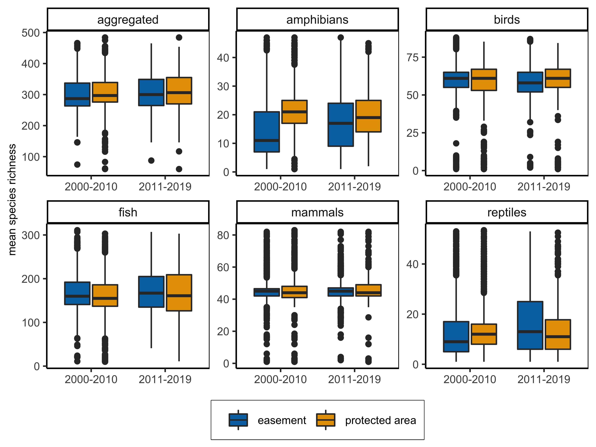

figures
================
Millie Chapman
2/25/2021

``` r
library(sf)
```

    ## Linking to GEOS 3.8.1, GDAL 3.1.4, PROJ 6.3.1

``` r
library(tidyverse)
```

    ## ── Attaching packages ─────────────────────────────────────── tidyverse 1.3.0 ──

    ## ✓ ggplot2 3.3.2     ✓ purrr   0.3.4
    ## ✓ tibble  3.0.4     ✓ dplyr   1.0.2
    ## ✓ tidyr   1.1.2     ✓ stringr 1.4.0
    ## ✓ readr   1.4.0     ✓ forcats 0.5.0

    ## ── Conflicts ────────────────────────────────────────── tidyverse_conflicts() ──
    ## x dplyr::filter() masks stats::filter()
    ## x dplyr::lag()    masks stats::lag()

``` r
library(ggplot2)
library(ungeviz)
```

``` r
fee_richness <- st_read("../data/output/fee_richness.shp")
```

    ## Reading layer `fee_richness' from data source `/Users/milliechapman/Desktop/Berkeley/birdlife/data/output/fee_richness.shp' using driver `ESRI Shapefile'
    ## Simple feature collection with 35711 features and 47 fields
    ## geometry type:  MULTIPOLYGON
    ## dimension:      XY
    ## bbox:           xmin: -11816080 ymin: -262699.1 xmax: 3399943 ymax: 7786809
    ## projected CRS:  USA_Contiguous_Albers_Equal_Area_Conic_USGS_version

``` r
easement_richness1 <- st_read("../data/output/easement_richness1.shp")
```

    ## Reading layer `easement_richness1' from data source `/Users/milliechapman/Desktop/Berkeley/birdlife/data/output/easement_richness1.shp' using driver `ESRI Shapefile'
    ## Simple feature collection with 1297 features and 56 fields
    ## geometry type:  MULTIPOLYGON
    ## dimension:      XY
    ## bbox:           xmin: -3400432 ymin: 34616.11 xmax: 3317527 ymax: 5805660
    ## projected CRS:  USA_Contiguous_Albers_Equal_Area_Conic_USGS_version

``` r
easement_richness2 <- st_read("../data/output/easement_richness2.shp")
```

    ## Reading layer `easement_richness2' from data source `/Users/milliechapman/Desktop/Berkeley/birdlife/data/output/easement_richness2.shp' using driver `ESRI Shapefile'
    ## Simple feature collection with 29351 features and 56 fields
    ## geometry type:  MULTIPOLYGON
    ## dimension:      XY
    ## bbox:           xmin: -6200667 ymin: 311165.3 xmax: 2244940 ymax: 5964881
    ## projected CRS:  USA_Contiguous_Albers_Equal_Area_Conic_USGS_version

``` r
easement_richness <- easement_richness1 %>%
  bind_rows(easement_richness2)
```

``` r
background_richness <- st_read("../data/output/background_richness.shp")
```

    ## Reading layer `background_richness' from data source `/Users/milliechapman/Desktop/Berkeley/birdlife/data/output/background_richness.shp' using driver `ESRI Shapefile'
    ## Simple feature collection with 1 feature and 7 fields
    ## geometry type:  MULTIPOLYGON
    ## dimension:      XY
    ## bbox:           xmin: -179.1506 ymin: 18.90986 xmax: 179.7734 ymax: 72.6875
    ## geographic CRS: WGS 84

area weight biodiversity

``` r
easement <- easement_richness %>%
  mutate(area = st_area(geometry)) %>%
  mutate(total_area = sum(area)) %>%
  mutate(perc_area = area/total_area) %>%
  mutate(reptiles = mean(rptl_rc, na.rm = TRUE)*perc_area,
         amphibians = mean(amphbn_, na.rm = TRUE)*perc_area,
         mammals= mean(mmml_rc, na.rm = TRUE)*perc_area,
         birds = mean(brd_rch, na.rm = TRUE)*perc_area,
         fish = mean(fsh_rch, na.rm = TRUE)*perc_area)

fee <- fee_richness %>%
  mutate(area = st_area(geometry)) %>%
  mutate(total_area = sum(area)) %>%
  mutate(perc_area = area/total_area) %>%
  mutate(reptiles = mean(rptl_rc, na.rm = TRUE)*perc_area,
         amphibians = mean(amphbn_, na.rm = TRUE)*perc_area,
         mammals= mean(mmml_rc, na.rm = TRUE)*perc_area,
         birds = mean(brd_rch, na.rm = TRUE)*perc_area,
         fish = mean(fsh_rch, na.rm = TRUE)*perc_area)
```

``` r
dplyr::as_tibble(fee) %>%
  group_by(GAP_Sts) %>%
  count()
```

    ## # A tibble: 2 x 2
    ## # Groups:   GAP_Sts [2]
    ##   GAP_Sts     n
    ##   <chr>   <int>
    ## 1 1        2579
    ## 2 2       33132

``` r
richness_easement <- dplyr::as_tibble(easement) %>%
  dplyr::mutate(type = "easement",
                perc_area = area/total_area) %>%
  dplyr::group_by(type) %>%
  dplyr::summarize(reptiles = sum(reptiles, na.rm = TRUE),
            amphibians = sum(amphibians, na.rm = TRUE),
            mammals= sum(mammals, na.rm = TRUE),
            birds = sum(birds, na.rm = TRUE),
            fish = sum(fish, na.rm = TRUE))
```

    ## `summarise()` ungrouping output (override with `.groups` argument)

``` r
richness_pa <- dplyr::as_tibble(fee) %>%
  mutate(type = "protected area") %>%
  #filter(GAP_Sts == "2") %>%
  group_by(type) %>%
  dplyr::summarize(reptiles = sum(reptiles, na.rm = TRUE),
            amphibians = sum(amphibians, na.rm = TRUE),
            mammals= sum(mammals, na.rm = TRUE),
            birds = sum(birds, na.rm = TRUE),
            fish = sum(fish, na.rm = TRUE))
```

    ## `summarise()` ungrouping output (override with `.groups` argument)

``` r
richness_all <- as_tibble(background_richness) %>%
  dplyr::mutate(type = NAME_0,
         reptiles = mean(rptl_rc, na.rm = TRUE),
         amphibians = mean(amphbn_, na.rm = TRUE),
         mammals= mean(mmml_rc, na.rm = TRUE),
         birds = mean(brd_rch, na.rm = TRUE),
         fish = mean(fsh_rch, na.rm = TRUE)) %>% 
  select(type, reptiles, amphibians, mammals, birds, fish)

richness_protected <-richness_pa %>%
  bind_rows(richness_easement) %>%
  tidyr::pivot_longer(reptiles:fish) 

richness_background <- richness_all %>%
  tidyr::pivot_longer(reptiles:fish)
```

``` r
private_public_richness <- read_csv("../data/private_public_richness.csv")
```

    ## 
    ## ── Column specification ────────────────────────────────────────────────────────
    ## cols(
    ##   type = col_character(),
    ##   name = col_character(),
    ##   value = col_double()
    ## )

``` r
ggplot() + 
  scale_fill_manual(values=c("#0072B2", "#E69F00")) +
  geom_bar(richness_protected, mapping = aes(x= name, y= as.numeric(value), fill = type),
                                  stat = "identity", width=0.65,
                                  position=position_dodge(width=0.8)) +
  geom_hpline(data = richness_background, aes(x=name, y =value), stat = "identity", height = 0.4, lwd = .9) +
  geom_point(richness_background, mapping = aes(x = name, y= value), pch = 19) +
  geom_point(private_public_richness, mapping = aes(x = name, y= as.numeric(value),  group = type), stat = "identity", position=position_dodge(width=0.8),  pch = 23, size = 2) +
  scale_color_manual(values=c("black", "black")) +
  theme_minimal() +
  theme(axis.title.y =element_blank()) +
  theme(axis.text.y = element_text(angle = 90,hjust=0.5)) +
  theme(legend.title = element_blank()) + coord_flip() +
  theme(legend.position = c(0.78, 0.89)) +
   theme(axis.text=element_text(size=8),
        axis.title=element_text(size=10),
        panel.border = element_rect(colour = "black", fill=NA),
        legend.box.background = element_rect(colour = "black"),
        legend.text = element_text(size = 8)) +
  guides(shape = guide_legend(override.aes = list(size = 5))) +
    labs(y = "mean species richness") 
```

    ## Warning: Ignoring unknown parameters: height

<!-- -->

``` r
 ## facet_grid(rows = vars(GAP_Sts))
```

\#\#Over time\!

``` r
richness_background_val <- richness_background %>%
  mutate(background = value) %>%
  select(background, name) 

easement_time <- as_tibble(easement_richness) %>%
  mutate(area = st_area(geometry)) %>%
  mutate(Accss_D = ifelse(Dat_Est < 2010 & Dat_Est > 2000,"2000-2010", 
                          ifelse(Dat_Est > 2010, "2011-2019", NA)),
         reptiles = rptl_rc,
         amphibians = amphbn_,
         mammals= mmml_rc,
         birds = brd_rch,
         fish = fsh_rch)%>%
  mutate(aggregated = reptiles + amphibians + mammals + birds + fish) %>%
  mutate(Accss_D = factor(Accss_D, levels = c("2000-2010","2011-2019"))) %>%
  select(Accss_D, reptiles:aggregated) %>%
  pivot_longer(reptiles:aggregated) %>%
  mutate(type = "easement")

fee_time <- as_tibble(fee_richness) %>%
  mutate(area = st_area(geometry)) %>%
  mutate(Accss_D = ifelse(Dat_Est < 2010 & Dat_Est > 2000,"2000-2010", 
                          ifelse(Dat_Est > 2010, "2011-2019", NA)),
         reptiles = rptl_rc,
         amphibians = amphbn_,
         mammals= mmml_rc,
         birds = brd_rch,
         fish = fsh_rch)%>%
  mutate(aggregated = reptiles + amphibians + mammals + birds + fish) %>%
  mutate(Accss_D = factor(Accss_D, levels = c("2000-2010","2011-2019"))) %>%
  select(Accss_D, reptiles:aggregated) %>%
  pivot_longer(reptiles:aggregated) %>%
  mutate(type = "protected area")
```

``` r
easement_time %>% bind_rows(fee_time) %>%
  group_by(type) %>%
  remove_missing() %>%
  ggplot(aes(x = Accss_D, y = value, fill = type)) + geom_boxplot() +
  facet_wrap(~name, scales = "free", ncol = 3) +theme_classic() +
    scale_fill_manual(values=c("#0072B2", "#E69F00")) +
  theme(axis.title.x =element_blank()) +
  theme(legend.title = element_blank(),
        legend.position = "bottom") +
  labs(y = "mean species richness") +
   theme(axis.text=element_text(size=8),
        axis.title=element_text(size=8),
        panel.border = element_rect(colour = "black", fill=NA),
        legend.box.background = element_rect(colour = "black"),
        legend.text = element_text(size = 8))
```

    ## Warning: Removed 284367 rows containing missing values.

<!-- -->
