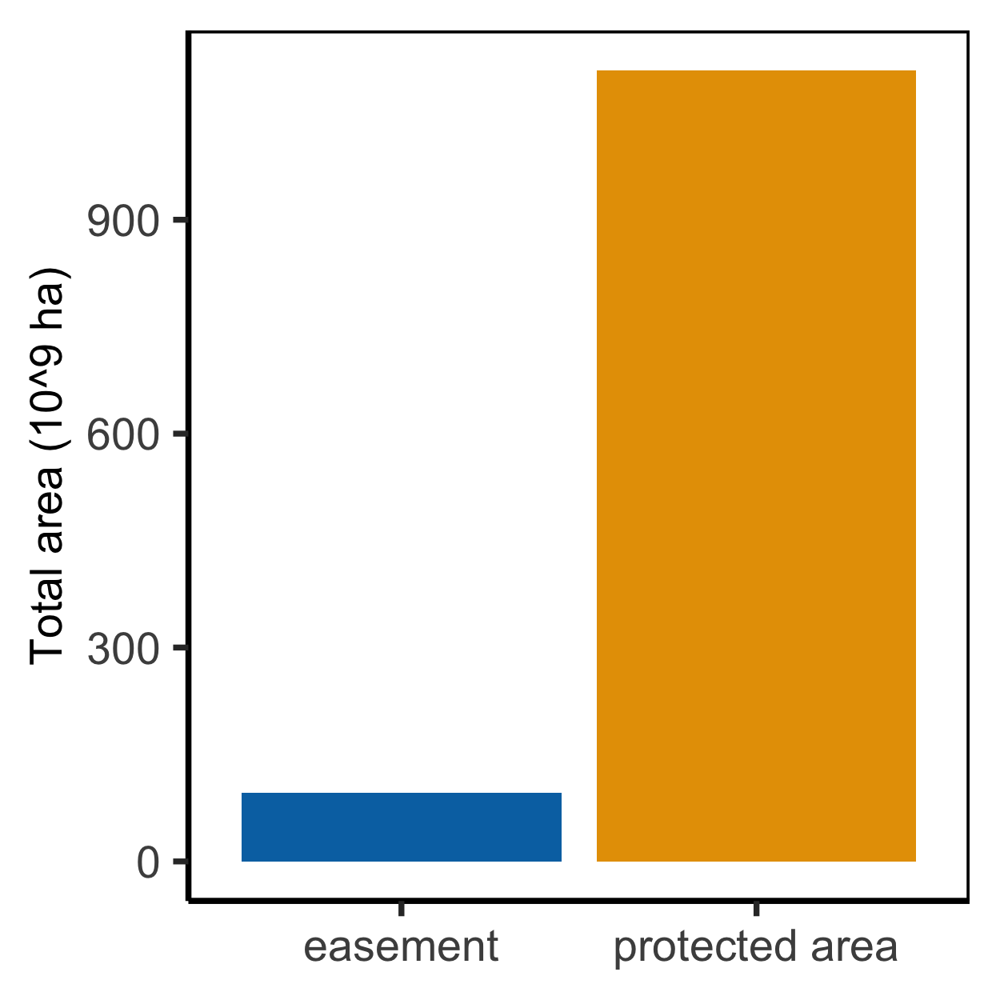
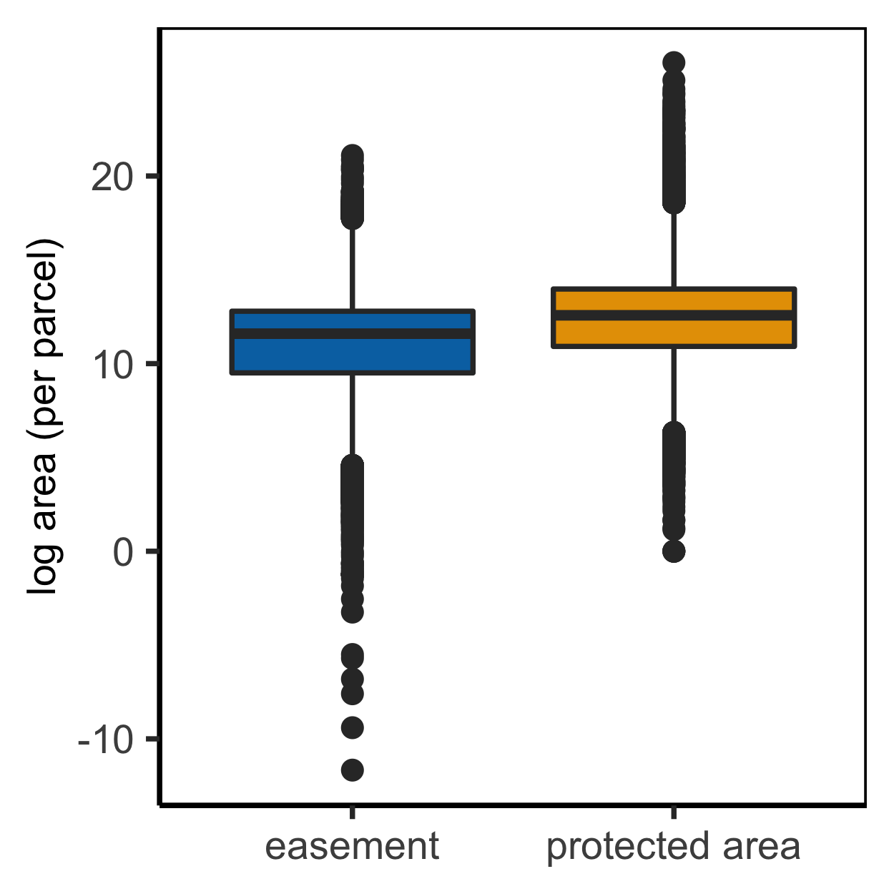
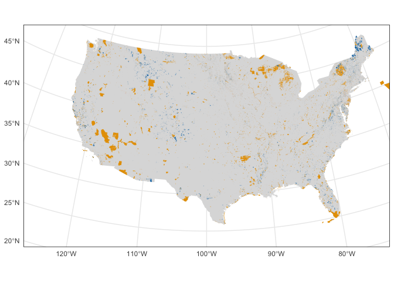
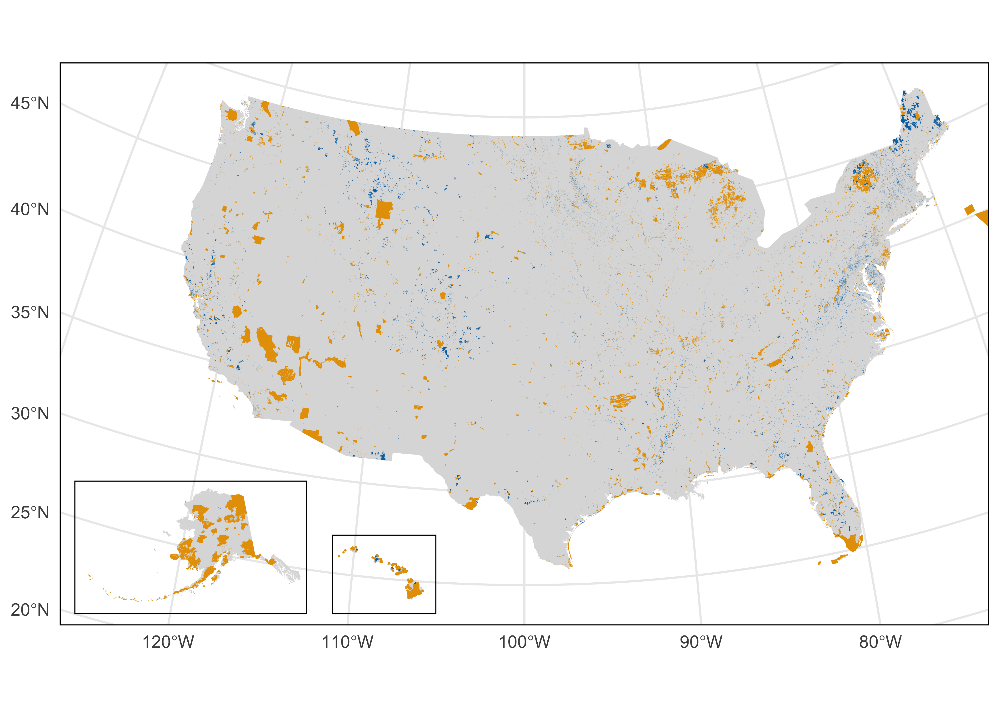

maps
================
Millie Chapman
3/7/2021

``` r
library(tidyverse)
```

    ## ── Attaching packages ─────────────────────────────────────── tidyverse 1.3.0 ──

    ## ✓ ggplot2 3.3.3     ✓ purrr   0.3.4
    ## ✓ tibble  3.1.0     ✓ dplyr   1.0.5
    ## ✓ tidyr   1.1.3     ✓ stringr 1.4.0
    ## ✓ readr   1.4.0     ✓ forcats 0.5.1

    ## ── Conflicts ────────────────────────────────────────── tidyverse_conflicts() ──
    ## x dplyr::filter() masks stats::filter()
    ## x dplyr::lag()    masks stats::lag()

``` r
library(sf)
```

    ## Linking to GEOS 3.8.1, GDAL 3.1.4, PROJ 6.3.1

``` r
usa <- st_read("../data/gadm36_USA_shp/gadm36_USA_0.shp") %>%
  mutate(area = st_area(geometry)) 
```

    ## Reading layer `gadm36_USA_0' from data source `/Users/milliechapman/Desktop/Berkeley/birdlife/data/gadm36_USA_shp/gadm36_USA_0.shp' using driver `ESRI Shapefile'
    ## Simple feature collection with 1 feature and 2 fields
    ## geometry type:  MULTIPOLYGON
    ## dimension:      XY
    ## bbox:           xmin: -179.1506 ymin: 18.90986 xmax: 179.7734 ymax: 72.6875
    ## geographic CRS: WGS 84

``` r
easement <- st_read("../data/PADUS2_0_Shapefiles/PADUS2_0Easement.shp")
```

    ## Reading layer `PADUS2_0Easement' from data source `/Users/milliechapman/Desktop/Berkeley/birdlife/data/PADUS2_0_Shapefiles/PADUS2_0Easement.shp' using driver `ESRI Shapefile'
    ## Simple feature collection with 140241 features and 51 fields
    ## geometry type:  MULTIPOLYGON
    ## dimension:      XY
    ## bbox:           xmin: -10403400 ymin: -57047.14 xmax: 3317527 ymax: 6532636
    ## projected CRS:  USA_Contiguous_Albers_Equal_Area_Conic_USGS_version

``` r
fee <- st_read("../data/PADUS2_0_Shapefiles/PADUS2_0Fee.shp")
```

    ## Reading layer `PADUS2_0Fee' from data source `/Users/milliechapman/Desktop/Berkeley/birdlife/data/PADUS2_0_Shapefiles/PADUS2_0Fee.shp' using driver `ESRI Shapefile'

    ## Warning in CPL_read_ogr(dsn, layer, query, as.character(options), quiet, : GDAL
    ## Message 1: organizePolygons() received an unexpected geometry. Either a polygon
    ## with interior rings, or a polygon with less than 4 points, or a non-Polygon
    ## geometry. Return arguments as a collection.

    ## Warning in CPL_read_ogr(dsn, layer, query, as.character(options), quiet, : GDAL
    ## Message 1: Geometry of polygon of fid 117138 cannot be translated to Simple
    ## Geometry. All polygons will be contained in a multipolygon.

    ## Warning in CPL_read_ogr(dsn, layer, query, as.character(options), quiet, : GDAL
    ## Message 1: organizePolygons() received an unexpected geometry. Either a polygon
    ## with interior rings, or a polygon with less than 4 points, or a non-Polygon
    ## geometry. Return arguments as a collection.

    ## Warning in CPL_read_ogr(dsn, layer, query, as.character(options), quiet, : GDAL
    ## Message 1: Geometry of polygon of fid 117581 cannot be translated to Simple
    ## Geometry. All polygons will be contained in a multipolygon.

    ## Warning in CPL_read_ogr(dsn, layer, query, as.character(options), quiet, : GDAL
    ## Message 1: organizePolygons() received an unexpected geometry. Either a polygon
    ## with interior rings, or a polygon with less than 4 points, or a non-Polygon
    ## geometry. Return arguments as a collection.

    ## Warning in CPL_read_ogr(dsn, layer, query, as.character(options), quiet, : GDAL
    ## Message 1: Geometry of polygon of fid 128034 cannot be translated to Simple
    ## Geometry. All polygons will be contained in a multipolygon.

    ## Warning in CPL_read_ogr(dsn, layer, query, as.character(options), quiet, : GDAL
    ## Message 1: organizePolygons() received an unexpected geometry. Either a polygon
    ## with interior rings, or a polygon with less than 4 points, or a non-Polygon
    ## geometry. Return arguments as a collection.

    ## Warning in CPL_read_ogr(dsn, layer, query, as.character(options), quiet, : GDAL
    ## Message 1: Geometry of polygon of fid 128160 cannot be translated to Simple
    ## Geometry. All polygons will be contained in a multipolygon.

    ## Simple feature collection with 180729 features and 41 fields
    ## geometry type:  MULTIPOLYGON
    ## dimension:      XY
    ## bbox:           xmin: -11816080 ymin: -262699.1 xmax: 3407884 ymax: 7786809
    ## projected CRS:  USA_Contiguous_Albers_Equal_Area_Conic_USGS_version

``` r
fee <- fee %>% 
  dplyr::filter(SHAPE_Area > 1,
                GAP_Sts == "1"|GAP_Sts == "2") %>%
  mutate(area = st_area(geometry))
```

``` r
easements <- easement %>% 
  dplyr::filter(GAP_Sts == "1"|GAP_Sts == "2") %>%
    mutate(area = st_area(geometry))
```

``` r
fee_area <- as_tibble(fee) %>% 
  mutate(type = "protected area") %>%
  group_by(type) %>%
  summarise(area = sum(area))

easement_area <- easement %>% 
  mutate(type = "easement",
         area = st_area(geometry))
```

``` r
as_tibble(easement_area) %>%
  group_by(type) %>%
  summarise(area = sum(area)) %>%
  bind_rows(fee_area) %>%
  ggplot(aes(x=type, y = as.numeric(area)/10^9, fill = type)) + geom_bar(stat= "identity") + 
  theme_classic() +
    scale_fill_manual(values=c("#0072B2", "#E69F00")) +
  theme(axis.title.x =element_blank()) +
  theme(legend.title = element_blank(),
        legend.position = "none") +
  labs(y = "Total area (10^9 ha)") +
   theme(axis.text=element_text(size=8),
        axis.title=element_text(size=8),
        panel.border = element_rect(colour = "black", fill=NA),
        legend.box.background = element_rect(colour = "black"),
        legend.text = element_text(size = 8))
```

<!-- -->

``` r
fee_box <- as_tibble(fee) %>%
  mutate(type = "protected area") %>%
  select(type, area)
```

``` r
as_tibble(easement_area) %>% select(type, area) %>%
  bind_rows(fee_box) %>%
  ggplot(aes(x=type, y = log(as.numeric(area)), fill = type)) + geom_boxplot() +
  theme_classic() +
    scale_fill_manual(values=c("#0072B2", "#E69F00")) +
  theme(axis.title.x =element_blank()) +
  theme(legend.title = element_blank(),
        legend.position = "none") +
  labs(y = "log area (per parcel)") +
   theme(axis.text=element_text(size=8),
        axis.title=element_text(size=8),
        panel.border = element_rect(colour = "black", fill=NA),
        legend.box.background = element_rect(colour = "black"),
        legend.text = element_text(size = 8))
```

<!-- -->

``` r
mainland <- ggplot() + 
  geom_sf(data = usa, fill = "#DCDCDC", lwd = 0)+
  geom_sf(data = easement, fill = "#0072B2",lwd = 0) +
  geom_sf(data = fee, fill = "#E69F00",lwd = 0) +
  coord_sf(crs = st_crs(2163), xlim = c(-2500000, 2500000), ylim = c(-2300000, 
         730000))+ theme_minimal() +
  theme(panel.border = element_rect(colour = "black", fill=NA))
mainland
```

<!-- -->

``` r
alaska <- ggplot() +
    geom_sf(data = usa, fill = "#DCDCDC", lwd = 0)+
     geom_sf(data = easement, fill = "#0072B2", lwd= 0) +
     geom_sf(data = fee, fill = "#E69F00", lwd = 0) +
     coord_sf(crs = st_crs(3467), xlim = c(-2400000, 1600000), ylim = c(200000, 
         2500000), expand = FALSE, datum = NA) +theme_minimal() +
   theme(panel.border = element_rect(colour = "black", fill=NA))
hawaii  <- ggplot() +
    geom_sf(data = usa, fill = "#DCDCDC", lwd = 0)+
       geom_sf(data = easement, fill = "#0072B2", color = "#0072B2") +
       geom_sf(data = fee, fill = "#E69F00", color = "#E69F00") +
     coord_sf(crs = st_crs(4135), xlim = c(-161, -154), ylim = c(18, 
         23), expand = FALSE, datum = NA) +theme_minimal() +
     theme(panel.border = element_rect(colour = "black", fill=NA))
```

``` r
mainland +
 annotation_custom(
      grob = ggplotGrob(alaska),
      xmin = -2800000,
      xmax = -2750000 + (1600000 - (-2400000))/2.5,
      ymin = -2450000,
      ymax = -2450000 + (2500000 - 200000)/2.5
  ) +
  annotation_custom(
      grob = ggplotGrob(hawaii),
      xmin = -1250000,
      xmax = -1250000 + (-154 - (-161))*120000,
      ymin = -2450000,
      ymax = -2450000 + (23 - 18)*120000
  )
```

<!-- -->
