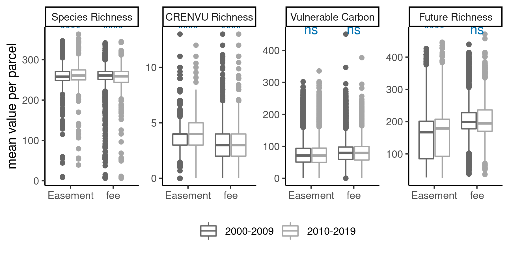
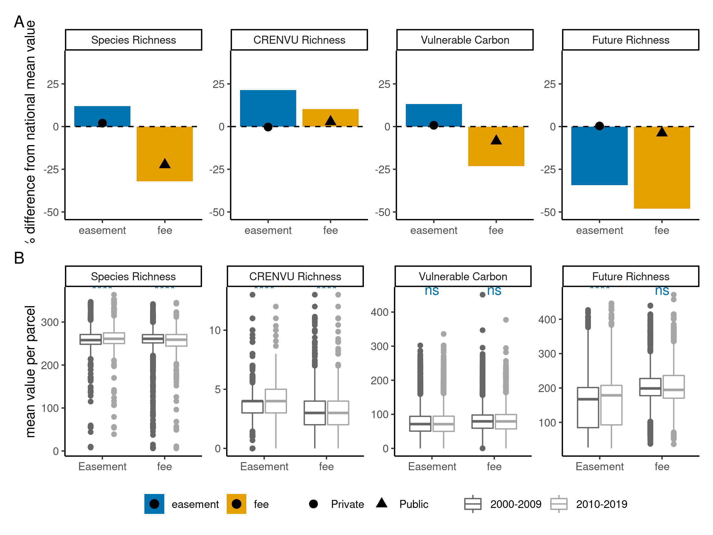
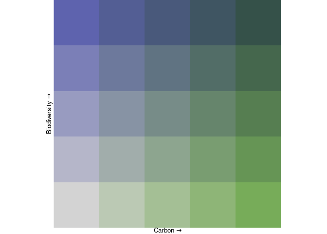
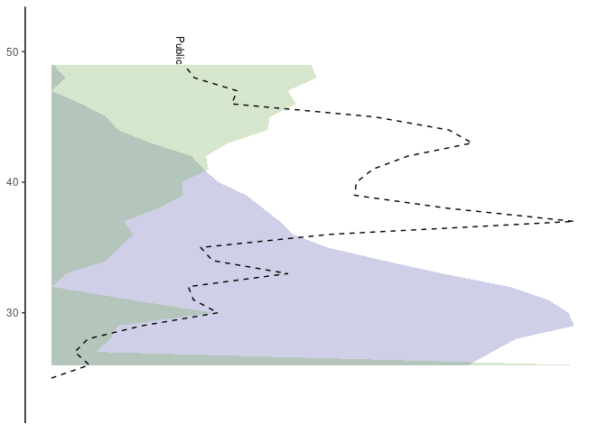
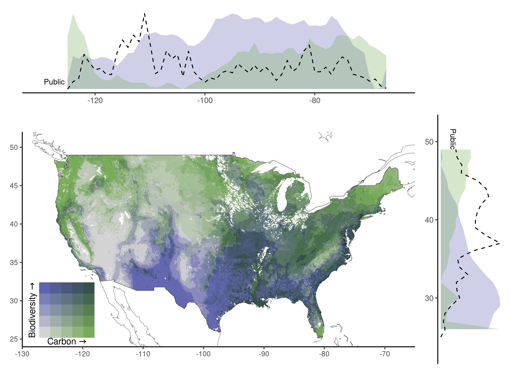

updated-analysis
================

Load libraries

``` r
library(sf)
```

    ## Linking to GEOS 3.8.0, GDAL 3.0.4, PROJ 6.3.1; sf_use_s2() is TRUE

``` r
library(tidyverse)
```

    ## ── Attaching packages ─────────────────────────────────────── tidyverse 1.3.1 ──

    ## ✓ ggplot2 3.3.5     ✓ purrr   0.3.4
    ## ✓ tibble  3.1.6     ✓ dplyr   1.0.7
    ## ✓ tidyr   1.1.4     ✓ stringr 1.4.0
    ## ✓ readr   2.1.1     ✓ forcats 0.5.1

    ## ── Conflicts ────────────────────────────────────────── tidyverse_conflicts() ──
    ## x dplyr::filter() masks stats::filter()
    ## x dplyr::lag()    masks stats::lag()

``` r
library(raster)
```

    ## Loading required package: sp

    ## 
    ## Attaching package: 'raster'

    ## The following object is masked from 'package:dplyr':
    ## 
    ##     select

``` r
#library(ggpubr)
library(lsr) # includes t-test functions
library(stats) # includes different t-test functions
#library(rio) # for importing data
library(psych) # for descriptives
```

    ## 
    ## Attaching package: 'psych'

    ## The following objects are masked from 'package:ggplot2':
    ## 
    ##     %+%, alpha

``` r
library(pwr) # for conducting a power analysis
library(zoo)
```

    ## 
    ## Attaching package: 'zoo'

    ## The following objects are masked from 'package:base':
    ## 
    ##     as.Date, as.Date.numeric

``` r
library(biscale)
library(tigris)
```

    ## To enable 
    ## caching of data, set `options(tigris_use_cache = TRUE)` in your R script or .Rprofile.

``` r
library(ggsignif)
library(ggpubr)
```

    ## 
    ## Attaching package: 'ggpubr'

    ## The following object is masked from 'package:raster':
    ## 
    ##     rotate

# Regional data with extracted richness values

Background

Easements

Fee

# Figure 2:

``` r
fee_fig <- fee %>%
mutate(future = plant_future  + tree_future + reptile_future + amphibian_future + bird_future + mammal_future) %>%
  filter(GAP_Sts == "1" | GAP_Sts == "2") %>%
  dplyr::select(Category,carbon_vulnerable,richness_all:RSR_all, future, area, Date_Est) %>%
  dplyr::rename(`Species Richness` = richness_all,
         `Vulnerable Carbon` = carbon_vulnerable,
         `CRENVU Richness` =  richness_crenvu, 
         `Future Richness` = future)
```

``` r
fig2b <- easements %>%
  mutate(future = plant_future  + tree_future + reptile_future + amphibian_future + bird_future + mammal_future) %>%
  dplyr::select(Category,carbon_vulnerable,richness_all:RSR_all, future, Date_Est, area) %>%
  dplyr::rename(`Species Richness` = richness_all,
         `Vulnerable Carbon` = carbon_vulnerable,
         `CRENVU Richness` =  richness_crenvu,
         `Future Richness` = future) %>%
  drop_na() %>%
  rbind(fee_fig) %>%
  mutate(time = ifelse(Date_Est <2000, NA, 
                       ifelse(Date_Est > 1999 & Date_Est < 2010, "2000-2009", "2010-2019"))) %>%
  drop_na() %>%
  dplyr::select(-c(Date_Est, area, RSR_all)) %>%
  pivot_longer(-c(Category, time)) %>%
  mutate(name = factor(name, levels = c("Species Richness", 
                                        "CRENVU Richness",
                                        "Vulnerable Carbon",
                                        "Future Richness"))) %>%
  ggplot(aes(x = Category, y = value, col = time)) + geom_boxplot() +
  facet_wrap(vars(name), ncol = 4, scales = "free") +
  stat_compare_means(aes(group = time), label = "p.signif", color = "#0072B2", size=4) + 
  scale_color_manual(values=c("#666666", "#a6a6a6")) +
  theme_classic() +
  theme(legend.position = "bottom",
        legend.title = element_blank()) +
  theme(axis.title.x = element_blank()) +
  labs(y = "mean value per parcel") 
fig2b
```

<!-- -->

``` r
# easements already filtered to GAP1-2 before extraction 
ag_e <- easements %>%
    mutate(future = plant_future  + tree_future + reptile_future + amphibian_future + bird_future + mammal_future) %>%
  mutate(Category = "easement") %>%
  group_by(Category) %>%
  mutate(total_area = sum(area)) %>%
  ungroup() %>%
  mutate(perc_area = area/total_area) %>%
  mutate(richness_all = richness_all*perc_area,
         future = future*perc_area,
         richness_crenvu= richness_crenvu*perc_area,
         carbon_vulnerable = carbon_vulnerable*perc_area) %>%
  group_by(Category, total_area) %>%
  summarise(richness_all = sum(richness_all, na.rm = TRUE),
         future = sum(future, na.rm = TRUE),
         richness_crenvu= sum(richness_crenvu, na.rm = TRUE),
         carbon_vulnerable = sum(carbon_vulnerable, na.rm = TRUE)) %>%
  ungroup()
```

    ## `summarise()` has grouped output by 'Category'. You can override using the `.groups` argument.

``` r
ag_f <- fee %>%
  filter(GAP_Sts == 1 | GAP_Sts == 2) %>%
      mutate(future = reptile_future + amphibian_future + bird_future + mammal_future) %>%
    mutate(Category = "fee") %>%
  group_by(Category) %>%
  mutate(total_area = sum(area)) %>%
  ungroup() %>%
  mutate(perc_area = area/total_area) %>%
  mutate(richness_all = richness_all*perc_area,
         future = future*perc_area,
         richness_crenvu= richness_crenvu*perc_area,
         carbon_vulnerable = carbon_vulnerable*perc_area) %>%
  group_by(Category, total_area) %>%
  summarise(richness_all = sum(richness_all, na.rm = TRUE),
         future = sum(future, na.rm = TRUE),
         richness_crenvu= sum(richness_crenvu, na.rm = TRUE),
         carbon_vulnerable = sum(carbon_vulnerable, na.rm = TRUE)) %>% 
  ungroup() 
```

    ## `summarise()` has grouped output by 'Category'. You can override using the `.groups` argument.

``` r
ag_b <- background %>%
  mutate(future = plant_future  + tree_future + reptile_future + amphibian_future + bird_future + mammal_future) %>%
  mutate(bind = "a") %>%
  group_by(bind) %>%
  mutate(total_area = sum(area)) %>%
  ungroup() %>%
  mutate(perc_area = area/total_area) %>%
  mutate(richness_all = richness_all*perc_area,
         future = future*perc_area,
         richness_crenvu= richness_crenvu*perc_area,
         carbon_vulnerable = carbon_vulnerable*perc_area) %>%
  group_by(bind) %>%
  summarise(richness_all_b = sum(richness_all, na.rm = TRUE),
         future_all_b = sum(future, na.rm = TRUE),
         richness_crenvu_b= sum(richness_crenvu, na.rm = TRUE),
         carbon_vulnerable_b = sum(carbon_vulnerable, na.rm = TRUE),
         total_area_ca = sum(area)) %>% 
  ungroup() 
```

public-private

Public = everything fee owned any gap status

``` r
f2public <- fee %>%
  filter(Category == "fee") %>%
  mutate(future = plant_future  + tree_future + reptile_future + amphibian_future + bird_future + mammal_future) %>%
  mutate(Category = recode(Category, fee = "Public")) %>%
  group_by(Category) %>%
  mutate(total_area_public = sum(area)) %>%
  ungroup() %>%
  mutate(perc_area = area/total_area_public) %>%
  mutate(richness_all = richness_all*perc_area,
         future = future*perc_area,
         richness_crenvu= richness_crenvu*perc_area,
         carbon_vulnerable = carbon_vulnerable*perc_area) %>%
  group_by(Category, total_area_public) %>%
  summarise(richness_all = sum(richness_all, na.rm = TRUE),
         future = sum(future, na.rm = TRUE),
         richness_crenvu = sum(richness_crenvu, na.rm = TRUE),
         carbon_vulnerable = sum(carbon_vulnerable, na.rm = TRUE)) %>% 
  ungroup() 
```

    ## `summarise()` has grouped output by 'Category'. You can override using the `.groups` argument.

``` r
f2private <- f2public %>%
  dplyr::select(-Category) %>%
  cbind(ag_b) %>%
  mutate(area_private = total_area_ca-total_area_public) %>%
  mutate(richness_all = ((richness_all_b*total_area_ca)-(richness_all*total_area_public))/(area_private),
         future = ((future_all_b*total_area_ca)-(future*total_area_public))/(area_private),
         richness_crenvu = ((richness_crenvu_b*total_area_ca)-(richness_crenvu*total_area_public))/(area_private),
         carbon_vulnerable = ((carbon_vulnerable_b*total_area_ca)-(carbon_vulnerable*total_area_public))/(area_private)) %>%
  dplyr::select(richness_all:carbon_vulnerable, area_private) %>%
  mutate(Category = "Private") %>%
  rename(area = area_private)
```

public private

``` r
public_private <- f2public %>%
  rename(area = total_area_public) %>%
  rbind(f2private) %>%
  mutate(bind= "a") %>%
  full_join(ag_b) %>%
  dplyr::mutate(`Species Richness` = (richness_all-richness_all_b)/richness_all_b,
                `Future Richness`  = (future-future_all_b)/future_all_b,
                `CRENVU Richness` = (richness_crenvu-richness_crenvu_b)/richness_crenvu_b,
                `Vulnerable Carbon` = (carbon_vulnerable-carbon_vulnerable_b)/carbon_vulnerable_b) %>%
  dplyr::select(`Species Richness`,`CRENVU Richness`, `Future Richness`, `Vulnerable Carbon`, Category) %>%
  pivot_longer(-Category) %>%
  mutate(name = factor(name, levels = c("Species Richness", 
                                        "CRENVU Richness",
                                        "Vulnerable Carbon",
                                        "Future Richness"))) %>%
  mutate(type = Category) %>%
  mutate(Category = plyr::revalue(Category, c(Private = "easement", Public = "fee") ))
```

    ## Joining, by = "bind"

``` r
fig2a <- ag_e %>%
  rbind(ag_f) %>%
  mutate(bind = "a") %>%
  full_join(ag_b) %>%
  dplyr::select(-c(bind, total_area_ca)) %>%
  dplyr::mutate(`Species Richness` = (richness_all-richness_all_b)/richness_all_b,
                `Future Richness` = (future-future_all_b)/future_all_b,
                `CRENVU Richness` = (richness_crenvu-richness_crenvu_b)/richness_crenvu_b,
                `Vulnerable Carbon` = (carbon_vulnerable-carbon_vulnerable_b)/carbon_vulnerable_b) %>% 
  dplyr::select(Category,`Species Richness`, `CRENVU Richness`,`Future Richness`, `Vulnerable Carbon`) %>%
  pivot_longer(-Category) %>%
  mutate(name = factor(name, levels = c("Species Richness", 
                                        "CRENVU Richness",
                                        "Vulnerable Carbon",
                                        "Future Richness"))) %>%
  ggplot(aes(x = Category, y = value*100, fill = Category)) + 
  geom_bar(stat = "identity") +
    scale_fill_manual(values=c("#0072B2", "#E69F00", "black", "black")) +
  geom_point(public_private, mapping = aes(x = Category, y= as.numeric(value)*100,  
                                           group = type, 
                                           shape= type), stat = "identity", 
             position=position_dodge(width=0.8), size = 3) +
  geom_hline(yintercept = 0, linetype = "dashed") +
  facet_wrap(vars(name), scales = "free", ncol = 4) +
  scale_y_continuous(limits=c(-50,40)) +
  theme_classic() +
  theme(legend.position = "bottom",
        legend.title = element_blank()) +
  theme(axis.title.x = element_blank()) +
  labs(y = "% difference from national mean value")
```

    ## Joining, by = "bind"

``` r
library(patchwork)
```

    ## 
    ## Attaching package: 'patchwork'

    ## The following object is masked from 'package:raster':
    ## 
    ##     area

``` r
fig2a/fig2b + plot_annotation(tag_levels = 'A') + plot_layout(guides = "collect") & theme(legend.position = "bottom")
```

<!-- -->

# BIVARIATE MAP!

``` r
# The function that produces the colour matrix
colmat <- function(nbreaks = 3, breakstyle = "quantile",
                   upperleft = "#0096EB", upperright = "#820050", 
                   bottomleft = "#BEBEBE", bottomright = "#FFE60F",
                   xlab = "x label", ylab = "y label", plotLeg = TRUE,
                   saveLeg = FALSE) {
   # TODO - replace any tidyr, dplyr etc. functions with data.table #
  library(tidyverse)
  require(ggplot2)
  require(classInt)
  library(data.table)
  if (breakstyle == "sd") {
    warning("SD breaks style cannot be used.\nWill not always return the correct number of breaks.\nSee classInt::classIntervals() for details.\nResetting to quantile",
            call. = FALSE, immediate. = FALSE)
    breakstyle <- "quantile"}
  # The colours can be changed by changing the HEX codes for:
  # upperleft, upperright, bottomleft, bottomright
  # From http://www.joshuastevens.net/cartography/make-a-bivariate-choropleth-map/
  # upperleft = "#64ACBE", upperright = "#574249", bottomleft = "#E8E8E8", bottomright = "#C85A5A",
  # upperleft = "#BE64AC", upperright = "#3B4994", bottomleft = "#E8E8E8", bottomright = "#5AC8C8",
  # upperleft = "#73AE80", upperright = "#2A5A5B", bottomleft = "#E8E8E8", bottomright = "#6C83B5", 
  # upperleft = "#9972AF", upperright = "#804D36", bottomleft = "#E8E8E8", bottomright = "#C8B35A",
  # upperleft = "#DA8DC8", upperright = "#697AA2", bottomleft = "#E8E8E8", bottomright = "#73BCA0",
  # Similar to Teuling, Stockli, Seneviratnea (2011) [https://doi.org/10.1002/joc.2153]
  # upperleft = "#F7900A", upperright = "#993A65", bottomleft = "#44B360", bottomright = "#3A88B5",
  # Viridis style
  # upperleft = "#FEF287", upperright = "#21908D", bottomleft = "#E8F4F3", bottomright = "#9874A1",
  # Similar to Fjeldsa, Bowie, Rahbek 2012
  # upperleft = "#34C21B", upperright = "#FFFFFF", bottomleft = "#595757",  bottomright = "#A874B8",
  # Default from original source
  # upperleft = "#0096EB", upperright = "#820050", bottomleft= "#BEBEBE", bottomright = "#FFE60F",
  my.data <- seq(0, 1, .01)
  # Default uses terciles (Lucchesi and Wikle [2017] doi: 10.1002/sta4.150)
  my.class <- classInt::classIntervals(my.data,
                                       n = nbreaks,
                                       style = breakstyle,
                                       )
  my.pal.1 <- classInt::findColours(my.class, c(upperleft, bottomleft))
  my.pal.2 <- classInt::findColours(my.class, c(upperright, bottomright))
  col.matrix <- matrix(nrow = 101, ncol = 101, NA)
  for (i in 1:101) {
    my.col <- c(paste(my.pal.1[i]), paste(my.pal.2[i]))
    col.matrix[102 - i, ] <- classInt::findColours(my.class, my.col)
  }
  ## need to convert this to data.table at some stage.
  col.matrix.plot <- col.matrix %>%
    as.data.frame(.) %>% 
    mutate("Y" = row_number()) %>%
    mutate_at(.tbl = ., .vars = vars(starts_with("V")), .funs = list(as.character)) %>% 
    pivot_longer(data = ., cols = -Y, names_to = "X", values_to = "HEXCode") %>% 
    mutate("X" = as.integer(sub("V", "", .$X))) %>%
    distinct(as.factor(HEXCode), .keep_all = TRUE) %>%
    mutate(Y = rev(.$Y)) %>% 
    dplyr::select(-c(4)) %>%
    mutate("Y" = rep(seq(from = 1, to = nbreaks, by = 1), each = nbreaks),
           "X" = rep(seq(from = 1, to = nbreaks, by = 1), times = nbreaks)) %>%
    mutate("UID" = row_number())
  # Use plotLeg if you want a preview of the legend
  if (plotLeg) {
    p <- ggplot(col.matrix.plot, aes(X, Y, fill = HEXCode)) +
      geom_tile() +
      scale_fill_identity() +
      coord_equal(expand = FALSE) +
      theme_void() +
      theme(aspect.ratio = 1,
            axis.title = element_text(size = 10, colour = "black",hjust = 0.5, 
                                      vjust = 1),
            axis.title.y = element_text(size = 10, angle = 90, hjust = 0.5, vjust = 1)) +
      xlab(bquote(.(xlab) ~  symbol("\256"))) +
      ylab(bquote(.(ylab) ~  symbol("\256")))
    print(p)
    assign(
      x = "BivLegend",
      value = p,
      pos = .GlobalEnv
    )
  }
  # Use saveLeg if you want to save a copy of the legend
  if (saveLeg) {
    ggsave(filename = "bivLegend.pdf", plot = p, device = "pdf",
           path = "./", width = 4, height = 4, units = "in",
           dpi = 300)
  }
  seqs <- seq(0, 100, (100 / nbreaks))
  seqs[1] <- 1
  col.matrix <- col.matrix[c(seqs), c(seqs)]
  attr(col.matrix, "breakstyle") <- breakstyle
  attr(col.matrix, "nbreaks") <- nbreaks
  return(col.matrix)
}

# Function to assign colour-codes to raster data
# As before, by default assign tercile breaks
bivariate.map <- function(rasterx, rastery, colourmatrix = col.matrix,
                          export.colour.matrix = TRUE,
                          outname = paste0("colMatrix_rasValues", names(rasterx))) {
  # TO DO - replace raster with terra #
  require(raster)
  require(classInt)
  # export.colour.matrix will export a data.frame of rastervalues and RGB codes 
  # to the global environment outname defines the name of the data.frame
  quanx <- getValues(rasterx)
  tempx <- data.frame(quanx, quantile = rep(NA, length(quanx)))
  brks <- with(tempx, classIntervals(quanx,
                                    n = attr(colourmatrix, "nbreaks"),
                                    style = attr(colourmatrix, "breakstyle"))$brks)
  ## Add (very) small amount of noise to all but the first break
  ## https://stackoverflow.com/a/19846365/1710632
  brks[-1] <- brks[-1] + seq_along(brks[-1]) * .Machine$double.eps
  r1 <- within(tempx, quantile <- cut(quanx,
                                     breaks = brks,
                                     labels = 2:length(brks),
                                     include.lowest = TRUE))
  quantr <- data.frame(r1[, 2])
  quany <- getValues(rastery)
  tempy <- data.frame(quany, quantile = rep(NA, length(quany)))
  brksy <- with(tempy, classIntervals(quany,
                                     n = attr(colourmatrix, "nbreaks"),
                                     style = attr(colourmatrix, "breakstyle"))$brks)
  brksy[-1] <- brksy[-1] + seq_along(brksy[-1]) * .Machine$double.eps
  r2 <- within(tempy, quantile <- cut(quany,
                                     breaks = brksy,
                                     labels = 2:length(brksy),
                                     include.lowest = TRUE
  ))
  quantr2 <- data.frame(r2[, 2])
  as.numeric.factor <- function(x) {
    as.numeric(levels(x))[x]
  }
  col.matrix2 <- colourmatrix
  cn <- unique(colourmatrix)
  for (i in 1:length(col.matrix2)) {
    ifelse(is.na(col.matrix2[i]),
           col.matrix2[i] <- 1, col.matrix2[i] <- which(
             col.matrix2[i] == cn
           )[1]
    )
  }
  # Export the colour.matrix to data.frame() in the global env
  # Can then save with write.table() and use in ArcMap/QGIS
  # Need to save the output raster as integer data-type
  if (export.colour.matrix) {
    # create a dataframe of colours corresponding to raster values
    exportCols <- as.data.frame(cbind(
      as.vector(col.matrix2), as.vector(colourmatrix),
      t(col2rgb(as.vector(colourmatrix)))
    ))
    # rename columns of data.frame()
    colnames(exportCols)[1:2] <- c("rasValue", "HEX")
    # Export to the global environment
    assign(
      x = outname,
      value = exportCols,
      pos = .GlobalEnv
    )
  }
  cols <- numeric(length(quantr[, 1]))
  for (i in 1:length(quantr[, 1])) {
    a <- as.numeric.factor(quantr[i, 1])
    b <- as.numeric.factor(quantr2[i, 1])
    cols[i] <- as.numeric(col.matrix2[b, a])
  }
  r <- rasterx
  r[1:length(r)] <- cols
  return(r)
}
```

``` r
if (!file.exists("../data/carbon-biodiv-bivariate.tif")) {
  #carbon_vulnerable <- raster("../data/carbon/Vulnerable_Carbon_2010/Vulnerable_C_Total_2010.tif")
  richness_all <- raster("../data/IUCN-precalculated/Richness_all.tif")
  #carbon_vulnerable_rs <- resample(carbon_vulnerable, richness_all, method = 'bilinear')
  #writeRaster(carbon_vulnerable_rs,       "../data/carbon/Vulnerable_Carbon_2010/Vulnerable_C_Total_2010_rs.tif")
  carbon_vulnerable_rs <- raster("../data/carbon/Vulnerable_Carbon_2010/Vulnerable_C_Total_2010_rs.tif")
  US_main <- US %>%
  dplyr::filter(STATE != "AK" & STATE != "HI")
  richness_all <- mask(richness_all, US_main)
  carbon_vulnerable_rs <- mask(carbon_vulnerable_rs, US_main)
  r <- stack(richness_all, carbon_vulnerable_rs)
  names(r) <- c("Biodiversity","Carbon")
  r <- crop(r, US_main)
  writeRaster(r, "../data/carbon-biodiv-bivariate.tif")
}

#read in your data 
biodiv <- raster("../data/carbon-biodiv-bivariate.tif", band = 1)
carbon <- raster("../data/carbon-biodiv-bivariate.tif", band = 2)
r <- stack(biodiv, carbon)
names(r) <- c("Biodiversity","Carbon")
```

``` r
# Define the number of breaks
nBreaks <- 5

# Create the colour matrix
col.matrixQ <- colmat(nbreaks = nBreaks, breakstyle = "quantile",
                       xlab = "Carbon", ylab = "Biodiversity", 
                       bottomright = "#77ac59", upperright = "#355149",
                       bottomleft = "#d3d3d3", upperleft = "#5e63ae",
                       saveLeg = FALSE, plotLeg = TRUE)
```

    ## Loading required package: classInt

    ## 
    ## Attaching package: 'data.table'

    ## The following object is masked from 'package:raster':
    ## 
    ##     shift

    ## The following objects are masked from 'package:dplyr':
    ## 
    ##     between, first, last

    ## The following object is masked from 'package:purrr':
    ## 
    ##     transpose

<!-- -->

``` r
# create the bivariate raster
if (!file.exists("../data/bivmapQ.tif")) {
  bivmapQ <- bivariate.map(rasterx = r[["Carbon"]], rastery = r[["Biodiversity"]],
                          export.colour.matrix = TRUE,
                          colourmatrix = col.matrixQ)
  writeRaster(bivmapQ, "../data/bivmapQ.tif")
}
bivmapQ <- raster("../data/bivmapQ.tif")

# Convert to dataframe for plotting with ggplot
library(data.table)
bivMapDFQ <- setDT(as.data.frame(bivmapQ, xy = TRUE))
colnames(bivMapDFQ)[3] <- "BivValue"
bivMapDFQ <- melt(bivMapDFQ, id.vars = c("x", "y"),
                   measure.vars = "BivValue",
                   value.name = "bivVal",
                   variable.name = "Variable")

# Make the map using ggplot
map_q <- ggplot(bivMapDFQ, aes(x = x, y = y)) +
    geom_raster(aes(fill = bivVal)) +
      scale_fill_gradientn(colours = col.matrixQ, na.value = "transparent") + 
    theme_classic() + theme(panel.grid.major = element_blank(),
                            panel.grid.minor = element_blank()) +
    theme(text = element_text(size = 10, colour = "black")) +
    borders(colour = "black", size = 0.1) +
    coord_quickmap(expand = FALSE, xlim = c(-130,-65), ylim = c(24,52)) +
    theme(legend.position = "none",
          plot.background = element_blank(),
          strip.text = element_blank(), 
          #axis.text.y = element_blank(),
          #axis.text = element_blank(),
          axis.title = element_blank())

map_q <- map_q + inset_element(BivLegend, 0, 0, 0.2, 0.3)
```

Bar plot Lat:

``` r
fee_line <- read_csv("../data/fee_lat_long.csv") %>%
  drop_na() %>% 
  filter(GAP_Sts == "1" | GAP_Sts == "2") %>%
  rename(x = lon, y = lat) %>%
  filter(x > (-130), x < (-65),
         y >22, y<52) %>%
  mutate(x = round(x, 0),
         y = round(y,0)) %>%
  group_by(x) %>%
  summarise(value = sum(area, na.rm = TRUE)) %>%
  ungroup()  %>%
  mutate(maxval = max(value), minval = min(value)) %>% ungroup() %>%
  mutate(Fee = (value-minval)/(maxval-minval)) %>%
  dplyr::select(x,Fee)
```

    ## Rows: 190738 Columns: 5

    ## ── Column specification ────────────────────────────────────────────────────────
    ## Delimiter: ","
    ## chr (1): Category
    ## dbl (4): GAP_Sts, area, lon, lat

    ## 
    ## ℹ Use `spec()` to retrieve the full column specification for this data.
    ## ℹ Specify the column types or set `show_col_types = FALSE` to quiet this message.

``` r
public_line <- read_csv("../data/fee_lat_long.csv") %>%
  drop_na() %>% 
  rename(x = lon, y = lat) %>%
  filter(x > (-130), x < (-65),
         y >22, y<52) %>%
  mutate(x = round(x, 0),
         y = round(y,0)) %>%
  group_by(x) %>%
  summarise(value = sum(area, na.rm = TRUE)) %>%
  ungroup()  %>%
  mutate(maxval = max(value), minval = min(value)) %>% ungroup() %>%
  mutate(Public = (value-minval)/(maxval-minval)) %>%
  dplyr::select(x,Public)
```

    ## Rows: 190738 Columns: 5

    ## ── Column specification ────────────────────────────────────────────────────────
    ## Delimiter: ","
    ## chr (1): Category
    ## dbl (4): GAP_Sts, area, lon, lat

    ## 
    ## ℹ Use `spec()` to retrieve the full column specification for this data.
    ## ℹ Specify the column types or set `show_col_types = FALSE` to quiet this message.

``` r
easement_line <- read_csv("../data/easement_lat_long.csv") %>%
  drop_na() %>% rename(x = lon, y = lat) %>%
  filter(x > (-130), x < (-65),
         y >22, y<52) %>%
  mutate(x = round(x, 0),
         y = round(y,0)) %>%
  group_by(x) %>%
  summarise(value = sum(area, na.rm = TRUE)) %>%
  ungroup()  %>%
  mutate(maxval = max(value), minval = min(value)) %>% ungroup() %>%
  mutate(Easement = (value-minval)/(maxval-minval)) %>%
  dplyr::select(x,Easement)
```

    ## Rows: 45735 Columns: 5

    ## ── Column specification ────────────────────────────────────────────────────────
    ## Delimiter: ","
    ## chr (1): Category
    ## dbl (4): GAP_Sts, area, lon, lat

    ## 
    ## ℹ Use `spec()` to retrieve the full column specification for this data.
    ## ℹ Specify the column types or set `show_col_types = FALSE` to quiet this message.

``` r
line_x <- public_line %>%
  #left_join(fee_line) %>%
  pivot_longer(-x)
```

``` r
richness_pts <- as_tibble(rasterToPoints(r[[1]])) %>%
  drop_na() %>%
  filter(Biodiversity >0,
         x > (-130), x < (-65),
         y >22, y<52) %>%
  mutate(x = round(x, 0),
         y = round(y,0)) %>%
  group_by(x) %>%
  summarise(value = mean(Biodiversity, na.rm = TRUE)) %>%
  ungroup()  %>%
  mutate(maxval = max(value), minval = min(value)) %>% ungroup() %>%
  mutate(Biodiversity = (value-minval)/(maxval-minval)) %>%
  dplyr::select(x,Biodiversity)
  
carbon_pts <- as_tibble(rasterToPoints(r[[2]])) %>%
  drop_na() %>%
  filter(Carbon >0,
         x > (-130), x < (-65),
         y >22, y<52) %>%
  mutate(x = round(x, 0),
         y = round(y,0)) %>%
  group_by(x) %>%
  summarise(value = mean(Carbon, na.rm = TRUE)) %>%
  ungroup()  %>%
  mutate(maxval = max(value), minval = min(value)) %>% ungroup() %>%
  mutate(Carbon = (value-minval)/(maxval-minval)) %>%
  dplyr::select(x, Carbon)
```

``` r
top <- richness_pts %>%
  left_join(carbon_pts) %>%
  pivot_longer(-x) %>%
  ggplot(aes(x = x, y = value, fill = name)) + 
  geom_density(stat = "identity", adjust = 10 , alpha = 0.3, lwd = 0) + 
  scale_fill_manual(values = c("#5e63ae", "#77ac59", "black", "black")) + xlim(-130,-65) +
  geom_line(data = line_x, aes(x = x, y = value), linetype = "dashed") +
  geom_text(data = subset(line_x, x == (-124)), aes(label = name, x = -124, y = value), size = 3, hjust = 1.4) +
  theme_classic() +
  theme(axis.text.y=element_blank(),
        axis.title.y=element_blank(),
        axis.title.x = element_blank(),
        axis.line.y = element_blank(),
        axis.ticks.y = element_blank(),
        legend.position = "none")
```

    ## Joining, by = "x"

    ## Warning: Ignoring unknown parameters: adjust

Bar plot Long:

``` r
fee_line <- read_csv("../data/fee_lat_long.csv") %>%
  drop_na() %>% rename(x = lon, y = lat) %>%
  filter(GAP_Sts == "1" | GAP_Sts == "2") %>%
  filter(x > (-130), x < (-65),
         y >22, y<52) %>%
  mutate(x = round(x, 0),
         y = round(y,0)) %>%
  group_by(y) %>%
  summarise(value = sum(area, na.rm = TRUE)) %>%
  ungroup()  %>%
  mutate(maxval = max(value), minval = min(value)) %>% ungroup() %>%
  mutate(Fee = (value-minval)/(maxval-minval)) %>%
  dplyr::select(y,Fee)
```

    ## Rows: 190738 Columns: 5

    ## ── Column specification ────────────────────────────────────────────────────────
    ## Delimiter: ","
    ## chr (1): Category
    ## dbl (4): GAP_Sts, area, lon, lat

    ## 
    ## ℹ Use `spec()` to retrieve the full column specification for this data.
    ## ℹ Specify the column types or set `show_col_types = FALSE` to quiet this message.

``` r
public_line <- read_csv("../data/fee_lat_long.csv") %>%
  drop_na() %>% 
  rename(x = lon, y = lat) %>%
  filter(x > (-130), x < (-65),
         y >22, y<52) %>%
  mutate(x = round(x, 0),
         y = round(y,0)) %>%
  group_by(y) %>%
  summarise(value = sum(area, na.rm = TRUE)) %>%
  ungroup()  %>%
  mutate(maxval = max(value), minval = min(value)) %>% ungroup() %>%
  mutate(Public = (value-minval)/(maxval-minval)) %>%
  dplyr::select(y,Public)
```

    ## Rows: 190738 Columns: 5

    ## ── Column specification ────────────────────────────────────────────────────────
    ## Delimiter: ","
    ## chr (1): Category
    ## dbl (4): GAP_Sts, area, lon, lat

    ## 
    ## ℹ Use `spec()` to retrieve the full column specification for this data.
    ## ℹ Specify the column types or set `show_col_types = FALSE` to quiet this message.

``` r
easement_line <- read_csv("../data/easement_lat_long.csv") %>%
  drop_na() %>% rename(x = lon, y = lat) %>%
  filter(x > (-130), x < (-65),
         y >22, y<52) %>%
  mutate(x = round(x, 0),
         y = round(y,0)) %>%
  group_by(y) %>%
  summarise(value = sum(area, na.rm = TRUE)) %>%
  ungroup()  %>%
  mutate(maxval = max(value), minval = min(value)) %>% ungroup() %>%
  mutate(Easement = (value-minval)/(maxval-minval)) %>%
  dplyr::select(y,Easement)
```

    ## Rows: 45735 Columns: 5

    ## ── Column specification ────────────────────────────────────────────────────────
    ## Delimiter: ","
    ## chr (1): Category
    ## dbl (4): GAP_Sts, area, lon, lat

    ## 
    ## ℹ Use `spec()` to retrieve the full column specification for this data.
    ## ℹ Specify the column types or set `show_col_types = FALSE` to quiet this message.

``` r
line_y <- public_line %>%
  #left_join(fee_line) %>%
  pivot_longer(-y)
```

``` r
richness_pts <- as_tibble(rasterToPoints(r[[1]])) %>%
  drop_na() %>%
  filter(Biodiversity >0,
         x > (-130), x < (-65),
         y > 26, y<52) %>%
  mutate(x = round(x, 0),
         y = round(y,0)) %>%
  group_by(y) %>%
  summarise(value = mean(Biodiversity, na.rm = TRUE)) %>%
  ungroup()  %>%
  mutate(maxval = max(value), minval = min(value)) %>% ungroup() %>%
  mutate(Biodiversity = (value-minval)/(maxval-minval)) %>%
  dplyr::select(y,Biodiversity)
  
carbon_pts <- as_tibble(rasterToPoints(r[[2]])) %>%
  drop_na() %>%
  filter(Carbon >0,
         x > (-130), x < (-65),
         y > 26, y<52) %>%
  mutate(x = round(x, 0),
         y = round(y,0)) %>%
  group_by(y) %>%
  summarise(value = mean(Carbon, na.rm = TRUE)) %>%
  ungroup()  %>%
  mutate(maxval = max(value), 
         minval = min(value)) %>% ungroup() %>%
  mutate(Carbon = (value-minval)/(maxval-minval)) %>%
  dplyr::select(y, Carbon)

side <- richness_pts %>%
  left_join(carbon_pts) %>%
  pivot_longer(-y) %>%
  ggplot(aes(x = y, y = value, fill = name)) + 
  geom_density(stat = "identity", alpha = 0.3, lwd = 0) + 
  scale_fill_manual(values = c("#5e63ae", "#77ac59", "black", "black")) + 
  xlim(23,52) +
  geom_line(data = line_y, aes(x = y, y = value), linetype = "dashed") +
  geom_text(data = subset(line_y, y == (49)), aes(label = name, x = 49, y = value), size = 3, hjust = 1, vjust = 1, angle=-90) +
  theme_classic() +
  theme(axis.text.x=element_blank(),
        axis.title.x=element_blank(),
        axis.title.y = element_blank(),
        axis.line.x = element_blank(),
        axis.ticks.x = element_blank(),
        legend.position = "none") + 
  coord_flip() 
```

    ## Joining, by = "y"

``` r
side
```

<!-- -->

``` r
library(patchwork)
layout <- "
AAAAAAAAAAAA##
CCCCCCCCCCCCBB
CCCCCCCCCCCCBB
CCCCCCCCCCCCBB
"
f4 <- top + side + map_q + plot_layout(design = layout)
f4
```

<!-- -->
